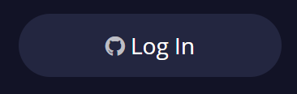
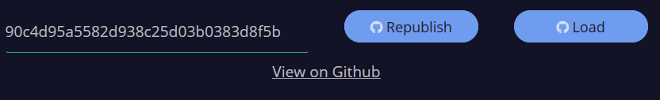
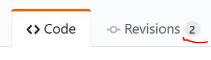

# Gist Support

In the [Plutus Playground](https://prod.playground.plutus.iohkdev.io/) you can now save your contracts and simulations to Github [gists](https://help.github.com/en/articles/about-gists) and read them from there. 

## Getting started

To use the gist integration you need to create an account on [Github](https://github.com) if you don't already have one.

Open the Playground and click on the "Login" button in the top right corner:

This brings up a Github authorisation page. After granting the permission to acess gists you are redirected back to the Playground. The "Login" button has been replaced by "Publish" and "Load" buttons:

## Publishing a contract for the first time

When you click "Publish", two things happen.

1. A new gist is created under your profile on Github. (To view all of your gists go to `https://gist.github.com/<your github username>`)
2. The ID of the gist appears in the textbox and the "Publish" button changes to "Republish". A link "View on Github" appears.

The link takes you to the gist on Github. There are two files: `Playground.hs` containing the source code of your contract, and `Simulation.json` with the wallets and actions that you have set up. 

## Publishing a new version

Every gist is backed by a git repository. Clicking the "Republish" button creates a new commit for the gist. When you click "View on Github" again you will see that the revision count has increased:

To see all prior versions of the contract click the "Revisions" tab on the gist's Github page.

## Sharing your contract

To share a Plutus contract with others, publish it and take note of the textbox next to the "Republish" button. This is the gist's ID. To load a contract from a gist simply enter the ID into the textbox and click the "Load" button. The Playground updates with the contract code and the simulations from the gist.

**Warning** Loading a gist overrides all content in the Playground. 