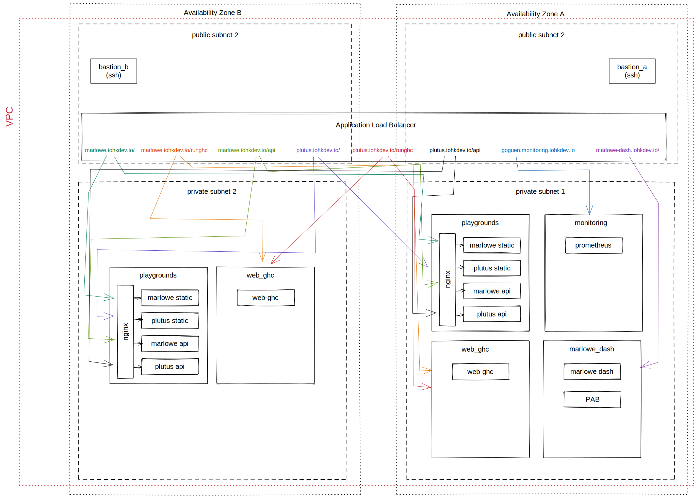

# Infrastructure Architecture

This document is a guide to the architecture we use for the plutus and marlowe infrastructure and is intended to help you gain a deeper understanding of how setup and deployment work. It is not a user guide, if you want detailed information about how to setup and deploy to the infrastructure, you should look at [./README.md](./README.md).

The infrastructure is split into two parts:
* AWS is used to create a private network infrastructure and unconfigured EC2 instances with a load balancer to present HTTP endpoints to the internet. This is managed using [Terraform](https://www.terraform.io/).
* [Morph](https://github.com/DBCDK/morph) is used to configure the EC2 instances

## AWS Architecture

We use a [standard architecture](https://docs.aws.amazon.com/vpc/latest/userguide/VPC_Scenario2.html) recommended by AWS. Within this architecture we use an [Application Load Balancer](https://aws.amazon.com/blogs/devops/introducing-application-load-balancer-unlocking-and-optimizing-architectures/) to forward different URLs to the relevant services.

This is all managed using terraform and there are many resources on the internet that describe how this works e.g. [this example of this architecture in Terraform](https://medium.com/appgambit/terraform-aws-vpc-with-private-public-subnets-with-nat-4094ad2ab331).

All our terraform code is defined in [./deployment/terraform](./deployment/terraform)

## Morph

Morph code is defined in [./deployment/morph](./deployment/morph) and more information about the structure of this can be viewed in [the README](./deployment/morph/README.md).

## Glue code and scripts

The terraform code will create EC2 instances that have IP addresses that we can't know ahead of time. Therefore we need to generate a file using terraform that can be read by morph so that it knows where to deploy things. In fact we create 4 files:
* machines.json - this file contains the private ip addresses and dns names of all the EC2 instances as well as some metadata such as the SSH keys that should be given access, the environment name etc.
* secrets.plutus.${env}.json - contains secret values used by the plutus playground that are stored encrypted using [pass](https://www.passwordstore.org/) in [../secrets]()
* secrets.marlowe.${env}.json - contains secret values used by the marlowe playground that are stored encrypted using [pass](https://www.passwordstore.org/) in [../secrets]()
* An ssh config file which should be included into your main ssh config in order to allow morph to use the bastion jump servers easily. FYI I have created [this issue](https://github.com/DBCDK/morph/issues/145) to try and avoid the need for doing this although the ssh config is still useful in order to make manual ssh connection to the machine easy, for example for debugging and inspecting logs etc.

In addition to this, we provide shell scripts that are generated by nix in [./default.nix]](./default.nix) in order to make all required operations easier. It's important to note that we use an environmental variable `PLUTUS_ROOT` to tell terraform where to save these files. For this reason you should always run these scripts within a nix-shell unless you really know what you are doing.
