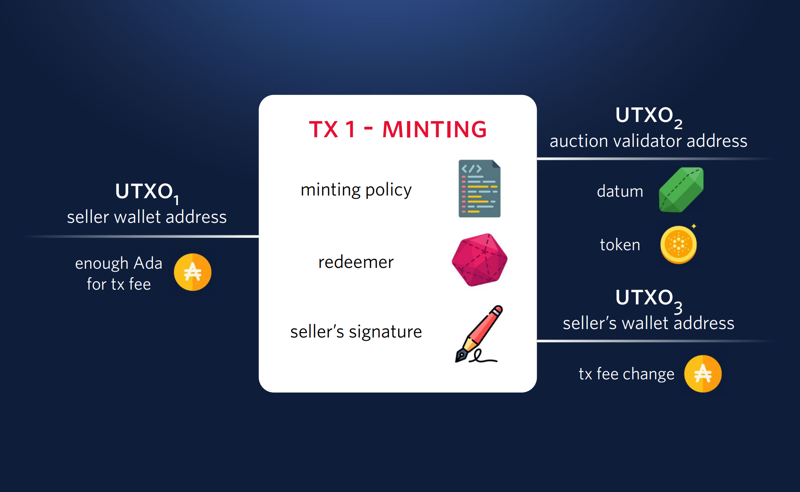

# Minting the Token to be Auctioned

Before we can start the auction, we need to mint a token to be auctioned.
To do so, we first must determine the token's currency symbol and name.
To mint or burn tokens with a specific currency symbol (`currencySymbol`), a Plutus script whose hash matches `currencySymbol` must be provided, and is used to validate the minting or burning action.
Therefore, we'll first write the on-chain script, then compute its hash and use it as the currency symbol.

## On-chain Minting Policy Script

The full minting policy code can be found at [AuctionMintingPolicy.hs](https://github.com/IntersectMBO/plutus-tx-template/blob/main/src/AuctionMintingPolicy.hs).
The main logic is in the following function:

<LiteralInclude file="AuctionMintingPolicy.hs" language="haskell" title="AuctionMintingPolicy.hs" start="-- BLOCK1" end="-- BLOCK2" />

This script will pass if the following two conditions are met:

1. The transaction is signed by a specific public key.
2. The transaction mints exactly one token, whose currency symbol matches the script's hash (i.e., `ownCurrencySymbol ctx`).
  The token name can be anything.

> :pushpin: **NOTE**
>
> A token minted in this way is _not_ considered a non-fungible token (NFT) because, while only one token can be minted in a single transaction, multiple transactions can mint additional tokens with the same currency symbol and token name.
> To create a truly unique token, you would need a more complex minting policy, but for simplicity, that is not covered here.

## Compile and Generate Blueprint for the Minting Policy

Next, we need to compile the minting policy script and create its blueprint.
To do so, we first need to supply a public key hash, which the minting policy will use for checking condition 1 above.
Assuming the seller is the one minting the token, this should be the seller's public key hash.
Open `GenMintingPolicyBlueprint.hs` in the `on-chain` directory, and replace `error "Replace with seller pkh"` with the content of `off-chain/seller.pkh`.

The minting policy code comes with `plutus-tx-template`, so you can find it in the `on-chain` repository.
To compile it and generate the blueprint, navigate to the `on-chain` directory and run

```
cabal run gen-minting-policy-blueprint -- ../off-chain/plutus-auction-minting-policy.json
```

You may need to run `cabal update` before executing this command for the first time.

This should produce a blueprint file named `off-chain/plutus-auction-minting-policy.json`.

## Compile and Generate Blueprint for the Auction Validator

One final step before minting the token: since we want to lock the minted token at the script address corresponding to the auction validator,
we must supply the parameters (i.e., `AuctionParams`) to the auction validator, compile the auction validator, and calculate its script address.

Open `GenAuctionValidatorBlueprint.hs` in the `on-chain` directory, and replace all placeholders:
- Replace `error "Replace with seller pkh"` with the content of `off-chain/seller.pkh`.
- Replace `error "Replace with currency symbol"` with the minting policy hash, which you can find in the `hash` field in `off-chain/plutus-auction-minting-policy.json`.
- Replace `error "Replace with the auction's end time"` with a POSIX timestamp for a time in the near future (say 24 hours from now).
  Note that the POSIX timestamp in Plutus is the number of _milliseconds_, rather than seconds, elapsed since January 1, 1970.
  In other words, add three zeros to the usual POSIX timestamp.
  For instance, the POSIX timestamp of September 1, 2024, 21:44:51 UTC, is 1725227091000.

Then, navigate to the `on-chain` directory and run

```
cabal run gen-auction-validator-blueprint -- ../off-chain/plutus-auction-validator.json
```

This will generate a blueprint file named `off-chain/plutus-auction-validator.json`, which the off-chain code can read and calculate the auction validator's script address.


## Off-chain Code for Minting

We are now ready to write and execute the off-chain code for minting.
Create a file named `off-chain/mint-token-for-auction.mjs` with the following content:

<LiteralInclude file="mint-token-for-auction.mjs" language="javascript" title="mint-token-for-auction.mjs" />

Substitute your Blockfrost project ID for `Replace with Blockfrost Project ID`.

This Javascript module uses the mesh library to build a transaction that mints a token (`tx.mintAsset`).
The token will have the currency symbol of the minting policy's hash, and a token name of `TokenToBeAuctioned`.
It will be sent to `auctionValidatorAddress`, with a datum corresponding to `Nothing`.
The transaction is signed by the seller (`seller.skey`), and then submitted to the Preview testnet.

Run the coding using:

```
node mint-token-for-auction.mjs
```

and you should see a message "Minted a token at address ..." printed in the console.
Within a minute, you should be able to find the transaction using the transaction hash on [Cardanoscan](https://preview.cardanoscan.io/) and review its details.

Illustration of the minting transaction:


