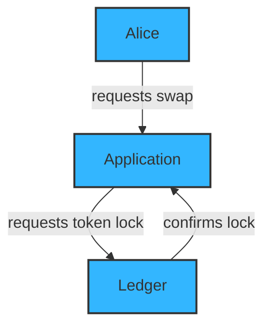
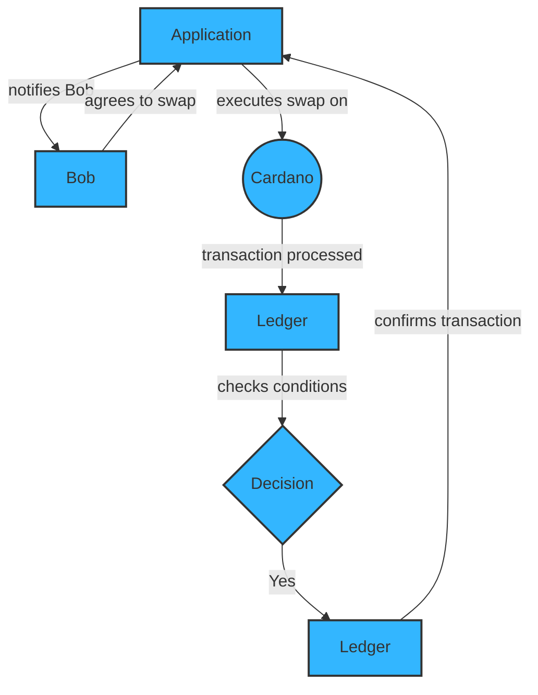
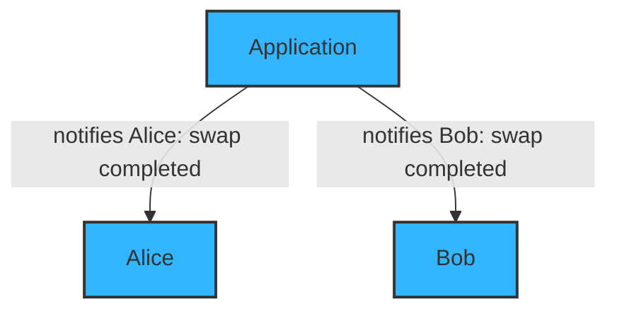

# Plutus platform

The Plutus platform is a platform for writing *applications* that interact with a *distributed ledger* featuring *scripting* capabilities, in particular the [Cardano](../reference/glossary.md#cardano) blockchain.

## Example application

What sort of "applications" are we talking about here? 
As an example, let's think about an application that provides the function of helping a pair of users, Alice and Bob, who want to engage in an atomic swap of some assets stored on Cardano.

### Alice initiates the swap

- **Alice:** tells the Application, "I want to do an escrowed swap with Bob, 50 Ada for my Special Token." 
- **Application:** tells the Ledger, "I want to lock up Alice's Special Token so that it can only be unlocked if Bob completes the swap."
- **Ledger:** responds to the Application, "Ok, that change has settled." 

### Application interacts with Bob, Cardano and the ledger to execute the swap 

- **Application:** tells Bob, "Hey, Alice wants to do a swap with you." 
- **Bob:** tells the Application, "I want to take up Alice's swap." 
- **Application:** communicates to Cardano, "I want to spend that locked output with Alice's Special Token while sending 50 of Bob's Ada to Alice." 
- **Ledger:** checks with itself: "Does this transaction satisfy the conditions that were asked for? Yes it does!" 
- **Ledger:** tells the Application, "Ok, that change has settled."

### Application communicates that the swap completed 

- **Application:** tells Alice, "The swap is completed!" 
- **Application:** tells Bob, "The swap is completed!"

Alice and Bob don't interact directly, nor do they directly interact with the ledger. 
Very few "smart" blockchain systems encourage their users to interact directly with the chain themselves, since this is usually complex and error-prone. 
Rather, the users interact with some *application* that presents the world in a form that they can understand and interact with.

Of course, such an application must want to do something with the ledger, otherwise you wouldn't need anything new. 
Simple applications might do nothing more than submit basic transactions that transfer assets&mdash;imagine a simple "regular payments" application. 
However, our main focus is on applications that *do* use smart features in order to have a kernel of trusted code that is validated as part of the ledger.

This enables applications that are not possible otherwise. 
Alice and Bob need trusted logic in order to perform their swap: a "dumb" application could submit the transactions transferring the assets, but would have no recourse against Bob defecting. 
Using the smart features of the ledger ensures that Bob can't take Alice's token unless he *really does* send her the money, and it does this without involving a trusted third party.

Creating and using the trusted kernel of code is the most technically difficult and security-sensitive part of the whole operation.
Nonetheless, writing the rest of the application contains plenty of complexity. 
Amongst other things, an application needs to deal with the software around the ledger (wallets, nodes, etc.); distributed systems issues such as settlement delays, inconsistent state between parties, and rollbacks; and simple user-experience issues like upgrades, state management and synchronization. 
Furthermore, while none of these are quite as security-critical as the trusted kernel, users certainly *can* be attacked through such applications, and even non-malicious bugs are likely to be quite upsetting when a user's money is at stake.

Even simple applications must deal with this complexity, and for more advanced applications that deal with state across time, the difficulty is magnified.

## Additional resources

- Michael Peyton-Jones and Jann Mueller introduce the Plutus platform in [this session](https://youtu.be/usMPt8KpBeI?si=4zkS3J7Bq8aFxWbU) from the Cardano 2020 event. 

- The design of the platform is discussed in the [Plutus technical report](https://intersectmbo.github.io/plutus/resources/plutus-report.pdf).

