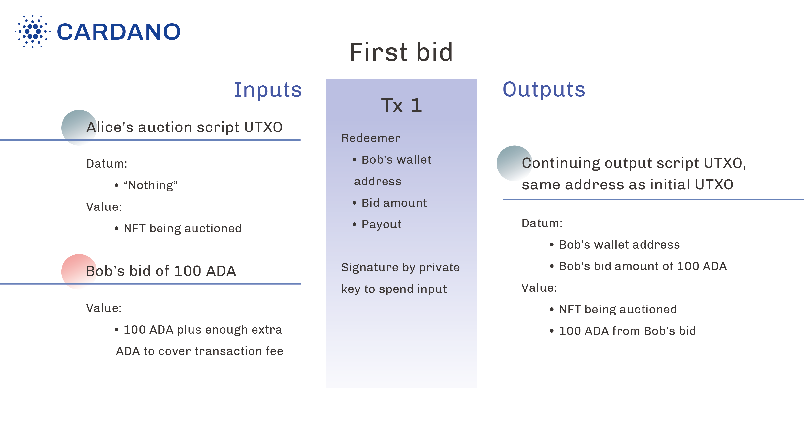
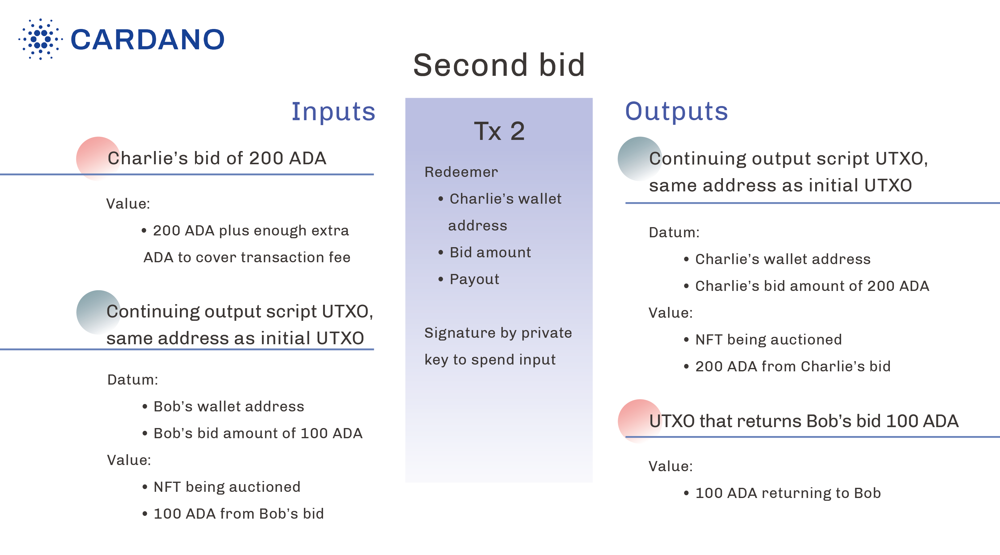
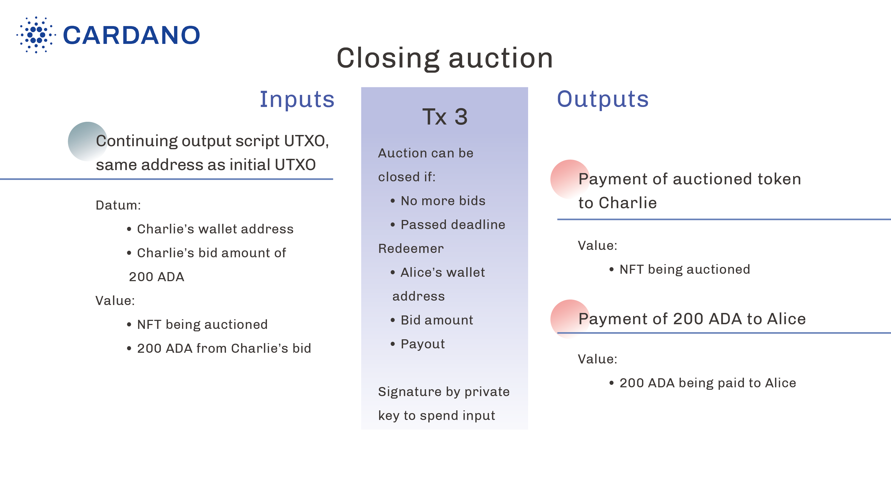

# Life cycle of the auction smart contract

With the Plutus script written, Alice is now ready to start the auction smart contract. 
At the outset, Alice creates a script UTXO whose address is the hash of the Plutus script, whose value is the token to be auctioned, and whose datum is `Nothing`. 
Recall that the datum represents the highest bid, and there's no bid yet. 
This script UTXO also contains the script itself, so that nodes validating transactions that try to spend this script UTXO have access to the script.

## Initial UTXO

Alice needs to create the initial UTXO transaction with the desired UTXO as an output. 
The token being auctioned can either be minted by this transaction, or if it already exists in another UTXO on the ledger, the transaction should consume that UTXO as an input. 
We will not go into the details here of how minting tokens works.

## The first bid

Suppose Bob, the first bidder, wants to bid 100 Ada for Alice's NFT. 
In order to do this, Bob creates a transaction that has at least two inputs and at least one output.

The required inputs are (1) the script UTXO Alice created; (2) Bob's bid of 100 Ada. 
The 100 Ada can come in one or multiple UTXOs. 
Note that the input UTXOs must have a total value of more than 100 Ada, because in addition to the bid amount, they also need to cover the transaction fee.

The required output is a script UTXO with the same address as the initial UTXO (since the Plutus script itself remains the same), which is known as a *continuing output*. 
This continuing output UTXO should contain:

- a datum that contains Bob's wallet address and Bob's bid amount (100 Ada).
   - Bob's wallet address is used to claim the token (if Bob ends up winning the auction) or receive the refund (if a higher bid is placed later).
- a value: the token being auctioned plus the 100 Ada from Bob's bid.

If the input UTXOs contain more Ada than 100 plus the transaction fee, then there should be additional output UTXOs that return the extra Ada.
Again, verifying that the input value of a transaction minus the transaction fee equals the output value (unless the transaction is burning tokens) is the responsibility of the ledger, not the Plutus script.

In order for Bob's transaction to be able to spend the initial script UTXO Alice created, Bob's transaction must also contain a redeemer. 
As shown in the code above, there are two kinds of redeemers in our example: `NewBid Bid` and `Payout`. 
The redeemer in Bob's transaction is a `NewBid Bid` where the `Bid` contains Bob's wallet address and bid amount.

Once Bob's transaction is submitted, the node validating this transaction will run the Plutus script, which checks a number of conditions like whether the bid happens before the deadline, and whether the bid is high enough. 
If the checks pass and everything else about the transaction is valid, the transaction will go through and be included in a block. 
At this point, the initial UTXO created by Alice no longer exists on the ledger, since it has been spent by Bob's transaction.

## The second bid

Next, suppose a second bidder, Charlie, wants to outbid Bob. 
Charlie wants to bid 200 Ada.

Charlie will create another transaction. 
This transaction should have an additional output compared to Bob's transaction: a UTXO that returns Bob's bid of 100 Ada. 
Recall that this is one of the conditions checked by the Plutus script; the transaction is rejected if the refund output is missing.

Charlie's transaction needs to spend the script UTXO produced by Bob's transaction, so it also needs a redeemer. 
The redeemer is a `NewBid Bid` where `Bid` contains Charlie's wallet address and bid amount.
Charlie's transaction cannot spend the initial UTXO produced by Alice, since it has already been spent by Bob's transaction.

## Closing the auction

Let's assume that there won't be another bid. 
Once the deadline has passed, the auction can be closed.

In order to do that, somebody has to create another transaction. 
That could be Alice, who wants to collect the bid, or it could be Charlie, who wants to collect the NFT. 
It can be anybody, but Alice and Charlie have an incentive to create it.

This transaction has one required input: the script UTXO produced by Charlie's transaction, and two required outputs: (1) the payment of the auctioned token to Charlie; (2) the payment of 200 Ada to Alice.

