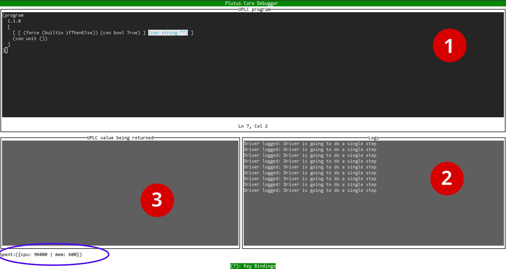

# CLI tool for Plutus

The `plutus` CLI tool allows you to:

- **check** statically your plutus-related (PIR/TPLC/UPLC) program for common errors.
- **compile** (convert) between plutus-derived languages and code formats.
- **optimise** the code.
- **run** or interactively **debug** your program *locally* (without starting a Cardano Node).

A pre-built executable of the `plutus` CLI
can be found on the [Latest Release](https://github.com/IntersectMBO/plutus/releases/latest) page in the repository. Alternatively, you can build the tool
using Nix, specifically for your platform:

``` shell
$ nix build ".#cabalProject.$(nix eval nixpkgs#stdenv.buildPlatform.system).hsPkgs.plutus-core.components.exes.plutus"
```

To consult the tool's usage you can invoke `plutus --help` in your command line:

``` shell
$ plutus --help
USAGE: plutus [--run|--debug] [-OLEVEL] FILES... [-o FILE]
```

In general, a *compiler tool* operates in a certain pattern:

> 1. Read (Parse or Deserialise) input program(s) of a *source* language
> <br/>&darr;<br/>
> 2. Check program(s) for certain errors
> <br/>&darr;<br/>
> 3. Compile to a lower-level *target* language
> <br/>&darr;<br/>
> 4. Optimise the compiled code (*optional*)
> <br/>&darr;<br/>
> 5. Write code to output (*optional*)

In case of `plutus` tool, *Step 1* is more or less straightforward:
the input programs are read from the specified `FILES...` in the CLI and/or from Standard Input (`--stdin` option).

After reading the input program(s), the tool continues
to run certain static **checks** on those programs (*Step 2*); currently there is no way to turn these static checks off.

In *Step 3* the tool will try to **compile** (convert) the higher-level source language (PIR, TPLC) of the input program to the lower-level target language (TPLC, UPLC).
In case the source and target languages are the same, this step is a "no-op" (has to be for UPLC, since it is the lowest-level Plutus language after all).

*Step 4* (**Optimising** code) is optional and has to be manually turned on by using the option `-OLEVEL` where *LEVEL* is a number between zero and two.
`-O0` specifies that no optimisations should be run (basically same as omitting the `-OLEVEL` option). `-O1` applies safe optimisations (guarantees no change to the program's semantics),
whereas `-O2` applies aggressive / unsafe optimisations (may alter program's semantics).

*Step 5* writes the resulting (compiled and/or optimised) code to given output specified with `-o FILE` or `--stdout`.
This step is optional: there is no program output when both options above are omitted. This is so that users can use the `plutus` tool as a background checker when developing a Plutus program
or if they want to continue with an extra *Step 6*:

> ...
> <br/>&darr;<br/>
> 5. Write code to output (*optional*)
> <br/>&darr;<br/>
> 6. Run *OR* Debug code (*optional*)

Users can pass a `--run` *or* `--debug` as an extra option to **run** or **debug** the resulting program of the compilation,
using the tool's built-in interpreter and debugger, respectively.

## Optimising UPLC with the CLI

In this section we only focus on UPLC; a prerequisite is that you have already acquired (extracted) the UPLC code corresponding to your high-level source program.
The process to *extract* plutus code varies depending on the source language you are using (Plinth, Aiken, ...);
if Plinth is the source language, you can follow the instructions on [how to inspect compiled code](./inspecting.md#inspecting-the-compiled-code).

Since UPLC is the lowest-level language, compiling (*Step 3*) is not applicable for UPLC input programs and thus omitted
&mdash; for actual compiling (converting) between different intermediate languages (PIR, TPLC) or serialisation formats (e.g. Flat, CBOR)
see the [Advanced section](#converting) on converting between Plutus languages & formats.
Instead, we can use the `plutus` tool to check for certain static errors in our UPLC, as in the example:

``` shell
$ echo '(program 1.1.0 (lam x (lam y z)))' > const_err.uplc
$ plutus const_err.uplc
Error from the PLC compiler:
Variable 2 is free at ()
```

After fixing the error:

```
$ echo '(program 1.1.0 (lam x (lam y x)))' | plutus --stdin
Compilation succeeded, but no output file was written; use -o or --stdout.
```

We can try to turn on some optimisations and write the resulting optimised code to standard output:

``` shell
# no optimisations by default
$ echo '(program 1.1.0 (force (delay (con unit ()))))' | plutus --stdin --stdout
(program 1.1.0 (force (delay (con unit ()))))

$ echo '(program 1.1.0 (force (delay (con unit ()))))' | plutus --stdin --stdout -O1
(program 1.1.0 (con unit ()))
```

When multiple input programs (files) are passed to the CLI, the `plutus` tool
will **check**, **compile** (not applicable for UPLC), and (optionally) **optimise** each program separately.
After this is done for *all* programs, the tool gathers the result of each compilation/optimisation and combines them into a single output program.
This is done by placing (interposing) an `Apply` term between the code of each compiled/optimised program, similar
to Haskell's juxtaposition of a function and its series of applied arguments.

``` shell
$ echo '(program 1.1.0 (lam x (lam y x)))' > func.uplc
$ echo '(program 1.1.0 (con string "OK"))' > arg1.uplc
$ echo '(program 1.1.0 (con bool True))' > arg2.uplc
$ plutus func.uplc arg1.uplc arg2.uplc --stdout -O2
(program 1.1.0 [ [ (lam x (lam y x)) (con string "OK") ] (con bool True) ])
```

In the example above, even with all optimisations turned on (`-O2`), the `plutus` tool will not reduce
the obviously reducible function applications in the output program; this is because the input programs are optimised only *individually* (separately). You can
instruct the tool to perform an **extra** optimisation pass of the whole (combined) program
by passing `--whole-opt` to the CLI &mdash; the given `-OLEVEL` will be taken into account also for this final extra pass (`-O2` in this case).

``` shell
$ plutus func.uplc arg1.uplc arg2.uplc --stdout -O2 --whole-opt
(program 1.1.0 (con string "OK"))
```

## Running UPLC with the CLI {#running}

Certain errors in `uplc` code cannot be caught by the static checks (*Step 2*)
because the UPLC language is untyped:

``` shell
# Pseudocode: 1 + True
$ echo "(program 1.1.0 [(builtin addInteger) (con integer 1) (con bool True)])" > typ_err.uplc
$ plutus typ_err.uplc
Compilation succeeded, but no output file was written; use -o or --stdout.
```

Alternatively we can try to run the program using the tool's built-in *interpreter* and look for any runtime (type) errors.
The `--run` option will invoke the interpreter passing to it the final output program.
An execution that raised an error will show information about the error and in which term
the error happened:

``` shell
$ plutus typ_err.uplc --run
Running the program: An error has occurred:
Could not unlift a value:
Type mismatch: expected: integer; actual: bool
Caused by: addInteger 1 True
```

Other times catching such (type) errors at runtime is not even possible. Consider the following
example program which contains a type error but the execution nevertheless succeeds with the final
evaluated result (term):

``` shell
# Pseudocode: if True then "" else unit
$ echo '(program 1.1.0 [(force (builtin ifThenElse)) (con bool True) (con string "") (con unit ())])' > if.uplc
$ plutus if.uplc --run
Running the program: Execution succeeded, final term:
(con string "")
Used budget: ExBudget {exBudgetCPU = ExCPU 204149, exBudgetMemory = ExMemory 901}
```

> :pushpin: **NOTE**
> The above example demonstrates that `uplc` &mdash; the language which actually *runs on the chain* &mdash;
> is low-level and more akin to assembly. Users that are concerned about the safety of their smart contracts
> are advised instead to develop in a higher-level (typed) language (e.g. Plinth) which compiles down to `uplc`.

After plutus program's execution is completed (either succeeded or failed), the final used budget will be printed as well.
Because the CLI tool employs the same `uplc` interpreter as the one that the Cardano node runs, you can be sure
that the program's execution result&budget match *precisely* &mdash; assuming same program
and cost model &mdash; the result&budget computed by the chain.

You can pass a maximum *CPU* and/or *Memory* budget that is allowed to be spent with the `--budget=CPU` or `-budget=,MEM` or `--budget=CPU,MEM` options; if given budget runs out, the execution will fail and stop earlier.
If there is no CPU and/or MEM limit given, the budget is practically unlimited.

``` shell
$ plutus if.uplc --run --budget=204148,903
Running the program: An error has occurred:
The machine terminated part way through evaluation due to overspending the budget.
The budget when the machine terminated was:
({cpu: -1
| mem: 2})
Negative numbers indicate the overspent budget; note that this only indicates the budget that was needed for the next step, not to run the program to completion.

$ plutus if.uplc --run --budget=,903
Running the program: Execution succeeded, final term:
(con string "")
Remaining budget: ExBudget {exBudgetCPU = ExCPU 9223372036854571658, exBudgetMemory = ExMemory 2}
Used budget: ExBudget {exBudgetCPU = ExCPU 204149, exBudgetMemory = ExMemory 901}
```

> :pushpin: **NOTE**
> Attempting to run a `tplc` target will use the `tplc` interpreter. Although
> the `tplc` interpreter behaves the same as the default `uplc` interpreter (for *type correct* programs),
> it comes with caveats: cannot execute `uplc` code,
> cannot have budget accounting and budget limits, runs way slower and your program must be fully type correct.
> The last point is not necessarily a caveat, but it diverges from the on-chain behavior:
> the `tplc` interpreter accepts less programs than the chain (and the default `uplc` interpreter) would accept.
> PIR target programs cannot be directly executed.

## Debugging UPLC with the CLI *(Experimental)* {#debugging}

> :pushpin: **NOTE**
> The debugger is in a *preliminary* , *experimental* state. What is described below is
> subject to change when new features are added to the debugger.

Another way to check for runtime errors or the execution budget
is by firing up the tool's built-in debugger. Again, the debugger utilises underneath the same UPLC interpreter
as the one the Cardano node runs, so you can be sure about its execution results and budget costs.
The difference compared to "running the code" is that with the debugger you can step by step progress over the execution
over your UPLC program's sub-terms, or interactively decide to pause the execution on specific UPLC sub-term(s) of interest.

> :pushpin: **NOTE**
> Unlike the `--run` option that can execute both UPLC *and* TPLC target programs, the `--debug` option works *exclusively* for UPLC targets.

The `--debug` option will launch the debugger after
the prior checking/compilation/optimisation steps of your input program(s) have been completed, for example:

``` shell
$ plutus if.uplc -O1 --debug
```

The debugger has a Terminal User Interface (TUI) with three windows that are kept automatically updated: (1)
the compiled/optimised target UPLC program, (2) the log/trace messages, and (3) the (current) return value.



You can interact (issue **Commands**) to the debugger by pressing keyboard shortcuts:

|Keyboard Shortcut|Command|
|-----|-----|
|?|Show help dialog|
|Esc|Quit help dialog or debugger|
|Ctrl+up/down/left/right|Resize window|
|Tab|Switch focus to other window|
|s|Step once the interpreter|

Unlike the `--run` option, the `step` command does not execute the program
to completion. Instead, the underlying `uplc` interpreter is moved one "budgeting" step forward &mdash;
the smallest step possible that gets accounted for and subtracted from the current budget.

After every such `step`, the debugger
highlights in window (1) the code region (sub-term) which will be executed in the future (next `step`);
A footer in the TUI screen will update to show the remaining budget.
You can combine `--debug` with the `--budget=CPU,MEM` option to limit the starting total budget:
the debugger fails the execution the moment the budget runs out, similar as to what happens with `--run`.

## Advanced: Converting between languages & formats {#converting}

``` shell
$ plutus IN_FILES... -o OUT_FILE
```

The filename extensions of the input files and output file
determine the language and format of the *sources* and *target*, respectively.
You can take a look at the [Table of Filename Extensions](#extensions) recognised by the `plutus` tool.
Alternatively, you can [manually set](#override) (or override) the language&format.

You are allowed to mix and match different input *sources* as long
as that make sense: the *target* must be a lower- or equal-level language to the sources.
All sources will be then compiled and combined to the given target, for example:

``` shell
$ plutus func.pir arg1.tplc arg2.uplc -o fully_applied.uplc

$ plutus func.pir arg1.tplc -o partially_applied.tplc
$ plutus partially_applied.tplc arg2.uplc -o also_fully_applied.uplc

$ plutus arg2.uplc -o arg2.tplc # does not make sense, cannot lift to a higher level language
$ plutus -O2 func.pir -o func_optimised.pir # makes sense for check / optimise
```

It is worth to re-iterate that the input files are checked/compiled/optimised **separately**;
this means that although the input programs are *individually* type correct, when *combined* to a specific target
they may become type incorrect:

``` shell
$ echo "(program 1.1.0 (lam x (con integer) [(builtin addInteger) x (con integer 1)]))" > inc.pir
$ echo "(program 1.1.0 (con bool True))" > true.pir

$ plutus inc.pir true.pir -o applied.uplc # NO TYPE ERROR because target is untyped (UPLC)
$ echo applied.uplc
(program
  1.1.0
  [ (lam i [ [ (builtin addInteger) (con integer 1) ] i ]) (con bool True) ]
)

$ plutus inc.pir true.pir -o applied.pir # TYPE ERROR because PIR target
$ plutus inc.pir true.pir -o applied.tplc # TYPE ERROR because TPLC target
```

### Filename Extensions {#extensions}

The following table lists the recognized extensions.

|Filename Extension|Format Type|Description|
|---|---|---|
|\**NO-EXTENSION\**|Textual|Untyped Plutus Core with Names|
|.uplc|Textual|Untyped Plutus Core with Names|
|.tplc|Textual|Typed Plutus Core with Names|
|.pir|Textual|PIR with Names|
|.data|Binary|Values of `Data` serialised in CBOR|
|.data-txt|Textual|Values of `Data` in Haskell's `Show` format|
|.uplc-flat|Binary|Untyped PlutusCore with NamedDeBruijn serialised in Flat|
|.uplc-cbor|Binary|Untyped PlutusCore with DeBruijn serialised in CBOR <br/> (the on-chain format)|

> :pushpin: **NOTE** If file has no extension or in case of `--stdin` / `--stdout`, the extension is assumed to be `.uplc`

### Manually set language&format {#override}

If the extension cannot be determined (missing / `--stdin` / `--stdout`)
or you would like to override the recognised extension,
you may use the `-x .EXTENSION` option (with or without the leading dot `.` taken from [Table](#extensions) above) to manually set the
extension for the given file(s):

``` shell
$ plutus file1 -x pir file2 file3
```

Note `-x` is positional: it applies its effect to all files after the option till the end or another `-x` is reached.
In the example above the effect (set to `pir`)  will not apply to `file1`, but will apply to `file2`, `file3` **and** target.
Possible filename extensions on `file2` and `file3` will be ignored. Using multiple invocations of `-x` may come handy
for mixing different sources or setting the output target. The next example sets the first two files
to be `pir`, the following two to `tplc`, and the target (the last invocation of `-x`) to `uplc`.

``` shell
$ plutus -x pir Pir_File Also_Pir -x tplc Now_Tplc Also_Tplc -x uplc
```

In case `-x` is not enough and the *format* is more complex because it contains a non-default variable-naming scheme or annotations,
you may extra specify the `-n NAMING` and `-a ANNOTATION` options to override the defaults.

|-n Short Option|-n Long Option|Description|
|---|---|---|
|-n n|-n name|Use descriptive textual names for variables|
|-n d|-n debruijn|Use debruijn indices for variables|
|-n nd|-n named-debruijn|Use name with debruijn index for variables: "name-index"|

|-a Option|Description|
|---|---|
|-a unit|Code does not contain any annotations (default)|
|-a srcspan|Code is annotated with source spans|

The `-n` and `-a` options are also positional.

### Pretty-printing output

If the output's format type is *textual* (see the [Filename Extensions Table](#extensions)) the compiled code
will be printed to the designated output (file or stdout) in a "pretty" format.
You can change how the output's looks by specifying a different `-p STYLE` style (defaults to `classic`).

|-p Option|Description|
|---|---|
|-p classic|Lisp-like syntax with unique variable names  (default)|
|-p classic-simple|Lisp-like syntax with ambiguous (no unique) variable names|
|-p readable|Succinct syntax with unique variable names|
|-p readable-simple|Succinct syntax with ambiguous (no unique) variable names|


``` shell
$ plutus inc.pir -x pir --stdout
(program
  1.1.0 (lam x-0 (con integer) [ [ (builtin addInteger) x-0 ] (con integer 1) ])
)

$ plutus inc.pir -x pir --stdout --pretty=readable-simple
program 1.1.0 (\(x : integer) -> addInteger x 1)
```

> :pushpin: **NOTE** Specifying a textual *output* with pretty style other than the default (classic) may not be possible to be read
back again (as textual *input* this time) in the CLI.

Using the standard output to capture the (pretty-printed) output program is safe,
because the tool's logs and error messages are sent by default to `stderr`.
You can of course silence those messages using `--quiet` option, or instead
increase their rate using `--verbose` (for tracing through the compilation process).
