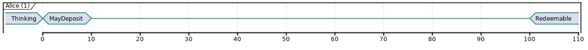
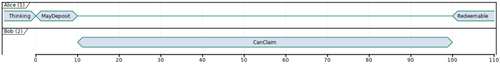
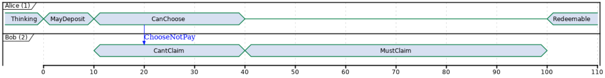
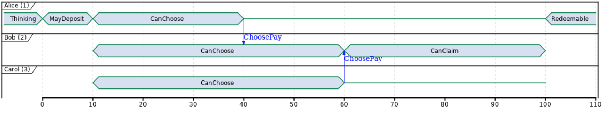
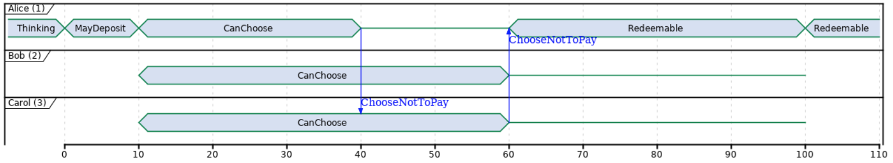
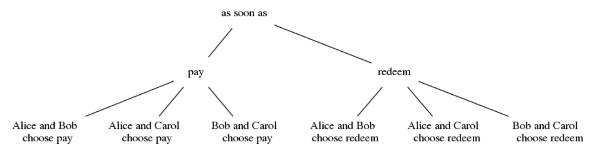

..
  This doesn't appear in a TOC, so we put this to suppress warnings for now

:orphan:

.. _escrow-step-by-step:

Marlowe
=======

A new smart contract language for the financial world
-----------------------------------------------------

Tutorial. Building upon an escrow contract.
~~~~~~~~~~~~~~~~~~~~~~~~~~~~~~~~~~~~~~~~~~~

Contract 1. Locked Savings.
~~~~~~~~~~~~~~~~~~~~~~~~~~~

Goal:

-  Save some money for the future.

Rules:

-  Alice has from time 0 to time 10 to make a deposit (commit) of 500
   ada.

-  Funds will be locked until time 100.

-  Only after time 100 funds will be redeemable.

Marlowe code:

::

   CommitCash (IdentCC 1) 1
              (ConstMoney 500)
              10 100 Null Null

Test cases:

-  Ada cannot be committed after time 10

-  Ada cannot be redeemed before time 100

-  Ada can be redeemed after time 100

Contract 2. Simple Payment with time limit to claim.
~~~~~~~~~~~~~~~~~~~~~~~~~~~~~~~~~~~~~~~~~~~~~~~~~~~~

Goal:

-  Pay for a product or service.

Rules:

-  Alice has from time 0 to time 10 to make a deposit of 500 ada.

-  Bob can claim payment from time 11 to time 100.

-  Alice can redeem funds after time 100 if Bob did not claim the
   payment.

Marlowe code:

::

   CommitCash (IdentCC 1) 1
              (ConstMoney 500)
              10 100
              (Pay (IdentPay 1) 1 2
                   (AvailableMoney (IdentCC 1))
                   100 Null)
              Null

Test cases:

-  Cash cannot be committed after time 10.

-  Ada can be claimed at any time after commitment and before time 100
   is reached.

-  Ada cannot be redeemed before time 100.

-  Only person 2 can claim the payment.

-  Ada can be redeemed after time 100.

Contract 3. Authorize payment
~~~~~~~~~~~~~~~~~~~~~~~~~~~~~

Goal:

-  Pay for a product or service but payment is subject to authorization
   from buyer.

Rules:

-  Alice has from time 0 to time 10 to deposit 500 ada.

-  Alice has from time 11 to time 40 to choose if she actualy authorizes
   the payment to Bob.

-  If Alice chooses to pay, Bob can claim payment from time 41 to time
   100.

-  Funds are reedemable by Alice after time 100.

.. image:: images/escrow/contract3.png
   :alt: Lock Savings

Marlowe code:

::

   CommitCash (IdentCC 1) 1
              (ConstMoney 500)
              10 100
              (When (PersonChoseThis (IdentChoice 1) 1 1)
                    40
                    (Pay (IdentPay 1) 1 2
                         (AvailableMoney (IdentCC 1))
                         100 Null)
                    (RedeemCC (IdentCC 1) Null))
              Null

Test cases:

-  Alice authorizes payment

-  Alice doesn’t authorize

Contract 4. Pay unless explicit rejection
~~~~~~~~~~~~~~~~~~~~~~~~~~~~~~~~~~~~~~~~~

Goal:

-  Pay Bob unless Alice explicitly rejects the payment.

Rules:

-  Alice has from time 0 to time 10 to deposit 500 ada.

-  Alice has from time 11 to time 40 to choose if she denies the
   payment.

-  If Alice chooses not to pay, funds are redeemable.

-  If Alice chooses to pay or does not make a selection, Bob can claim
   from time 41 to time 100.

-  Funds are reedemable by Alice after time 100.

Marlowe code:

::

   CommitCash (IdentCC 1) 1
              (ConstMoney 500)
              10 100
              (When (PersonChoseSomething (IdentChoice 1) 1)
                    40
                    (Choice (PersonChoseThis (IdentChoice 1) 1 0)
                            (RedeemCC (IdentCC 1) Null)
                            (Pay (IdentPay 1) 1 2
                                 (AvailableMoney (IdentCC 1))
                                 100 Null))
                    (Pay (IdentPay 2) 1 2
                         (AvailableMoney (IdentCC 1))
                         100 Null))
              Null

Test cases:

-  Bob can collect even if Alice doesn’t give an instruction.

-  Alice can cancel payment

-  Bob can’t claim payment before block 40 or approval from alice.

Contract 5. Simple Escrow
~~~~~~~~~~~~~~~~~~~~~~~~~

Goal:

-  Pay Bob when two out of three persons vote for payment,

-  Refund Alice when two out of three persons vote for not to pay.

Rules:

-  Alice has from time 0 to time 10 to deposit 500 ada.

-  Alice has from time 11 to time 40 to vote if she approves or denies
   the payment.

-  Bob has from time 11 to time 60 to vote if he approves or denies the
   payment.

-  Carol has from time 11 to time 60 to vote if she approves or denies
   the payment.

-  If two out of three participants vote not to pay, funds are
   redeemable after time 100.

-  If two out of three participants vote to pay, Bob can claim the
   payment from time 61 to time 100.

-  Funds are reedemable by Alice after time 100.

Marlowe Code:

::

   CommitCash (IdentCC 1) 1
              (ConstMoney 500)
              10 100
              (When (OrObs (AndObs (PersonChoseThis (IdentChoice 1) 1 1)
                                   (PersonChoseThis (IdentChoice 1) 2 1))
                           (OrObs (AndObs (PersonChoseThis (IdentChoice 1) 1 1)
                                          (PersonChoseThis (IdentChoice 1) 3 1))
                                  (AndObs (PersonChoseThis (IdentChoice 1) 2 1)
                                          (PersonChoseThis (IdentChoice 1) 3 1))))
                    100
                    (Pay (IdentPay 1) 1 2
                         (AvailableMoney (IdentCC 1))
                         100 Null)
                    Null)
              Null

Test Cases:

-  Payment can only be claimed when 2 out of 3 participants have voted
   to pay.

-  Alice and Bob agree to pay

-  Bob and Carol agree to pay

-  Alice and Carol agree to pay

-  Only person 2 (bob) can claim the payment.

-  Ada can be redeemed after block 100

Contract 6. Complete Escrow
~~~~~~~~~~~~~~~~~~~~~~~~~~~

Goal:

-  Pay Bob when two out of three persons vote for payment,

-  Refund Alice when two out of three persons vote for not to pay.

-  Improve Contract 5 to allow Alice be refunded earlier if outcome of
   voting is not to pay.

Rules:

-  Alice has from time 0 to time 10 to deposit 500 ada.

-  Alice has from time 11 to time 40 to vote if she approves or denies
   the payment.

-  Bob has from time 11 to time 60 to vote if he approves or denies the
   payment.

-  Carol has from time 11 to time 60 to vote if she approves or denies
   the payment.

-  If two out of three participants vote not to pay, funds are
   redeemable immediatly.

-  If two out of three participants vote to pay, Bob can claim the
   payment from time 61 to time 100.

-  Funds are reedemable by Alice after time 100.

Decision Tree

Marlowe Code:

::

   CommitCash (IdentCC 1) 1
              (ConstMoney 500)
              10 100
              (When (OrObs (OrObs (AndObs (PersonChoseThis (IdentChoice 1) 1 1)
                                          (PersonChoseThis (IdentChoice 1) 2 1))
                                  (OrObs (AndObs (PersonChoseThis (IdentChoice 1) 1 1)
                                                 (PersonChoseThis (IdentChoice 1) 3 1))
                                         (AndObs (PersonChoseThis (IdentChoice 1) 2 1)
                                                 (PersonChoseThis (IdentChoice 1) 3 1))))
                           (OrObs (AndObs (PersonChoseThis (IdentChoice 1) 1 0)
                                          (PersonChoseThis (IdentChoice 1) 2 0))
                                  (OrObs (AndObs (PersonChoseThis (IdentChoice 1) 1 0)
                                                 (PersonChoseThis (IdentChoice 1) 3 0))
                                         (AndObs (PersonChoseThis (IdentChoice 1) 2 0)
                                                 (PersonChoseThis (IdentChoice 1) 3 0)))))
                    100
                    (Choice (OrObs (AndObs (PersonChoseThis (IdentChoice 1) 1 1)
                                           (PersonChoseThis (IdentChoice 1) 2 1))
                                   (OrObs (AndObs (PersonChoseThis (IdentChoice 1) 1 1)
                                                  (PersonChoseThis (IdentChoice 1) 3 1))
                                          (AndObs (PersonChoseThis (IdentChoice 1) 2 1)
                                                  (PersonChoseThis (IdentChoice 1) 3 1))))
                            (Pay (IdentPay 1) 1 2
                                 (AvailableMoney (IdentCC 1))
                                 100 Null)
                            (RedeemCC (IdentCC 1) Null))
                    Null)
              Null

Test Cases:

-  Check that when both Alice and Carol choose NOT to pay, Alice can
   immediately redeem the funds.
