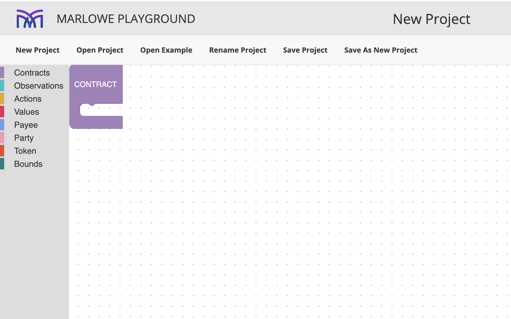
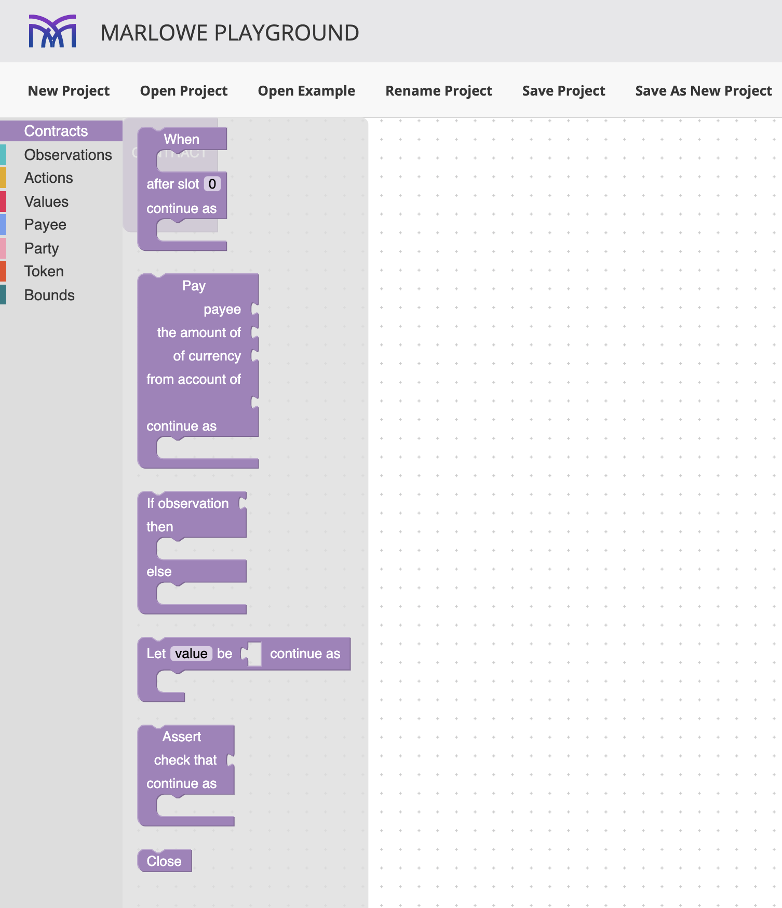
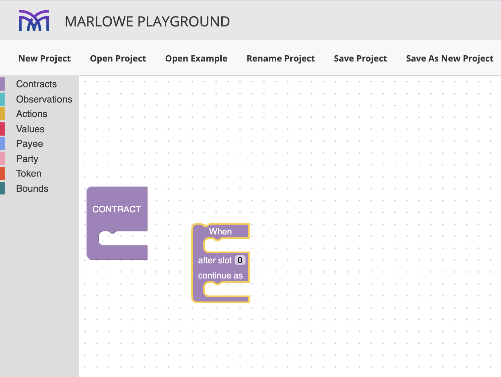
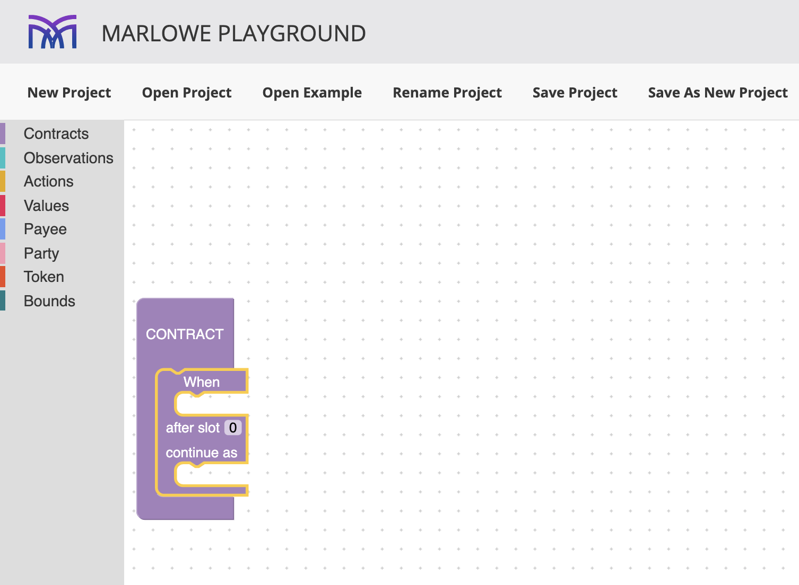
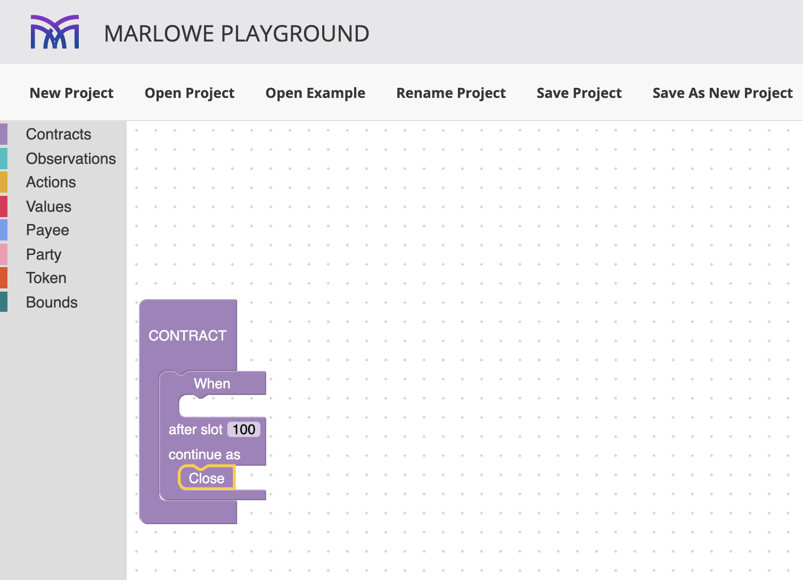
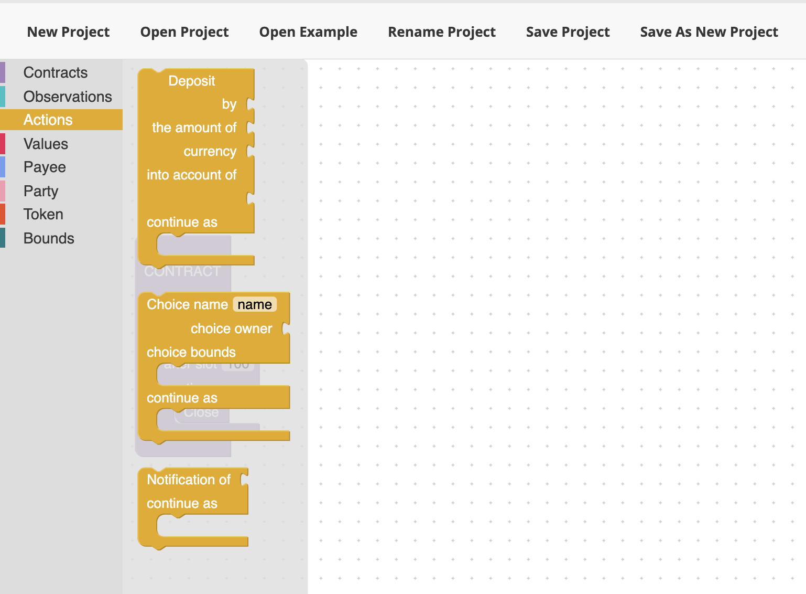
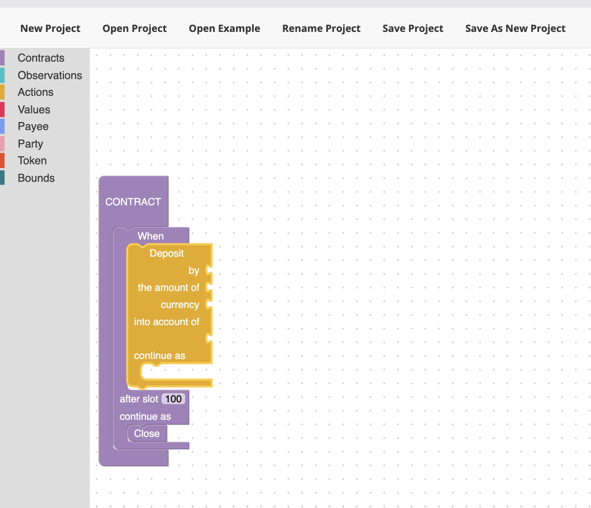
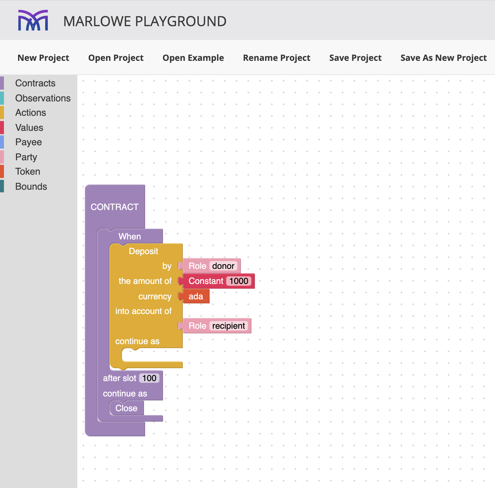
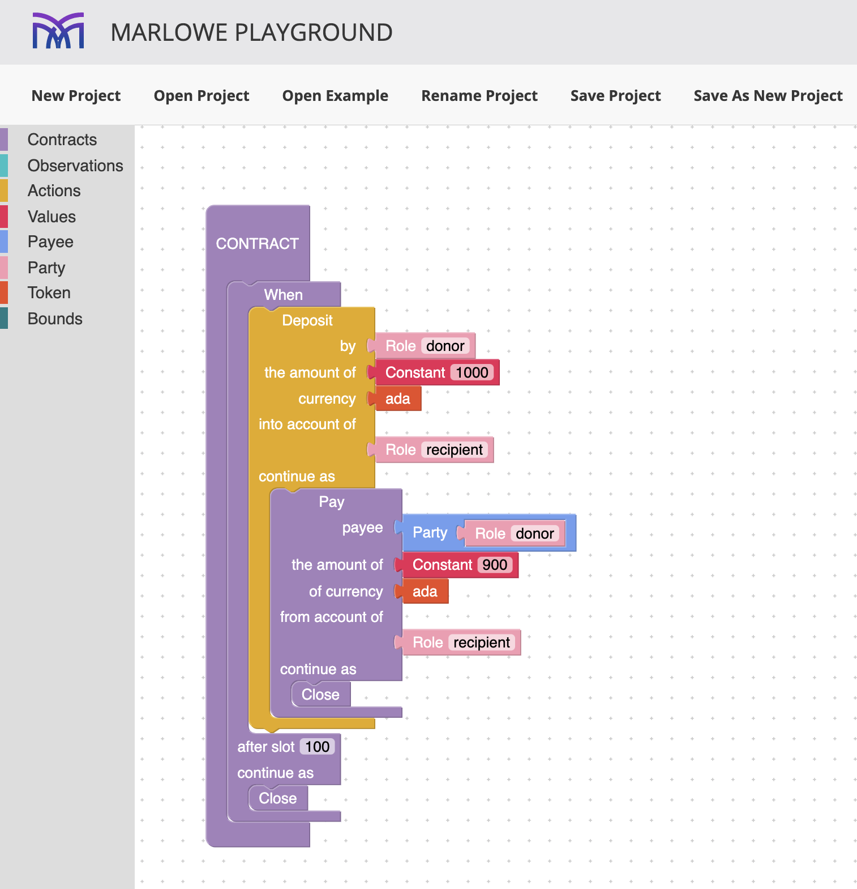
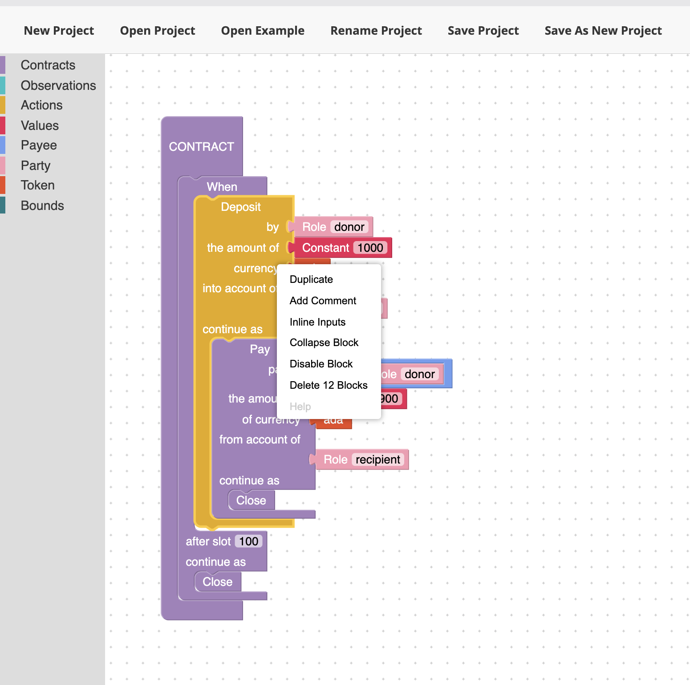

.. _playground-blockly:

Marlowe in Blockly
==================

So far in these tutorials we have concentrated on building contracts in
the textual version of Marlowe, embedded in Haskell, Marlowe contracts
can also be built using the Blockly visual programming environment, as
we describe here.

Getting started
---------------

To start building a Blockly project in the Marlowe Playground, which you
can find out more about in the section about
:ref:`playground overview <playground-overview>`,
select **New Project** and then **Blockly** for the project type. You’ll
now see a screen like this:

Contracts are assembled by adding components to the holes in the blocks.
To build a contract, we have to fill the single, top-level, hole here
with a ``Contract``, and blocks for these are found by clicking on
**Contracts** in the menu on the left hand side. Doing this shows all
the different blocks that build contracts, as shown here:

We can select one and drag it into the editing area, which has a dotted
background, like this:

and then fit it into the top-level hole, so that we’re constructing a
contract with a ``When`` as its main construct.

We can then repeat this process, adding contracts and other types of
components – all of which are shown in the menu on the left-hand side –
to build a complete contract, that is a contract that contains no holes.

Let’s fill in the timeout information and add a ``Close`` contract to be
performed in the case of timeout:

What action should we choose now? Again we see all the possible actions
by selecting **Actions** in the menu:

If we select a ``Deposit`` action we have a number of different types of
holes to fill.

Here we have to choose

-  A **Role** for the depositor

-  A **Value** which is the amount deposited …

-  … in the **Token** (often **ada**)

-  Where the money is to be deposited, give by a **Party**, which is
   either a **Role** or a **Public Key**.

In filling in some of these we have also to fill in a text field, or a
number, as shown in the final result here.

Finally, we have to decide what the *continutation* contract is: what
does the contract do next? That’s another contract. Here it is completed
as a payment:

Exercises
~~~~~~~~~

In Blockly, complete for yourself the construction of the contract
above.

What is the effect of the example contract? In particular, what are
the payments made by the contract?

Editing Blockly
---------------

Blockly contracts can be manipulated and edited using visual gestures
and keyboard short cuts.

-  Blocks can be **dragged** from holes, as well as being inserted.

-  There is a **right click menu** available, as seen in the image
   above, offering a range of options.

-  Typical editing short cuts are operative, e.g. DEL, ⌘C, ⌘V, and ⌘X on
   Mac OS.
