.. _playground-overview:

The Marlowe Playground
======================

This tutorial gives an overview of the `Marlowe Playground`_, an online
tool that allows users to create, to analyse, to interact with and to
simulate the operation of embedded Marlowe contracts.

Introducing the Marlowe Playground
----------------------------------

For Marlowe to be usable in practice, users need to be able to
understand how contracts will behave once deployed to the blockchain,
but without doing the deployment. We can do that by simulating their
behaviour off-chain, interactively stepping through the evaluation of a
contract in the browser-based tool, the Marlowe Playground, a web tool
that supports the interactive construction, revision, and simulation of
smart-contracts written in Marlowe.

Contracts can be authored in four different ways in the Playground. We
can write directly in Marlowe, or use the Blockly representation of
Marlowe. Marlowe is also embedded in Haskell and JavaScript, and we can
author contracts in these languages and then convert ("compile") them to
Marlowe in the Playground. Once a contract has been written in Blockly, Haskell, or JavaScript, we
can move to the Simulator to analyse and simulate the contract.

Work from the Playground can be saved as a github gist. Projects can be
reloaded or duplicated at a later time. Even without using github the
project is saved between sessions, but this is *volatile*, and will be
lost if browser caches are updated.

The rest of this section will cover the operation of the Playground in
more detail. Note that we use **bold** type for buttons and other components in what follows.

Getting started
---------------

The landing page for the Marlowe Playground looks like this

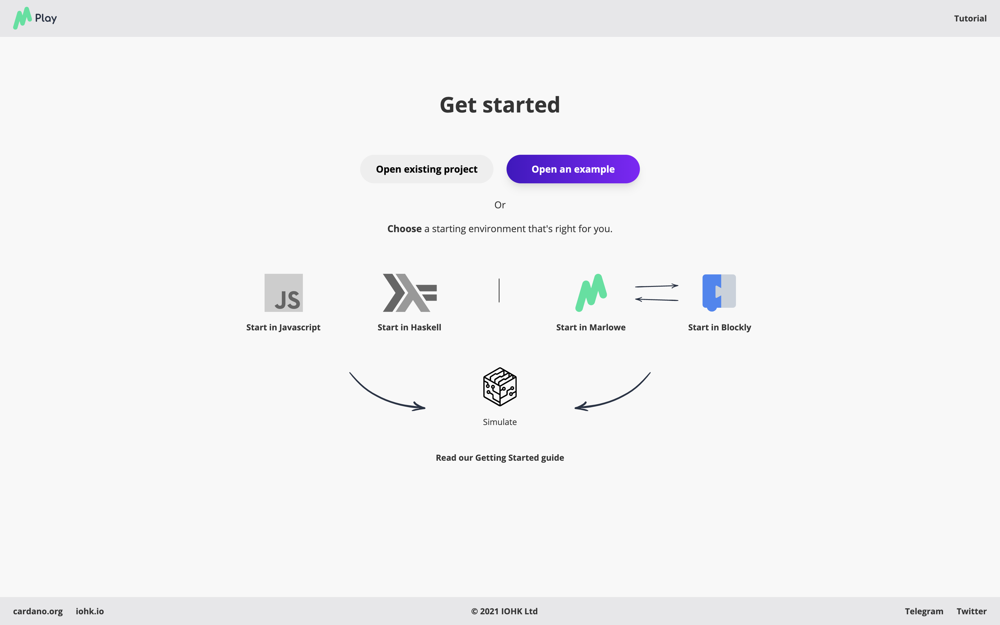

The title bar has a link to this tutorial at the right-hand side, and the footer has some general links.

The page offers three options

-  **Open existing project** This opens a project that has been saved previously.
   See the section on `Saving and Opening
   Projects <#_saving_and_opening_projects>`_ below for more details on
   setting this up.

-  **Open an example** This will load an example into the existing project,
   in the environment chosen by the user. 

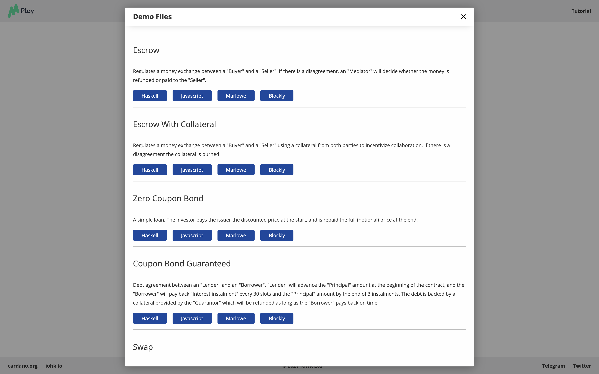

-  **Start something new** Here you're given the **choice**  to start in Javascript, Haskell, Marlowe or Blockly. 
-  Each of these choices is covered now.
    
- Wherever you start, you will have the chance to **simulate** the contracts that you develop.

The program editor used in the Playground is the Monaco editor
https://microsoft.github.io/monaco-editor/ and many of its features are
available, including the menu available on right-click.

The JavaScript Editor: developing embedded contracts
----------------------------------------------------

For details of how the JavaScript embedding for Marlowe is defined, 
see `Marlowe embedded in JavaScript <#_javascipt-embedding>`_ 

We can use JavaScript to make contract definitions more
readable by using JS definitions for sub-components, abbreviations, and
simple template functions. The JS editor is shown here.

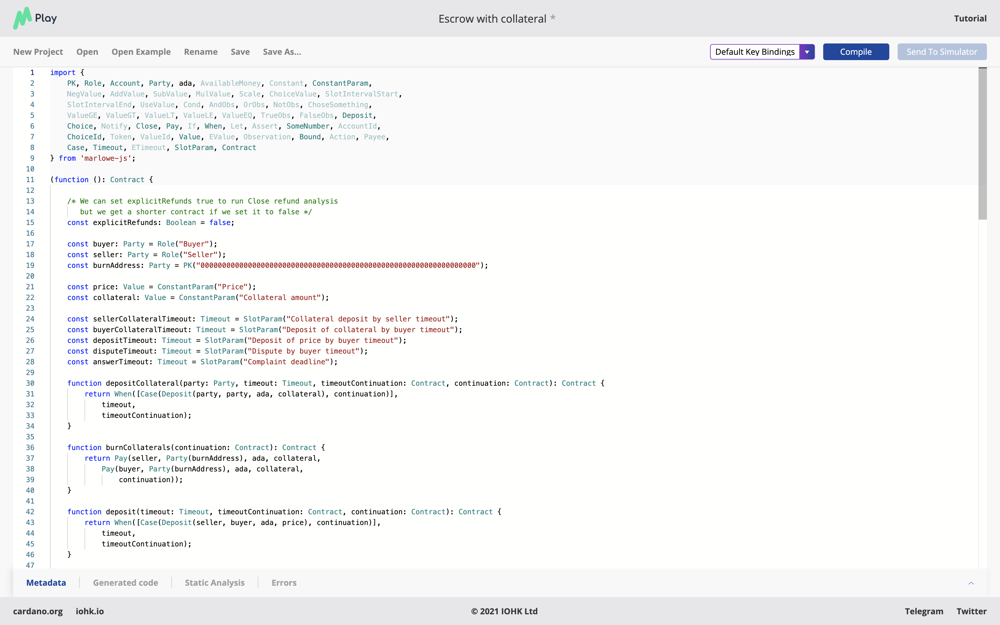

The JS editor is open here on the *Escrow with collateral* example contained in the
examples. To describe a Marlowe contract in the editor, a value of the
type ``Contract`` must be returned as result of the provided function by
using the instruction ``return``.

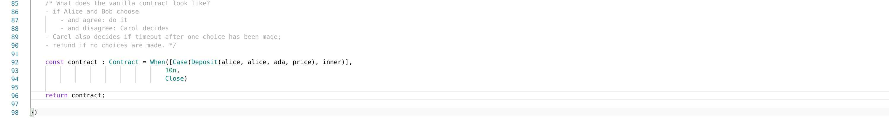

The editor supports auto-complete, error checking during editing, and
information about bindings on mouse over. In particular, using mouse
over on any of the imported bindings will show its type (in TypeScript).

The buttons in the header bar provide standard functionality:

- Create a **New Project**
- **Open** an existing project
- **Open** one of the built in **examples**
- **Rename** the existing project
- **Save** the current project under its current name (if it has one).
- **Save** the current project **as** a newly named one.

When you click the **Compile** button (in the top right-hand corner),
the code in the editor is executed, and the JSON object returned by the
function resulting from the execution is parsed into an actual Marlowe
contract; you can then press **Send to simulator** to begin contract simulation.

If compilation is successful, the compiled code is shown by selecting **Generated code** in the 
footer of the page; this can subsequently be minimised, too.

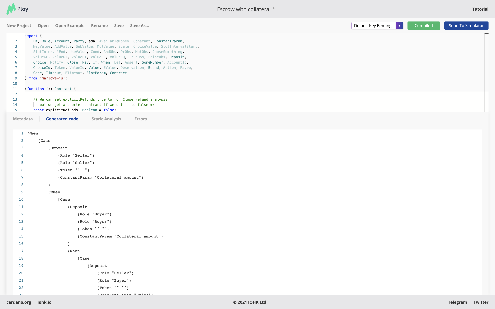

If the contract cannot successfully be converted to Marlowe, the errors
are also shown in an overlay accessible as **Errors** in the footer.

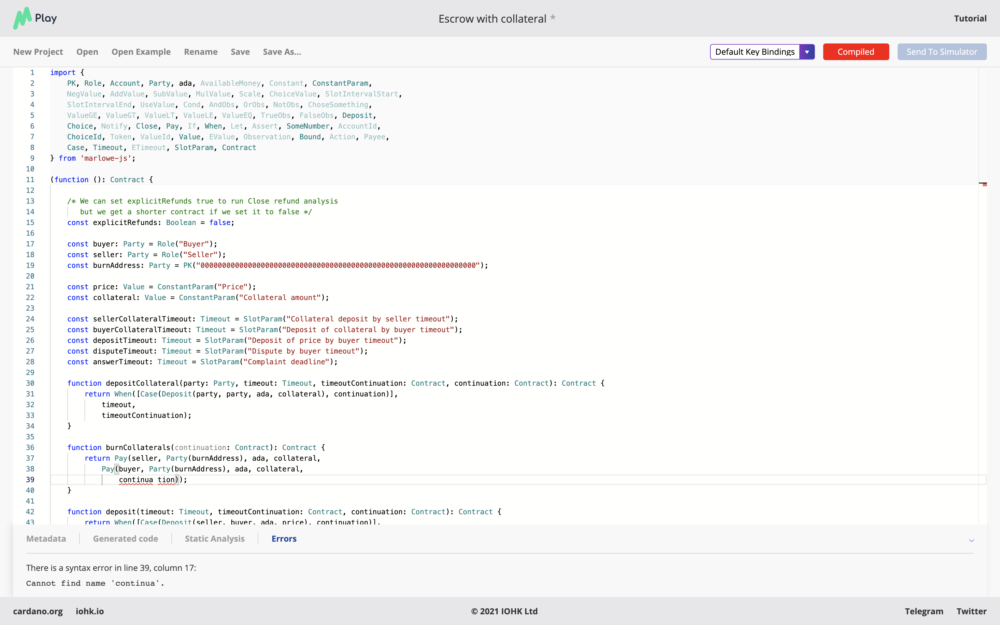

Looking again at the footer you can see that you can access the results of **Static analysis**, as described below, as well
as examine and edit the contract **Metadata**.

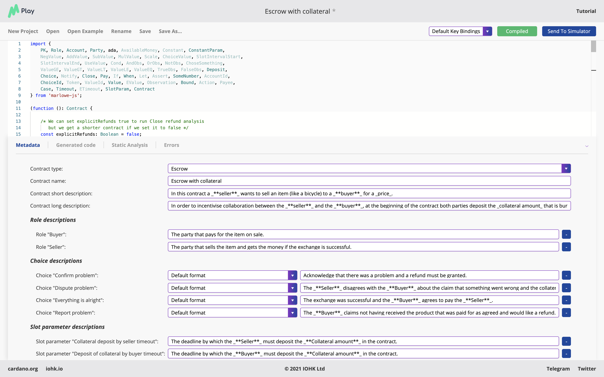

The metadata editor contains fields for general descriptions of every contract, but also supports the entry of 
information describing   

- roles
- parameters
- choices

When a contract is compiled successfully, the metadata editor will prompt
you to add metadata for the fields that correspond to the appropriate
elements of the contract, and to delete the fields that do not correspond
to anything in the contract.

Contract metadata not only provides documentation for Marlowe contracts, but is also used in Marlowe Run, the 
end-user client that is to be used to run Marlowe contacts on the Cardano blockchain.

The Haskell Editor: developing embedded contracts
-------------------------------------------------

The editor supports the development of Marlowe contracts described in
Haskell. We can use Haskell to make contract definitions more readable
by using Haskell definitions for sub-components, abbreviations, and
simple template functions. The Haskell editor is shown in the following
image.

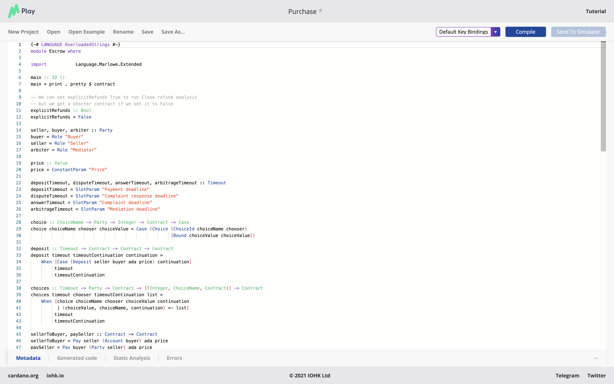

The editor supports auto-complete, error checking during editing, and
information about bindings on mouse over. The buttons in the header bar provide standard functionality:

- Create a **New Project**
- **Open** an existing project
- **Open** one of the built in **examples**
- **Rename** the existing project
- **Save** the current project under its current name (if it has one).
- **Save** the current project **as** a newly named one.

The Haskell editor is open here on the Escrow example contained in the
examples. To describe a Marlowe contract in the editor, we have to
define a top-level value ``contract`` of type ``Contract``; it is this
value that is converted to pure Marlowe with the **Compile** button (in
the top right-hand corner). If compilation is successful, the compiled
code is shown by selecting **Generated code** in the footer:

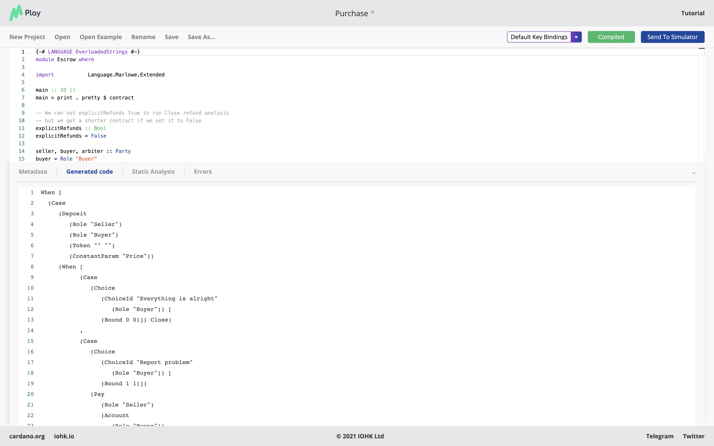

On successful compilation the result can be sent to the simulator or to
Blockly: these options are provided by the **Send to Simulator** and
**Send to Blockly** buttons in the top right-hand corner of the page.

If the contract cannot successfully be converted to Marlowe, the errors
are also shown by selecting **Errors** in the footer:

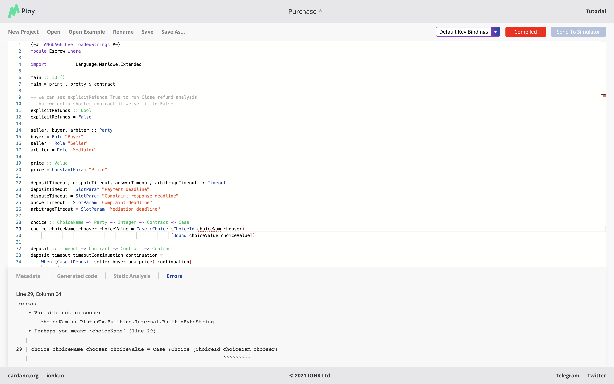

Looking again at the footer you can see that you can access the results of **Static analysis**, as described below, as well
as examine and edit the contract **Metadata**.

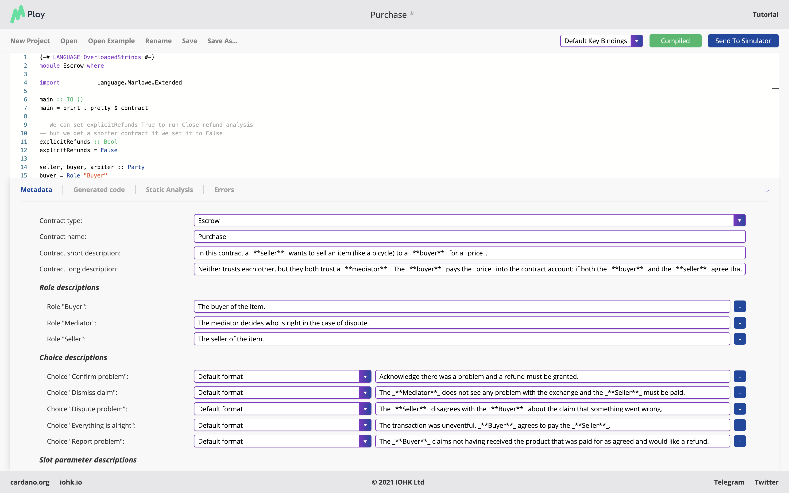

The metadata editor contains fields for general descriptions of every contract, but also supports the entry of 
information describing   

- roles
- parameters
- choices

When a contract is compiled successfully, the metadata editor will prompt
you to add metadata for the fields that correspond to the appropriate
elements of the contract, and to delete the fields that do not correspond
to anything in the contract.

Contract metadata not only provides documentation for Marlowe contracts, but is also used in Marlowe Run, the 
end-user client that is to be used to run Marlowe contacts on the Cardano blockchain.

Developing contracts in Blockly
-------------------------------

The playground provides a mechanism for creating and viewing contracts
in a visual form, rather than in text. This is discussed in this earlier
section on :ref:`Blockly <playground-blockly>`. Note that the Blockly editor also offers
access to the metadata editor and static analysis.

Developing contracts in Marlowe
-------------------------------

It is also possible to create contracts in "raw" Marlowe too.  
Marlowe is edited in the
Marlowe editor, and this gives automatic formatting (on right click) and
supports **holes** too.

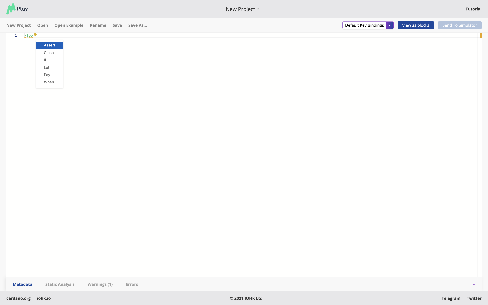

Holes allow a program to be built top-down. Clicking the lightbulb next
to a hole presents a completion menu, in each case replacing each sub
component by a new hole. For example, choosing ``Pay`` to fill the
top-level hole will result in this (after formatting on right click):

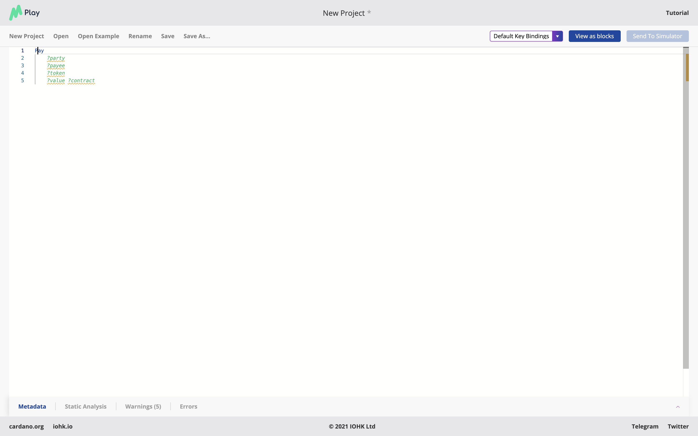

Holes can be combined with ordinary text editing, so that you can use a
mixture of bottom-up and top-down constructs in building Marlowe
contracts. Moreover, contracts with holes can be transferred to and from
Blockly: holes in Marlowe become literal holes in Blockly. To transfer
to Blockly use the **View as blocks** in the top right-hand
corner of the screen, and *vice versa*.

Simulating Marlowe contracts and templates
------------------------------------------

However a contract is written, when it is sent to simulation this is the
view seen first. Here we’re looking at the *Zero coupon bond* example.

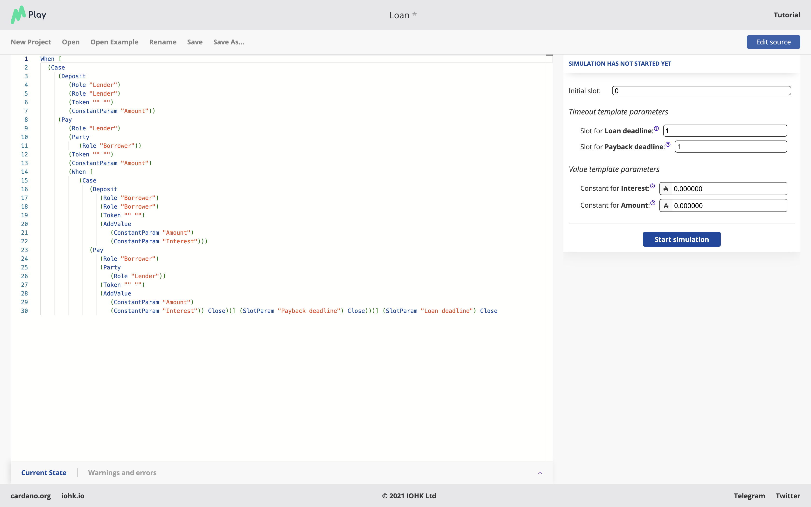

Before a simulation can be started you need to supply some information.

- The *slot number* at which to start the simulation.
- Any *value parameters*: in this case the amount loaned and the (added) amount of interest to be paid.
- Any *slot parameters*: here we give the time by which the lender has to deposit the amount, and
  the time by which the borrower needs to repay that amount with interest.

The code shown here presents the complete contract that is being
simulated. Once the simulation has begun, whatever of the contract remains to be
simulated is highlighted. The footer gives data about the simulation.

For our example let’s fill in the parameters like this, and retain slot 0 as the starting point.

Simulation is started by clicking the **Start simulation** button, and
once this is done, the available actions that will advance the contract
are presented. Note too that the whole contract is highlighted, showing that none
of it has yet been executed.

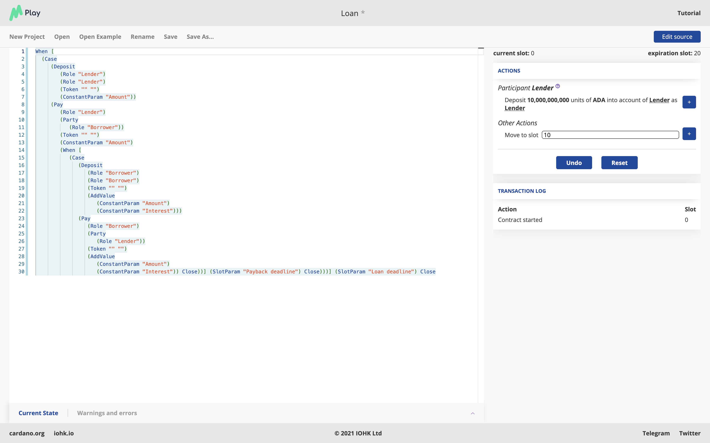

In this case there are two potential actions: the *Lender* can make a deposit of 10,000 Ada,
or the slot (time) can advance to ``10`` at which the wait for a deposit
times out. Two other generic actions can be taken too

-  **Undo** will undo the last action made in the simulator. This means
   that we can explore a contract interactively, making some moves,
   undoing some of them, and then proceeding in a different direction.

-  **Reset** will reset the contract and its state back to their initial
   values: the full contract and an empty state. It also *stops* the
   simulation.

For our example, let us select for the *Lender* to make the deposit of 10,000
Ada. We can do that with the **+** button next to this input. After
doing that we see

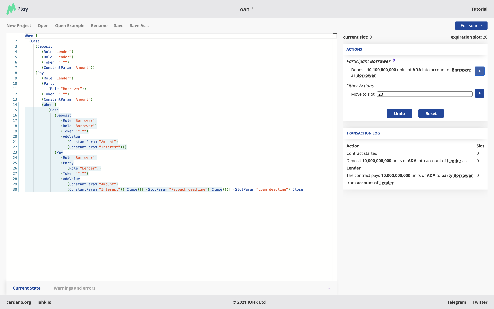

where we see to the right of the screen that the deposit has been made, followed by
an automatic payment to the *Borrower*. We can also see that the highlighted part has changed
to reflect the fact that the initial deposit and pay have been performed.

The remaining part of the contract is the repayment: if we select this action by the *Borrower* 
we see that the contract has completed.

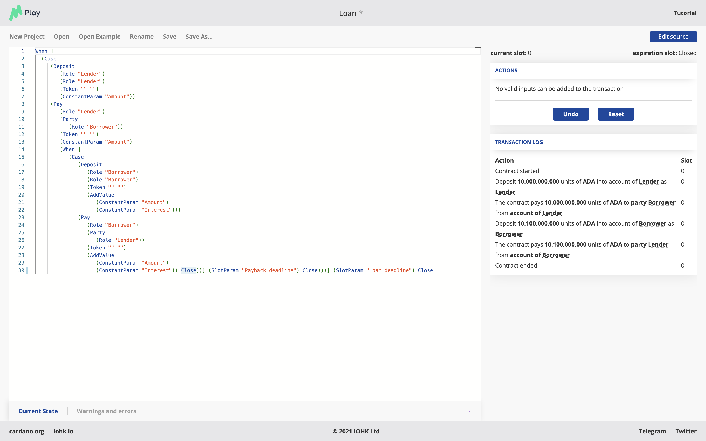

The log on the right hand side of the screen now gives a complete list of the actions undertaken 
by the participants and by the contract itself. One final note: we chose not to advance the slot at any time: this is consistent with the
contract design; on the other hand we didn’t see any *timeout* actions happening. Why not try 
this yourself? 

Oracle simulation
-----------------

As we noted earlier in the section on `??? <#_oracles>`_, the
Playground provides oracle values to simulations for the role
``"kraken"``. When the simulation reaches the point of simulating this
construct

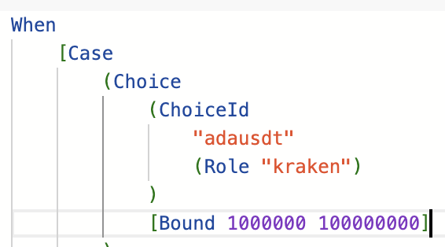

then the value is *pre-filled* in the simulation like this:

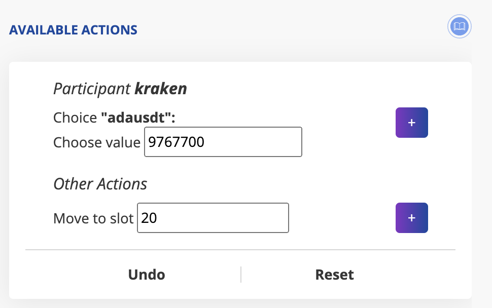

Saving and Opening Projects
---------------------------

Projects can be saved on github, and so when you first save a project
you will be prompted thus:

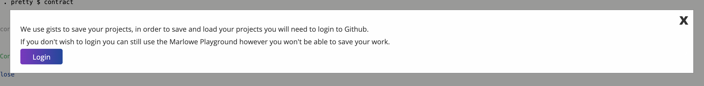

and, if you choose to **Login** there, you will be taken to a login
screen for github:

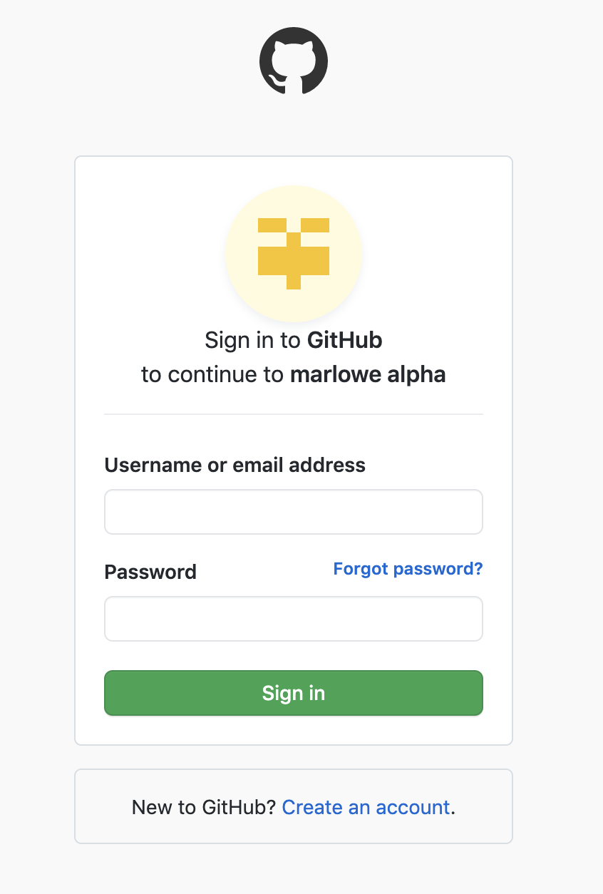

When you opt to **Open Project** you will be presented with a choice
like this:

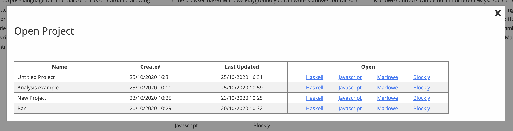

The Marlowe Playground does not provide a mechanism for deleting
projects, but this can be done directly on github.

Analysing a contract
--------------------

The static analysis of a contract is performed by selecting the **Static
analysis** tab in footer at the bottom of the page.

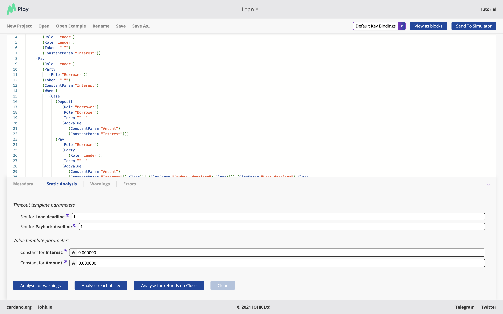

In order to analyse a *template* it is necessary to give values to any
of its parameters, as you can see in the screenshot.

Clicking the **Analyse for warnings** button results in the current
contract *in the current state* being analysed. The result is either to
say that the contract passed all the tests, or to explain how it fails,
and giving the sequence of transactions that lead to the error. As an
exercise try this with the ``Escrow`` contract, changing the initial
deposit from Alice to something smaller than 450 lovelace. More details
are given in the section on
:ref:`static analysis <static-analysis>` below.

The **Analyse reachability** button will check whether any parts of a
contract will never be executed, however participants interact with it.

The **Analyse for refunds on Close** will check whether it is possible for
any of the ``Close`` constructs to refund funds, or whether at every ``Close`` all
the funds in the contract have already been refunded.

Use the Marlowe Playground to interact with the example contracts and, in
particular try the contracts with different parameter values, and also modify them in 
various ways to see how contracts can fail to meet the analysis.

