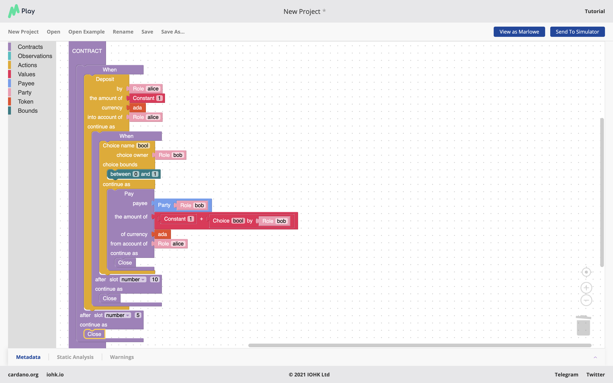
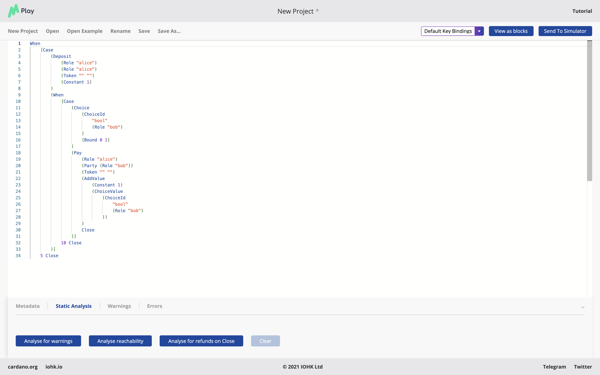
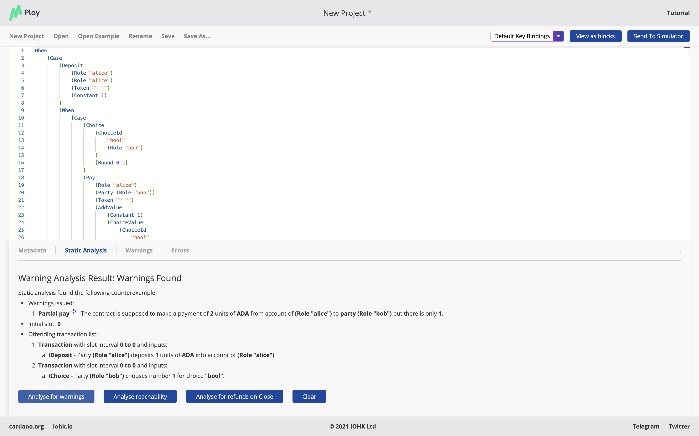

.. _static-analysis:

Static analysis
===============

One distinctive feature of Marlowe – probably its most distinctive
feature – is that we can analyse contracts, and deduce properties of
them, without running them.

We can check, in advance of running a contract, these properties:

-  Partial payments: i.e. payments when there was not enough money in
   account.

-  Non positive deposits: under which the contract asks for a value
   which is negtive or zero.

-  Non positive payments: payments of 0 or a negative amount.

-  Shadowing of Lets , where two ``Lets`` set the same identifier in the
   same execution path.

In the rest of this tutorial we will focus on the first of these, which
is the worst kind of error. It is in this case that a payment fails,
because there is not enough money in the contract (or more strictly in
the account) to make a complete payment.

An example
----------

Let us look at this example, in Blockly

and in pure Marlowe

The contract first requires a deposit from Alice of ``1`` Lovelace, and
then asks Bob to make a choice (called ``bool``) of ``0`` or ``1``. The
contract then pays this choice *plus one* to Bob from Alice’s account.

So, we can see that while the contract works OK when Bob chooses ``0``,
there won’t be enough in the contract to pay him if he chooses ``1``.
Our analysis, which is built into the SIMULATION tab in the Marlowe
Playground, can diagnose this:

This shows that the error occurs when

-  Alice has made the deposit, and

-  Bob has chosen the value ``1``.

and that the error generated is a ``TransactionPartialPay``: in this
case Bob only receives a payment of ``1`` instead of ``2``.

If we modify the contract so that Alice makes an initial deposit of
``2``, then the analysis will succeed:

.. image:: images/analysis4.png
   :alt: Successful analysis

Under the hood
--------------

Just to re-iterate: the effect of this analysis is to check *every
possible execution path* through the contract, using a symbolic version
of the contract. This gets passed to the Z3 SMT solver, which is a
state-of-the-art automated system for deciding whether logic formulas
are satisfable.

If the analysis is not successful, i.e. if there is a way of making the
contract fail a payment, then the system will also *give an example* of
how it can go wrong, and present that to the user. Users can then fix
the problem, and check it again.

Next steps
----------

In the next few months we will look at how to present the results of our
analysis in a more "user friendly" way, as well as broadening out the
scope of our work.

Use the analysis button in the Marlowe Playground to analyse some of the
contracts that you have already written. If the analysis fails, can you
see why, and correct the contracts so that they do not fail.
