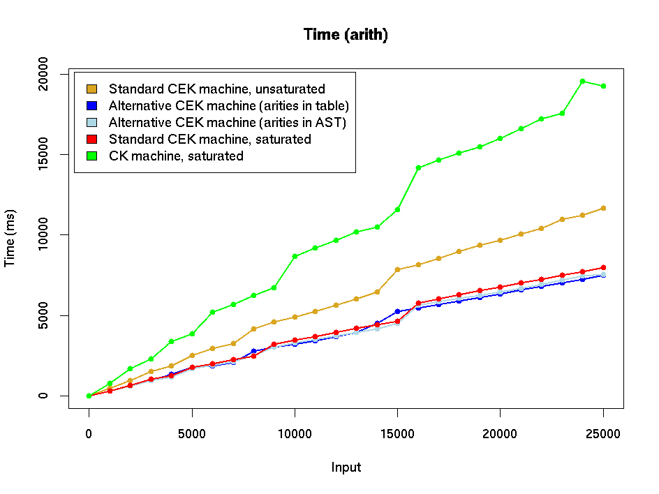

# Experiments with variations on the CEK machine - Appendix

The graphs in [CEK-variations-stats.md](./CEK-variations-stats.md) don't include
the CK machine because doing that usually compresses the information
for the CEK machine, which is what we really care about.  For
completeness, here are graphs including the CK machine (using
saturated builtins).  

