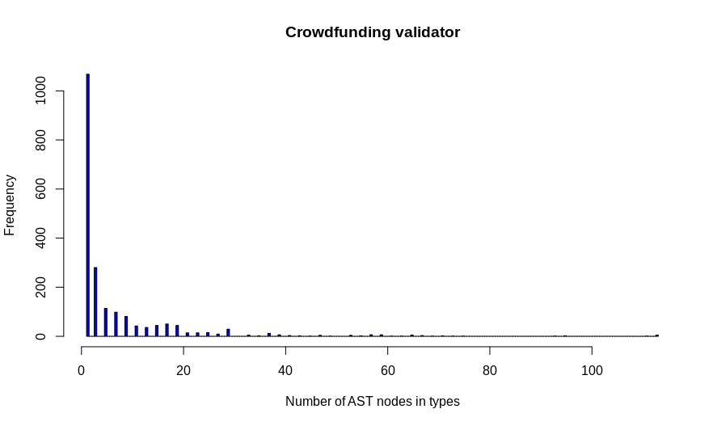
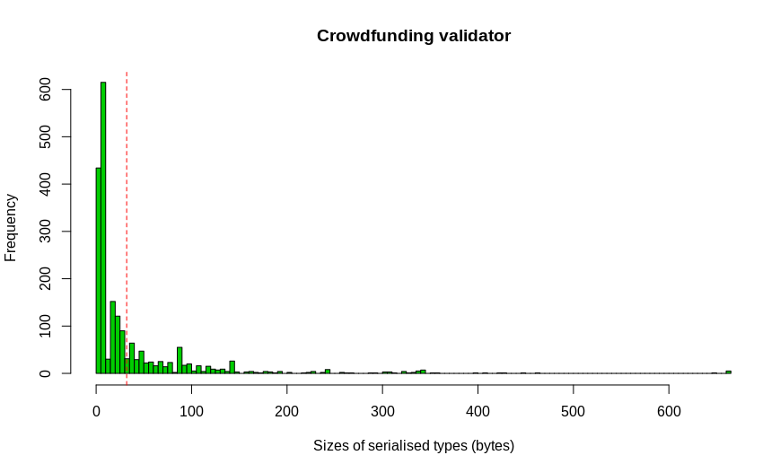
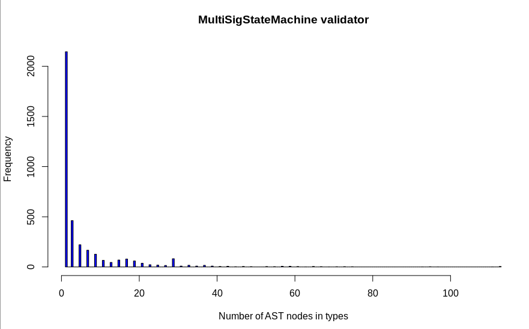
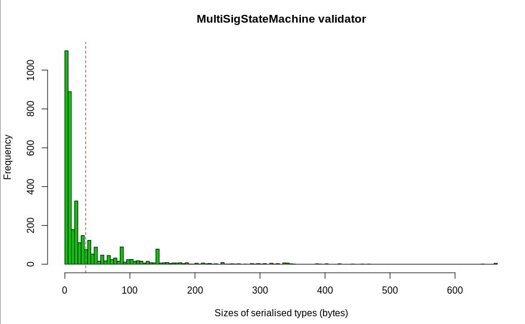

## 2. Merkle trees and Merklised Abstract Syntax Trees

A [Merkle tree](https://en.wikipedia.org/wiki/Merkle_tree) is a tree with blocks of data at the leaves; internal nodes contain cryptographic hashes of the contents of their child nodes.  The hash at the root is called the _Merkle root_ of the tree.  The advantage of Merkle trees is that one can prove that a block of data occurs in the tree just by supplying the data and the path from the root to the leaf containing it, together with the hashes of branches which are not taken.  Given this information, one can calculate what the Merkle root of the tree should be and compare it with the Merkle root of the complete tree (provided by some trusted entity). 

### Merklised ASTs and Bitcoin

The term _Merklised Abstract Syntax Tree_ (MAST) is used in various Bitcoin proposals to reduced the size of validation code (see [BIP 114](https://github.com/bitcoin/bips/blob/master/bip-0114.mediawiki), [BIP 116](https://github.com/bitcoin/bips/blob/master/bip-0116.mediawiki), [BIP 117](https://github.com/bitcoin/bips/blob/master/bip-0117.mediawiki), for example; also see [this paper](https://rubin.io/projects/MAST/) by Rubin et al.).  In the Bitcoin setting, the abstract syntax trees represent [Bitcoin script](https://en.bitcoin.it/wiki/Script).  Bitcoin script is quite a simple language, and in particular has no looping constructs.  This means that the most complex scripts one can write are essentially trees of if-then-else blocks, and the most complex validation code that occurs is effectively a large OR of a number of independent validation conditions.  This fits well with the Merklisation technique described above, with the separate validation conditions appearing as blocks of code at the leaves.  When one wishes to prove that one has the authority to spend an output, it is only necessary to provide an AST containing the particular validation code which has to be executed, and it can still be checked that the Merkle root of the AST is the same as that provided for the validation code for the transaction (I'm still a bit hazy about the precise details here).  This also has the claimed advantage that it's not necessary to reveal irrelevant information, such as un-executed validation code which might be used to identify other potential participants in the transaction.

### Merklised ASTs and Plutus Core
See [this document](./PLC-AST-types.md) for a summary of the structure of Plutus Core ASTs.

The Merklisation technique described above is not suitable for Plutus Core validation code.  Here validators do not just consist of a collection of independent sub-validators; instead, one can have very complex ASTs where a lot of important code is contained in internal nodes.  To deal with this I've used a variant of the standard Merklisation technique.

#### Modified Merklisation technique
For each AST node `N` we can produce a hash `M#(N)` as follows:

  * Take some unique bytestring identifying the type of the node (for example, serialise the name of the constructor).  This is required in case two different types of node have the same structure but different functions.
  * Serialise all of the contents of the node into bytestrings.
  * Recursively calculate `M#(S)` for every child `S` of `N` and serialise these hashes to obtain bytestrings.
  * Concatenate all of these bytestrings and take a cryptographic hash of the result (in my experimental implementation I've used SHA-256 for this, giving 512-bit/32-byte hashes).

This produces a Merkle root which will identify a Plutus Core AST uniquely, modulo the usual assumptions about cryptographic hash functions. 

When we run a validator with a particular input, not all of the nodes
in its AST may actually be required.  By extending the Plutus Core AST
type slightly we can produce ASTs which omit unneeded nodes while
still having the same Merkle root. To do this, introduce new
constructors `Pruned` into the `Term` type and `PrunedTy` into the
`Type` type, each with a single argument containing a hash.  To
Merklise a validator with particular inputs, we run it with those
inputs and observe (using a suitably modified evaluator) which nodes
are actually used during execution.  Having done this, we take the
unused nodes and replace each one with a `Pruned`/`PrunedTy` node
containing their Merkle hashes.

The function `M#` for calculating Merkle hashes now has to be extended
to deal with `Pruned` nodes: we do exactly the same as above except
that when we encounter a `Pruned` node we just extract the hash which
it contains rather than calculating a new hash. This means that if we
take an AST `T` and another AST `T'` obtained by replacing any number
of nodes with their `Pruned` version, then we have `M#(T) = M#(T')`.
This allows one to use a validator which has been shrunk to contain
only relevant code, while allowing an on-chain check that the Merkle
hash is as expected.  If such a validator is executed and an attempt
to evaluate a `Pruned` node is encountered then validation should
fail.  This might happen if, for example, Merklisation was performed
with program inputs differing from those provided on chain.

#### The cost of calculating Merkle hashes

The procedure described above requires quite a lot of computation, and
here we try to quantify this. To do this, it's necessary to understand
the basic structure of the
[SHA-256](https://en.wikipedia.org/wiki/SHA-2) algorithm.

The core of the algorithm is a _compression function_ which maps
768-bit numbers to 256-bit numbers.  Computing the compression
function involves 64 rounds of quite complex bit-twiddling operations.
The compression function is extended to bytestrings of arbitrary
length using the [Merkle-Damgård
construction](https://en.wikipedia.org/wiki/Merkle%E2%80%93Damg%C3%A5rd_construction),
which essentially folds the compression function over the input
bytestring.  In more detail, the algorithm pads the input so that its
length is an exact multiple of 512 bits and then processes it in
512-bit blocks. It begins with a fixed 256-bit _initialisation
vector_, appends the first block, and applies the compression function
to get a new 256-bit value; this process is completed until the entire
input has been consumed, and the final 256-bit value is the SHA-256
hash of the input.  The cost of computing the SHA-256 hash is thus
proportional to the number of 512-bit (64-byte) blocks in the padded
input.  The padding procedure adds at least 65 bits to the size of the
input, and an input consisting of at most 447 bits can be processed
with a single application of the compression function.

Contract addresses are currently calculated as the SHA-256 hash of the
CBOR-serialised contract, so the number of applications of the
compression function required will be about `ceil(s/64)`, where `s` is
the number of bytes in the serialised contract.  Calculating a Merkle
hash as described above requires one SHA-256 computation per AST node,
and typically the serialised contents of each node will be under the
447-bit limit mentioned above, so we will require about `n`
applications of the compression function, where `n` is the number of
nodes in the AST.

The table below contains these figures for our example contracts.

| Contract | Number of nodes | Serialised size (bytes) | 512-bit blocks | Merkle hash overhead |
| :---: | ---: | ---: | ---: | ---: |
| Crowdfunding | 18540 | 110413 | 1726 | 10.7x |
| Currency | 25478 | 159160 | 2487 | 10.2x |
| Escrow | 19891 | 117438 | 1835 | 10.8x |
| Future | 36026 | 206137 | 3221 | 11.2x |
| Game | 14465 | 98970 | 1547 | 9.4x |
| GameStateMachine | 20664 | 117053 | 1829 | 11.3x |
| MultiSig | 16766 | 111990 | 1750 | 9.6x |
| MultiSigStateMachine | 33897 | 196628 | 3073 | 11.0x |
| PubKey | 15815 | 106535 | 1665 | 9.5x |
| Swap | 23332 | 154724 | 2418 | 9.6x |
| TokenAccount | 13690 | 78030 | 1220 | 11.2x |
| Vesting | 20440 | 119514 | 1868 | 10.9x |

This suggests that Merkle hashing is typically 9-11 times more
expensive than our current contract address scheme.  The figures above
are just based on the estimated number of applications of the SHA-256
compression function though, and ignore the overhead involved in CBOR
serialisation (although we have do do that anyway) and in the AST
traversal and node-serialisation required to calculate Merkle hashes.
If this question becomes important, we could do some experiments to
measure actual computation times of the two methods.

#### Objections to Merkle hashes

  * As seen above, calculating the Merkle hash of an AST is quite
    expensive.  It requires repeated calculation of SHA-256 hashes,
    which are computationally expensive.

  * For theaddr esses of scripts, we currently use a SHA-256 digest of
    their serialised form.  This will not be the same for an AST and a
    version where some nodes are Merklised away.  We'd probably need
    to need to start using expensive Merkle hashes for contract
    addresses instead, which would be quite a big change.

  * Why bother?  Can't we just take an AST with some missing nodes and
    compare it with the known full AST?  Maybe this would require more
    on-chain storage.

#### Security
  * Think carefully about the claims made above about the extended Merklisation process.
      * The current implementation is a bit crude, but is OK for prototyping purposes.
  * See eg https://github.com/sipa/bips/blob/bip-schnorr/bip-taproot.mediawiki for some issues regarding security and Merklised ASTs in Bitcoin.

## Merklising types

Since types are not used during evaluation of Plutus Core programs,
every type (and there are a lot of these ) in a program with be
replaced by a Merkle hash before submission to the chain if we apply
the Merklisation process above without modification. The experiments
below show that this is not a good strategy.

### Merklising all types

The following table shows what happens if we Merklise all of the types
in the validators for our [use
cases](https://github.com/input-output-hk/plutus/tree/master/plutus-use-cases),
leaving terms untouched.  The first two columns show the total number
of nodes in the validator AST and the number used by types, and the
final two columns show the serialised sizes of the original AST and
the version of the AST with all of the types Merklised.  The second
row for each contract shows the compressed sizes of the two serialised
ASTs.

| Contract | Total Nodes | Type nodes | Serialised Size | Serialised, types Merklised |
| :---: | ---: | ---: | ---: | ---: |
| Crowdfunding | 18540 | 13877 | 110413 (100.0%) | 95951 (86.9%) | 
| (Compressed) | | | 21440 (19.4%) | 40230 (36.4%) |
| Currency | 25478 | 18169 | 159160 (100.0%) | 155312 (97.6%) | 
| (Compressed) | | | 29004 (18.2%) | 54210 (34.1%) |
| Escrow | 19891 | 14674 | 117438 (100.0%) | 102931 (87.6%) | 
| (Compressed) | | | 22064 (18.8%) | 39698 (33.8%) |
| Future | 36026 | 26725 | 206137 (100.0%) | 176634 (85.7%) | 
| (Compressed) | | | 40134 (19.5%) | 70530 (34.2%) |
| Game | 14465 | 9978 | 98970 (100.0%) | 101915 (103.0%) | 
| (Compressed) | | | 16898 (17.1%) | 30777 (31.1%) |
| GameStateMachine | 20664 | 14710 | 117053 (100.0%) | 107203 (91.6%) | 
| (Compressed) | | | 22322 (19.1%) | 41789 (35.7%) |
| MultiSig | 16766 | 11312 | 111990 (100.0%) | 118709 (106.0%) | 
| (Compressed) | | | 19771 (17.7%) | 36964 (33.0%) |
| MultiSigStateMachine | 33897 | 23923 | 196628 (100.0%) | 189564 (96.4%) | 
| (Compressed) | | | 37535 (19.1%) | 69999 (35.6%) |
| PubKey | 15815 | 10738 | 106535 (100.0%) | 112243 (105.4%) | 
| (Compressed) | | | 18483 (17.3%) | 34079 (32.0%) |
| Swap | 23332 | 15270 | 154724 (100.0%) | 171136 (110.6%) | 
| (Compressed) | | | 28243 (18.3%) | 55288 (35.7%) |
| TokenAccount | 13690 | 11226 | 78030 (100.0%) | 52410 (67.2%) | 
| (Compressed) | | | 15765 (20.2%) | 29539 (37.9%) |
| Vesting | 20440 | 15480 | 119514 (100.0%) | 101552 (85.0%) | 
| (Compressed) | | | 23348 (19.5%) | 43789 (36.6%) |

We see that Merklising all of the types in general doesn't save much
space.  This is because types are generally quite small (see below)
and replacing them all with 32-byte hashes doesn't do a lot of good.
Note also that after Merklisation the serialised code becomes much
less compressible: this is because we replace the fairly simple
structured AST representations of types with incompressible hashes.

### Distribution of types sizes

I looked at the details of the distribution of type sizes for the
validators of the `Crowdfunding` and `MultiSigStateMachine`
contracts. (These were actually earlier versions of the validators
(with the old contract API), but the figures are similar for the
current validators).

#### Crowdfunding

The two histograms below how the distributions of the number of AST
nodes in types (and kinds) and their serialised lengths.  The vertical
red line in the second histogram is at 32 bytes: to the left of this
Merklisation is counterproductive because it increases the size of the
type.  It is clear that the majority of types are relatively small,
with a long tail of a few very large types.

The validator contains 2016 types and kinds, totalling 13634 nodes. The
mean number of nodes is 6.76.  The total size of serialised types is
76242 bytes. 

The mean number of bytes in serialised types is 37.8, and 72% of the
types (1446 types) have serialised size <= 32.  The maximum
serialised type size is 664. The minimum serialised size is 2, and 276
types are of this size; 158 have length 3, so 22% of the serialised
types have length 2 or 3.

#### MultiSigStateMachine
The distribution of type sizes is shown in the two histograms below; again,
the majority of the types are small.

The `MultiSigStateMachine` validator contains 3750 types and kinds, totalling 23052
nodes.  The mean number of nodes is 6.14.  The total size of serialised
types is 126034 bytes.

The mean number of bytes in serialised types is 33.6, and 75% of the
types (2808 types) have serialised size <= 32.  The maximum
serialised type size is 661. The minimum serialised size is 2, and 417
types are of this size; 683 have length 3, so 30% of the serialised
types have length 2 or 3.

#### Duplicated types

Visual inspection of the types above (rendered using `show`) reveals a
great deal of repetition.  For example, in the `MultiSigStateMachine`
validator (3750 types and kinds in total), `TyBuiltin () TyInteger`
appears 543 times, 
`TyVar () (TyName {unTyName = Name {nameAttribute =(), nameString = "Unit", nameUnique = Unique {unUnique = 0}}})` 
(the name of unit type) appears 385 times, and `TyBuiltin () TyByteString` 
appears 137 times. Another 19 types appear 10 to 80 times each.

Kinds are even more repetitious: 457 kinds appear in the
`MultiSigStateMachine` validator, but there are only 4 unique ones:
`*` (417 times), `* -> *` (36 times), `* -> (* -> *)` (5 times), and
`(* ->*) -> *` (once).  These kinds take up 1, 3, 5, and 5 nodes
respectively.

The preponderance of small types explains the shapes of the histograms above.

A related issue here is that CBOR serialisation does not preserve
sharing.  In the GHC heap an AST may contain multiple pointers to the
same type object, but when the AST is serialised the structure will be
flattened out and the output will contain multiple occurrences of the
serialised type (this probably partially explains why the amenability
of the CBOR to compression).  When the CBOR is deserialised on-chain
we will get multiple copies of the types in the heap.  One way to
avoid this would be to intern types in a separate table and have
references to this table in the AST; this would probably reduce the
size of the AST substantially.

## Conclusions on types and Merklisation

Our ASTs contain a lot of type information: the earlier table shows
that typically 70% or more of the nodes in an AST are accounted for by
types.  The table in
https://github.com/input-output-hk/plutus/blob/master/docs/plutus-core/Merklisation/Erasure.md
shows that a great deal of space can be saved if we use an untyped
representation.

It might be hoped that Merklisation would enable us to retain types
for on-chain code but reduce sizes.  The figures above suggest quite
strongly that this is not the case.  We haven't yet said anything
about Merklising away unused code (see
[Merklising-programs.md](./Merklising-programs.md)), but even when we
do this the problems above will still persist: types will still
account for the majority of remaining AST nodes, and indiscriminate
Merklisation of types won't help to reduce sizes much.

There are at least four possible ways to deal with this.
  * Discard types entirely. This saves a great deal of space.
  * Don't Merklise types at all.
  * Only Merklise types if their serialised forms take up more than 32 bytes.
  * Avoid type duplication by interning types.

## Further results
See [this page](./Merklising-programs.md) for some experiments on Merklising the validators in our example contracts.