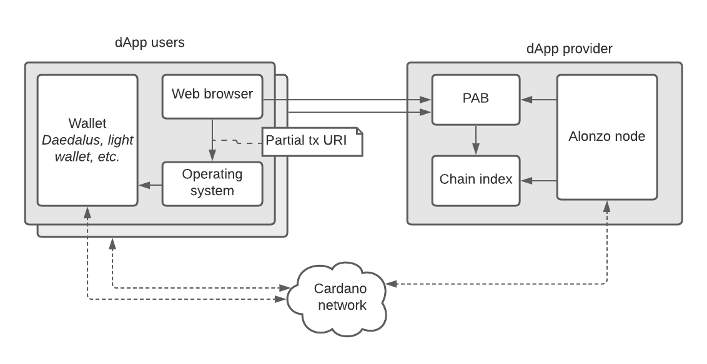
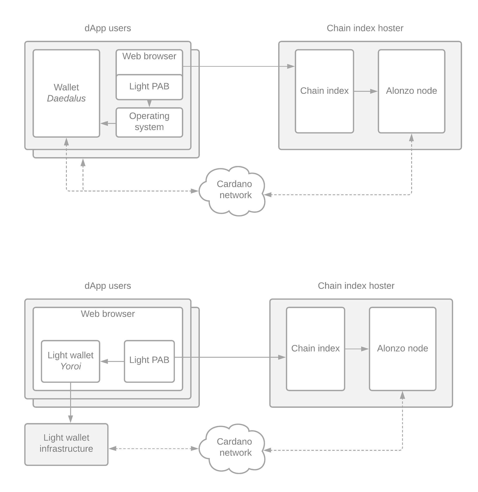

.. _what_is_the_pab:

What is the PAB?
================

PAB is short for *Plutus Application Backend*.
The Plutus Application Backend is the client-side runtime for :term:`Plutus apps<contract application>` that are built with the :ref:`Plutus Platform<what_is_the_plutus_platform>`.
It is the PAB's task to deal with requests from running ``Contract`` instances, to forward user input to them, and to notify them of ledger state change events.

.. TODO: Ref. to `Contract` type

The ``plutus-pab`` cabal package in the Plutus repository defines a ``plutus-pab`` Haskell library.
Application developers use this library to build the actual PAB executable, specialised to one or more of their ``Contract`` s.

.. note::
    In an older version of the PAB, each ``Contract`` was compiled to a separate executable, and there was a single PAB that knew about all the locally available excutable contracts.
    This approach is not supported anymore.

Client interface
----------------

The PAB provides an HTTP and websocket interface for interacting with ``Contract`` instances.
All PAB operations, including starting new instances, calling endpoints on instances, and querying instance state, are performed using this API.
Application developers can build their own frontends and server processes that make HTTP calls to the PAB.

Other components
----------------

In addition to the PAB itself, the following components are required.

.. _pab_chain_index:

Chain index
~~~~~~~~~~~

The chain index is a database of data gathered from Cardano transactions.
It uses the Cardano node's chain sync protocol.
Therefore it needs to be co-located with a Cardano node.
The chain index is a read-only component for the PAB.
Multiple instances of the PAB can therefore share a single instance of the chain index.

The expressiveness of queries supported by the chain index lies somewhere between that of the node, which answers queries related to the ledger state, and that of ``db-sync``, which has a full history of all transactions and an expressive database schema for staking and other information.

All chain index queries are served over an HTTP API.

Alonzo node
~~~~~~~~~~~

The PAB subscribes to ledger state updates from the node, using a socket protocol.

Wallet
~~~~~~

A Cardano wallet is required for balancing and signing transactions.
Balancing means taking a partial transaction and adding inputs and outputs to make the transaction valid.

Take :ref:`Marlowe<introducing-marlowe>` as an example.
When the user first starts a Marlowe contract, funds need to be transferred from one of the user's addresses to the contract address.
This is achieved by sending a partial transaction that has zero inputs and a script output for the Marlowe contract instance to the wallet for balancing.
The wallet adds some of its own inputs to cover the amount that is to be paid into the contract, plus a change output for any excess funds.
When the Marlowe contract has finished, funds are transferred back to the user's wallet using the same mechanism:
The PAB sends another partial transaction, this time with a single script input and no outputs.
The wallet then adds an output at one of its own addresses to receive the funds.

Deployment Scenarios
--------------------

There are two deployment models envisaged for the PAB: Hosted and in-browser.
The hosted variant will be supported at the initial release of the PAB.
The in-browser variant wil be available after the initial release.

Hosted
~~~~~~

In the “Hosted PAB” scenario, the dApp provider / developer hosts an instance of the PAB alongside the :ref:`chain index<pab_chain_index>` and an Alonzo node.
The off-chain code of the Plutus app is run on the dApp provider’s infrastructure.
Coin selection and transaction signing (in short: anything that deals with the user’s money) happens on the user’s machine.

    The hosted deployment scenario for the PAB.

In-browser
~~~~~~~~~~

In the “In-browser PAB” scenario, the PAB runs in the user’s browser, and therefore all of the off-chain code of the app is run on the client’s machine.
A centrally hosted :ref:`chain index<pab_chain_index>` is still required. 
This can be shared with other applications as the chain index is a read-only component.

    The in-browser deployment scenario for the PAB.
