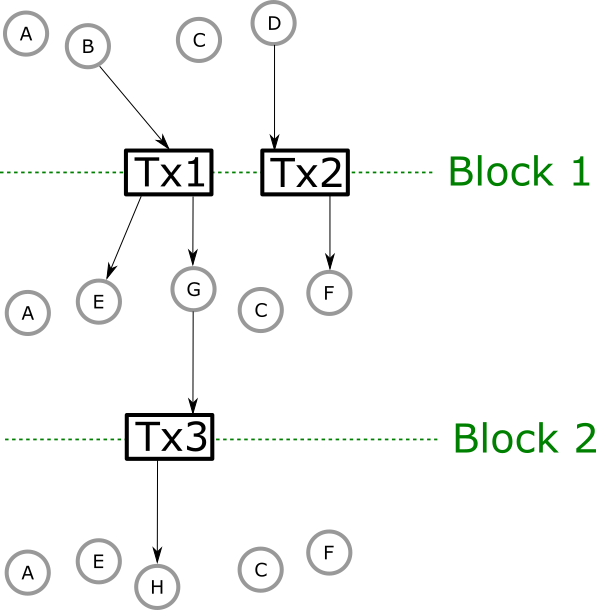

.. _what_is_a_rollback:

What is a rollback?
===================

The Cardano network is a distributed system with many nodes operating at the same time.
Each node keeps its own local copy of the blockchain, extending it regularly with new blocks.
At the same time, the node is talking to some of the other nodes in the network in order to establish a consensus about what *the* canonical blockchain should be.
Sometimes the node discovers that its local version of the blockchain is different from the canonical one that the other nodes agree on.
When that happens, the node has to switch to the correct blockchain.
In order to perform this switch, the node first *rolls back* its own blockchain, by discarding the last couple of blocks that are different from the target blockchain.
After the rollback, the node's local blockchain is a prefix of the target chain, so the node can safely *roll forward*, to catch up with any missing blocks that exist on the target chain but haven't yet been added to the local chain.

.. note::

    Rollbacks are part of the normal operation of the consensus algorithm and happen frequently.

Rollbacks cannot extend indefinitely into the past: The maximum number of blocks that may be discarded due to a rollback is defined as a chain constant `k`, and any blocks that are deeper than `k` blocks in are guaranteed to never be rolled back.

What does this mean for dapps?
~~~~~~~~~~~~~~~~~~~~~~~~~~~~~~

To a Plutus app whose on-chain state is a set of :term:`unspent transaction outputs <UTXO>`, the effect of a rollback is to undo changes to the state of transaction outputs that were performed by transactions which are now being dropped as part of the rollback.
Let's look at a concrete example to illustrate the effect of rollbacks.

    Illustration of a blockchain with two blocks. Block 1 contains two transactions and block 2 contains one transaction.

In the example above, we have three different UTXO sets, and two blocks that transition between them:

+-----------+-----------------+----------------------------+
|UTXO set # | Unspent outputs | Changes to previous        |
+===========+=================+============================+
|         1 | A, B, C, D      | N/A                        |
+-----------+-----------------+----------------------------+
|         2 | A, C, E, F, G   | B, D removed. E,F,G added. |
+-----------+-----------------+----------------------------+
|         3 | A, C, E, F, H   | G removed. H added.        |
+-----------+-----------------+----------------------------+

Now assume that the second block is rolled back, and our new ledger state is UTXO set No. 2 in the table.
Rolling back the block undoes the changes of Tx3: The state of output G changes back to *unspent* and H disappears altogether, so its new state is *unknown*.
If we roll back both blocks then the state of outputs B, D, E, F and G is also affected. B and D are now *unspent* and E, F, and G are *unknown*.

Note that transactions that were rolled back may be reapplied if they are still valid, that is if their inputs haven't been spent by other transactions.
For example, after rolling back block 2, Tx3 could be added to new chain at a later stage (perhaps as part of a different block).
Then the state of G would change again, from *unspent* to *spent*.
