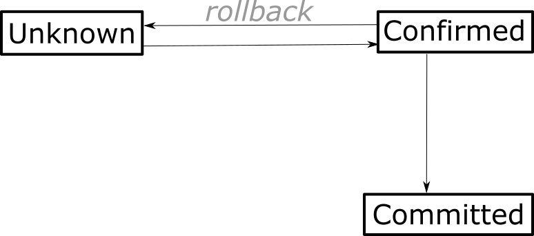

.. highlight:: haskell
.. _handling_blockchain_events:

How to handle blockchain events
===============================

The state of a Cardano dapp often spans :ref:`many UTXOs <scalability_guidelines>` and it can change with every new block that's added to the chain.
Our :term:`off-chain code` needs to react to state changes, for example by informing users that a trade has been settled, or by constructing new transactions in response to actions of other participants.
Since many smart contracts are time sensitive, we want to respond to these events as quickly as possible.

With the :term:`Plutus Application Backend (PAB)` we can write reactive off-chain code that deals promptly with blockchain events, using an easy-to-consume interface that wraps some of the complexity of the :term:`distributed ledger`.

Transaction output lifecycle
----------------------------

:term:`Transaction outputs <transaction output>` are either spent or unspent.
They start out as *unspent*, when the transaction that produces them is added to the chain.
Later on, another transaction might use them as inputs, so their state changes to *spent*.
Once an output has been spent, it can never be "un-spent", or spent a second time -- that's a fundamental property of the ledger. However, for certain time after a block of transactions was first appended to the blockchain, it is possible for it to disappear again as result of a :term:`rollback`.

Transaction states
~~~~~~~~~~~~~~~~~~

In the presence of rollbacks, transactions have three states that they can switch between: Unknown, tentatively confirmed, and committed.

    The state of transactions as observed by the PAB, and possible transitions between them. When the transaction is deep enough in the blockchain, the state changes to *committed* and does not change anymore.

If we want to respond to a new transaction as quickly as possible (for example, by spending one of its outputs), we must be prepared for the possibility that the transaction is rolled back, invalidating our own transaction.

.. note::

    The fact that rolling back a transaction invalidates all transactions that spend the rolled-back transaction's outputs can be useful for combining multiple actions in a group of transaction that should all be accepted or rejected together.

PAB functions for listening to state changes
--------------------------------------------

The PAB has a function for the state of a transaction to change:

.. literalinclude:: ../tutorials/HandlingBlockchainEvents.hs
   :start-after: BLOCK4
   :end-before: BLOCK5

:hsobj:`Plutus.Contract.Request.awaitTxStatusChange` returns a :hsobj:`Plutus.ChainIndex.Types.TxStatus` value with the new state of the transaction.

.. note::

   If you do not want to deal with rollbacks in your application, you can keep calling `awaitTxStatusChange` until the status is `DefinitelyConfirmed`. This will eventually happen for all valid transactions.

In addition, we can use the following functions to wait for outputs to be spent or to appear at a given address on the chain:

.. literalinclude:: ../tutorials/HandlingBlockchainEvents.hs
   :start-after: BLOCK0
   :end-before: BLOCK1

.. literalinclude:: ../tutorials/HandlingBlockchainEvents.hs
   :start-after: BLOCK2
   :end-before: BLOCK3

With this functions we can implement off-chain code that reacts quickly to on-chain events.
