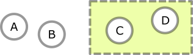
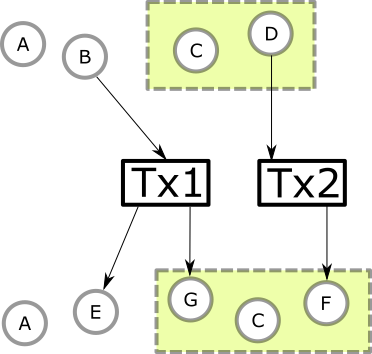

.. _plutus_scalable_app:

How to write a scalable Plutus app
==================================

Every dapp has its own requirements for throughput and performance, often quantified in terms of number of concurrent users, number of events per time window, and so forth.
When building a dapp, developers need to find a design that achieves the desired performance within the constraints of the underlying blockchain.

The Cardano blockchain uses the :term:`extended UTXO model with scripts <Extended UTXO Model>` to represent the ledger state.
The UTXO model with its graph structure is fundamentally different from the account model used by some existing smart-contract enabled blockchains.
As a result, the design patterns that work for dapps on account-based blockchains do not translate directly to Cardano.
We need new design patterns, because the underlying representation of the data is different.

In this document we discuss the structure of the UTXO model and its implications for scalability, arriving at a list of :ref:`scalability guidelines <scalability_guidelines>` that can guide the design of distributed applications on Plutus.
We use the :ref:`example of a decentralised exchange <scalability_example>` to illustrate the pros and cons of the different approaches.

The building blocks
-------------------

Let's look at the building blocks of the ledger's scripting features.

Transaction outputs
~~~~~~~~~~~~~~~~~~~

At its core, the on-chain state of our app is captured in *transaction outputs*.
The extended UTXO model has two types of transaction outputs: Script outputs and public key outputs.
Public key outputs contain the hash of a public key. Script outputs contain two hashes: The hash of a validator script and the hash of a data value.
Both types of outputs hold crypto currency values.

They differ in the kind of witness that is required to spend them.
A public key output can be spent by a transaction that carry a signature of the private key that corresponds to the output's public key.
A script output can be spent by a transaction that carries the validator script which hashes to the script hash, and two pieces of data - the redeemer and the datum.
The latter must be the value that hashes to the output's datum hash.
In addition, any transaction attempting to spend a script output must meet the requirements set out in the validator script.

+-------------+-----------+------------------+-----------+
| Output type | Witness   | Address          | Data      |
+=============+===========+==================+===========+
| Public key  | Signature | Public key hash  | N/A       |
+-------------+-----------+------------------+-----------+
| Script      | composite | Script hash      | Datum hash|
+-------------+-----------+------------------+-----------+

The address of an output is used to group similar outputs together on the ledger.
If we have a validator script then we can look at the ledger to see which outputs are currently at the script's address, that is, which outputs are locked by the hash of our validator script.

Each transaction output is uniquely identified by two pieces of data: The hash of the transaction that produced the output, and the index of this output in the transaction's list of outputs.

State of transaction outputs
~~~~~~~~~~~~~~~~~~~~~~~~~~~~

It is tempting to think of the datum hash of a script output as the *state* of the output.
After all, the datum hash is a piece of data that must be supplied with the spending transaction, and it doesn't affect the script address.
This is a bit misleading because the datum hash of a transaction output never changes.
The datum hash is determined by the transaction that produces the output, and it is immutable.

There is only one bit of information that changes: Whether the output has been spent.
Every transaction output starts in the **unspent** state, then it may transition to the **spent** state.
The transition happens when a transaction that spends the output is appended to the blockchain.

.. note::
    Reality is slightly more complicated: Since transactions can be rolled back, the state of a transaction output can change back to *unspent* if the spending transaction gets rolled back.
    Only when a certain number of blocks have been added is the spending transaction firmly committed and the state of the output cannot change back to *unspent* anymore.
    Rollbacks are reflected in the :ref:`Plutus Application Backend (PAB) <what_is_the_pab>`'s interface for :ref:`dealing with blockchain events <handling_blockchain_events>`, and they need to be considered when thinking about the business logic of your applications.

Changing the state of our app
~~~~~~~~~~~~~~~~~~~~~~~~~~~~~

Let's think of the on-chain state of our application as a **set of unspent transactions outputs** (a subset of the global UTXO set that is maintained by the ledger).
There are no hard restrictions on how many different outputs or addresses our app can have -- a one-off trade between two parties only needs a single output, while a complex distributed application with governance, tokens and so forth might involve multiple Plutus scripts and a large number of unspent transaction outputs.

    A UTXO set with four unspent outputs, two of which belong to our app (green box).

Any transaction that changes the set of UTXOs that belong to our app also changes the state of the app.
Transactions can change our application's set of UTXOs by adding new outputs to it, or by spending existing unspent outputs.

    A block with two transactions, Tx1 and Tx2, both changing the on-chain state of our app. Adding the block to the chain caused outputs (B) and (D) to become spent, and (E), (F), and (G) to be created in the unspent state.

The number of new outputs that can be added to our application state in a single block is ultimately limited by the block size. The block size is a protocol parameter that can be adapted over time to match the growth in smart contract usage.
The number of outputs that can be removed from our application state in a block is limited both by the block size *and* by the number of outputs that are currently unspent.

To produce a script output we only need to provide the hashes of the script and the datum, whereas to spend a script output we need to provide the script, datum and redeemer values in full.
Transactions that produce script outputs therefore tend to be smaller (and cheaper) than transactions that spend them.
In addition, a transaction that only produces script outputs and doesn't spend them cannot fail due to UTXO congestion on script outputs.

.. _utxo_congestion:

UTXO congestion
...............

Two transactions conflict if they try to spend the same unspent output.
When this happens, only one of the transactions is added to the ledger.
The other transaction is rejected.
The author of the rejected transaction must build a new transaction spending a different output and try again.
If many users are trying to spend the same output there can quickly arise a situation where most users spend a lot of time waiting, because their clients all try to spend the same output.
Almost all of them will fail and try again in the next block.

Congestion can happen on any type of output, but the chances of it happening to public key outputs are low, because the private key required to spend the output is usually only known to a single wallet, which can keep track of which outputs it has attempted to spend.
For example, let's assume the user wants to make a payment and run a Plutus script in two different transactions.
When the wallet has constructed and submitted the payment transaction, it remembers the public key inputs that were used to fund it.
Then when the wallet balances the Plutus transaction it knows not to use the same public key inputs again, even if the inputs are still technically unspent at that time (while the payment transaction is in the mempool).

Script outputs are more likely to fall victim to UTXO congestion *if* they can be spent by more than one party.
To avoid UTXO congestion we should therefore design our system such that the number of simultaneous attempts made to spend the same script output is as low as possible.
What does this mean for the state of our distributed application?

We need to minimise the number of transactions that are trying to spend the same script output.
At the same time, we should design the system so that the access patterns which require relatively high throughput can be realised exclusively by producing script outputs, not by spending script outputs.

Minting Policy Scripts
~~~~~~~~~~~~~~~~~~~~~~

Another way to run Plutus scripts on the ledger is by creating tokens with a custom minting policy.
From a scalability perspective, minting scripts are great because they do not consume a script input.
They aren't subject to UTXO congestion on script outputs, while allowing us to run a script in the transaction that *produces* the tokens.
Seeing the token on the ledger is therefore evidence that the minting policy script has been executed successfully (as opposed to seeing a script output on the ledger, which can be produced without running any scripts at all).
Whenever we need to run a Plutus script in our application we should ask ourselves if we can make this script a minting policy, and only use validators if we absolutely have to store some information or crypto currency value in a transaction output.

.. _scalability_guidelines:

Scalability guidelines
----------------------

The discussion of the UTXO model above can be summarised in three guiding principles for avoiding bottlenecks in your app:

1. **Minimise the number of transactions that are trying to spend the same script output.** The number of entities (users) that try to spend a given script output at a single time should be small. It should certainly not grow with the total number of concurrent users of the system. A good distributed app design ensures that the number of UTXOs that make up the application state grows with the number of active users, and that each user interacts with a small subset of the application's UTXOs only.
2. **Decouple the spending of script outputs from producing script outputs.** Transactions that don't spend script outputs are not liable to UTXO congestion on script outputs.
3. **Use minting policy scripts and tokens.** Minting policies are Plutus scripts that can be run without spending a script output. Besides being useful for NFTs and other currency-like applications, tokens created by Plutus minting policies can act as *evidence* that some event happened in the past. For example, we could write a state machine that produces a token in its last transition. This token can then be used as proof that the state machine has finished, long after the last output has been spent. In this way, minting policies could be used to implement certain forms of oracles.

Examples
--------

.. _scalability_example:

Decentralised exchange
~~~~~~~~~~~~~~~~~~~~~~

A decentralised exchange (DEX) can be realised either as an automated market maker (AMM) contract or using an order book.
The AMM approach results in one UTXO per liquidity pair.
This is fine for rarely-traded pairs, but pairs that have even close to one trade per block will soon run into UTXO congestion issues.
Frequently traded pairs are better off with an order book model.
Each order (bid/ask) is represented as a single UTXO.
Creating a new order only requires adding a script output, so it cannot be subject to UTXO congestion.
Matching orders is performed by a service that scans the blockchain for script outputs, maintains an order book and creates spending transactions when a match has been made.
This is an example decoupling the spending of script outputs from producing them (Guideline 2).
It is an instance of the :ref:`order book pattern <what_is_the_order_book_pattern>`.

The basic idea could be extended in many different ways.
For example, minting policies can be used to enforce payment for market makers or to create governance tokens.
If the code was open sourced, anyone could run a match making service and earn fees, thus creating incentives for fast settlement.
This would result in a truly decentralised exchange, because the match making could be performed by anyone without central coordination.

Marlowe
~~~~~~~

Marlowe is implemented using the Plutus state machine libraries.
The number of concurrent users on a given Marlowe instance is fixed and limited, and it rarely exceeds a handful.
Updates that require spending and producing the instance UTXO happen with a frequency of much less than once per block.
The chances of UTXO congestion happening on a Marlowe contract instance are therefore small (Guideline 1).
If they do happen, they only affect a single instance of Marlowe, and not the entire system.

Summary
-------

Apart from the :ref:`guidelines <scalability_guidelines>`, the main lesson of this article is that Plutus apps need to be designed with the UTXO ledger in mind.
Porting an existing contract from an account-based blockchain such as Ethereum is likely to result in :ref:`UTXO congestion<utxo_congestion>` if the entire on-chain state of the app is kept in a single unspent output.
