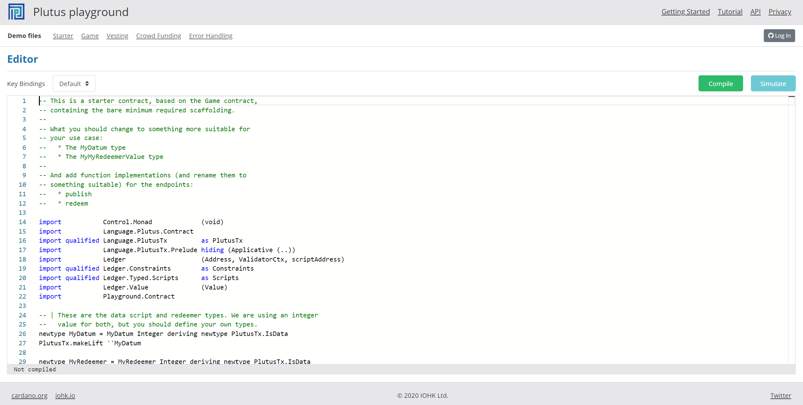
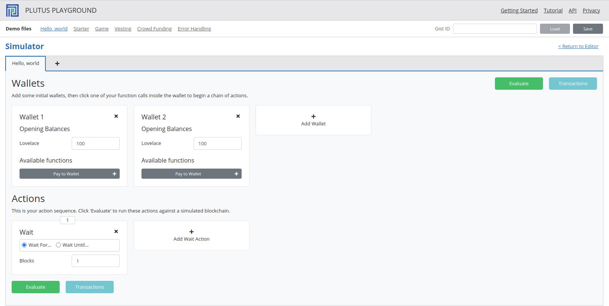
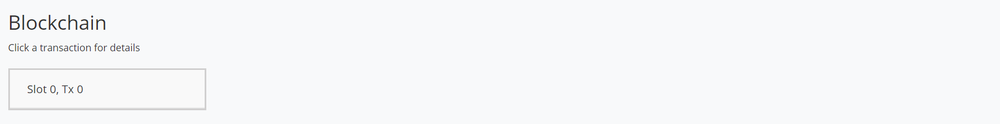
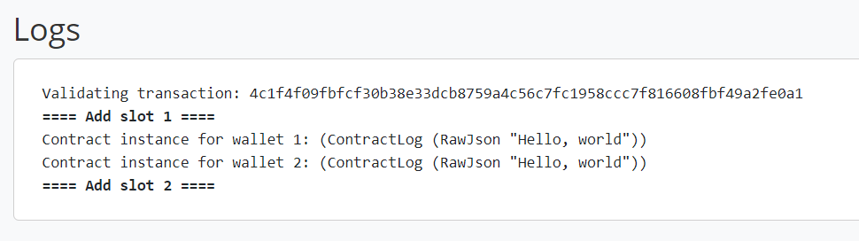
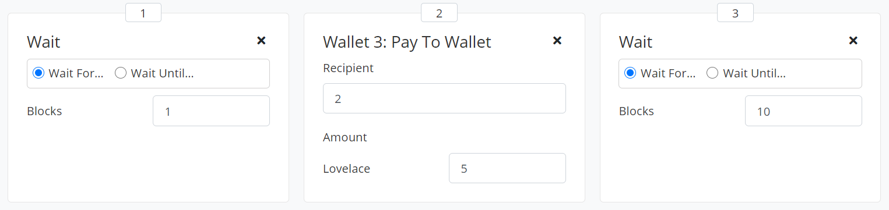
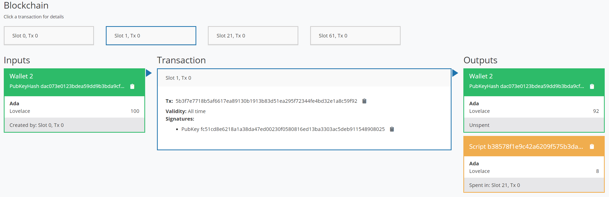
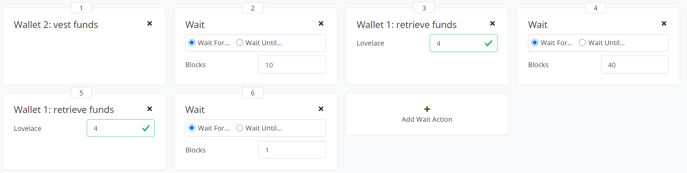

.. highlight:: haskell
.. _basic_playground_tutorial:

Compiling and testing a Plutus app in the Plutus Playground
===========================================================

The `Plutus Playground <https://playground.plutus.iohkdev.io/>`_ consists of a code editor and a simulator.

  Plutus Playground (code editor)

You can write Plutus apps in the code editor and test them in the simulator.

.. note::

  Plutus apps are distributed applications with on-chain and off-chain state.
  Their main task is to build the transactions that produce and spend Plutus script outputs.

The Plutus Playground includes a number of sample apps.
In this tutorial you are going to run through two of these sample apps.

.. _playground-compiling-hello-world:

You can find a video that covers this tutorial on `youtube <https://youtu.be/DhRS-JvoCw8/>`_.

Running the "Hello, World" app
------------------------------

When you first open the Plutus Playground, the code editor is populated with the "Vesting" app.
To load the "Hello, World" app, click the "Hello, World" link in the top row.
This app is much simpler than the vesting app.
In fact, the app itself only consists of a single line, and a type annotation:

.. literalinclude:: HelloWorldApp.hs
    :start-after: BLOCK1
    :end-before: BLOCK2

Running the first simulation of the app
^^^^^^^^^^^^^^^^^^^^^^^^^^^^^^^^^^^^^^^

Now that the app has been compiled, you can run it in the simulated environment. 
The builtin examples are already compiled, so you can click **Simulate** right away.

.. note::

  If an app has not been compiled yet, the **Simulate** button is deactivated.
  To compile the app, click the **Compile** button.
  The feedback line at the bottom of the code editor changes to "Compiling...".
  When the app has been compiled without errors, the feedback message changes to "Compilation successful", and the **Simulate** button is active.

Click the **Simulate** button.
The code editor is replaced by the simulator.

  Plutus Playground (simulator)

You can use the simulator to define complex scenarios with multiple agents trading and communicating over Cardano.
For the "Hello, World" app however you don't need to change anything in the simulator.
You can click **Evaluate** right away.
This sends the simulation to the server, alongside the source code of our app.
When the server has finished running the simulation, the transactions pane is displayed, which presents the outcome of the simulation.

Interpreting the results of the first simulation
^^^^^^^^^^^^^^^^^^^^^^^^^^^^^^^^^^^^^^^^^^^^^^^^

The "Transactions" pane has four sections: Blockchain, final balances, logs and trace.

Blockchain
""""""""""

The blockchain section shows all the transactions that were produced during the simulation.

  Simulated blockchain with a single transaction

Each simulation is run on a fresh blockchain.
The "Hello, World" simulation only results in a single transaction called "Slot 0, Tx 0".
This is the initial transaction that distributes some funds to the simulated agents.
The initial transaction is preselected when you open the blockchain view.
There are two sections with detailed information about the selected transaction.
The first section shows the inputs and outputs of the selected transaction, and some other details.
The second section has a table with the balances of each address *after* the selected transaction.
You can see that wallet 1 and wallet 2 each have one hundred lovelace.

Final Balances
""""""""""""""

Below this a chart shows the final balances at the end of the simulation, after all transactions.
Since you only have a single transaction, the final balances are exactly the same as the "Balances Carried Forward" from the initial transaction.

  Log output from the "Hello, World" simulation

Logs
""""

The "Logs" section displays messages that were produced by the emulator during the simulation.
The logs tell us that the initial transaction was validated, then the slot number changed, and then the app running in each wallet produced a log message saying "Hello, World".

.. note::

  Each of the simulated wallets has its own application instance with its own state. This is why the message "Hello, world" appears twice in the emulator logs.

Trace
"""""

The final "Trace" section contains some more detailed information about the emulator.
This data is useful for diagnosing problems with the app.

Adding a payment to the first simulation
^^^^^^^^^^^^^^^^^^^^^^^^^^^^^^^^^^^^^^^^

Now you can extend the simulation by adding a new wallet and a payment between two wallets.
Click the **Close** button to return to the simulator.
In the "Wallets" section of the simulator there is a box for each simulated wallet.
Click **Add Wallet** to add a new simulated wallet.
Now click **Pay to Wallet** on wallet 3. In the "Actions" section there are now two entries, a "Wait" action and a "Pay to Wallet" action.

In the "Pay to Wallet" action, enter the number 2 into the "Recipient" field.
This means that wallet 2 is the recipient of the payment (the payer is wallet 3).
Change the amount to five lovelace.

Now you need to make sure our simulation runs long enough for the payment to appear on the blockchain.
The simulation ends after the last action in the action sequence.
To make it run a little longer, click **Add Wait Action**.
Another "Wait" action is added to the end of the list.

  Action sequence for a payment of five lovelace from wallet 3 to wallet 2.

Now click **Evaluate**.
The results pane is displayed and you can see that the blockchain has two transactions.
Click the second transaction.
It has one input (a public-key output belonging to wallet 3) and two outputs:
One output with five lovelace belonging to wallet 2, and another output with the remaining five lovelace belonging to wallet 3.
This second output is called a *change output*.
It is needed because the input that was spent contained ten lovelace, and you only wanted to pay five of them to wallet 2.
Therefore the remaining five lovelace were given back to wallet 3.

The "Balances carried forward" and "Final balances" sections also reflect the payment that was made.

Finally, the logs indicate that there are now three instances running, because the "Hello, world" message shows up three times.
You can see that the payment transaction was validated, and that the simulation ran until slot 12.

Running the "Vesting" app
-------------------------

You've seen how to compile code, run simulations and make sense of their output.
In the second part of this tutorial you are going to run an app that actually does something on the blockchain, and you're going to feed input to it using the endpoints that it provides.

Click the "Vesting" link in the row of demo files at the top.
The vesting app is loaded into the code editor.
You are not going to look at the source for now (there are comments in the code explaining how it works).

.. note::

  The vesting app locks some funds in a script. The recipient of the funds can retrieve them later, when some time has passed.

Click **Compile** and then **Simulate** to get to the simulator.
The vesting app comes with a predefined simulation of a total of six actions.
Besides the "Wait" actions which you've seen before, there are some app-specific actions: "vest funds" and "retrieve funds".
The vesting app defines endpoints with those names and uses them to ask for input.

The box for the "vest funds" action is empty.
This endpoint is there to tell the app to make a payment to the address of the vesting script.
The box for the "retrieve funds" endpoint has an input field for an Ada amount.
In each of the two invocations you retrieve four lovelace.

Each endpoint used by an app has its own type (number, text, currency, etc.) that is defined in the source code.
The Plutus Playground uses this type to provide the correct set of form elements for creating a value of the type.
That way you don't need to manually enter JSON objects into the action boxes, and you can perform some basic validation of the values.

Running the vesting simulation
^^^^^^^^^^^^^^^^^^^^^^^^^^^^^^

Click **Evaluate** to view what the simulation does.
There are four transactions.

  Blockchain of the vesting simulation.
  
  The highlighted transaction locks eight lovelace with the vesting script.

Select the transaction in slot 1.
One of its outputs is a script output.
This is the vesting script that locks eight lovelace.

Now select the next transaction (Slot 21, Tx 0).
It spends the script output, paying four lovelace to wallet 1 and the remaining four lovelace to the vesting script.

Note that the script address of the input and of the output are identical.
The script address always stays the same, but the number of outputs at the address changes over time.

.. note::

  At any point in time there may be zero, one or more outputs at the script address. All those outputs together constitute the *state* of the script. You change the state by spending and producing outputs at the script address.

The final transaction (Slot 61, Tx 0) takes the remaining four lovelace from the script and places them in a public-key output belonging to wallet 1.

At the end of the simulation, wallet 1 has eight lovelace more than it started out with.
The money came from wallet 2 via the vesting script.
Note the timing: Wallet 1 retrieved the funds in slot 21 and 61.
The vesting contract defines how long the funds have to stay locked in the script before the recipient can retrieve them.

Error Handling
^^^^^^^^^^^^^^

Let's return to the simulator by clicking the "X" button on the transactions pane.
Change the first "Wait" action to wait for 10 blocks instead of 20 and click **Evaluate**.

  Vesting simulation modified to produce an error.

Now there are only two transactions.
The simlation finished with the total of eight lovelace still locked by the script.

Scroll down to the "Trace" section of the transactions view.
Among the messages for slot 11 there is one that says ``Contract instance stopped with error``.
It explains the reason for the failure.
Wallet 1 attempted to retrieve the funds before it was allowed to do so.
The app instance for wallet 1 then stopped with an error and did not process any more endpoint calls.

It is important to realise the source of the error.
The error came from the *client* (wallet one), not from the blockchain.
If it had come from the blockchain you would have seen a failed transaction in the logs.

The app running in wallet one did not attempt to submit a transaction for retrieving the funds, because such a transaction would fail to validate.
Instead, the app stopped with an error, leaving the on-chain state untouched.
This is another example the different notions of state that you are dealing with in Plutus apps.

Exercise
--------

As an exercise, load the "Starter" app, compile it and run the default simulation. Check the logs to see an example of an on-chain error in the Playground.
