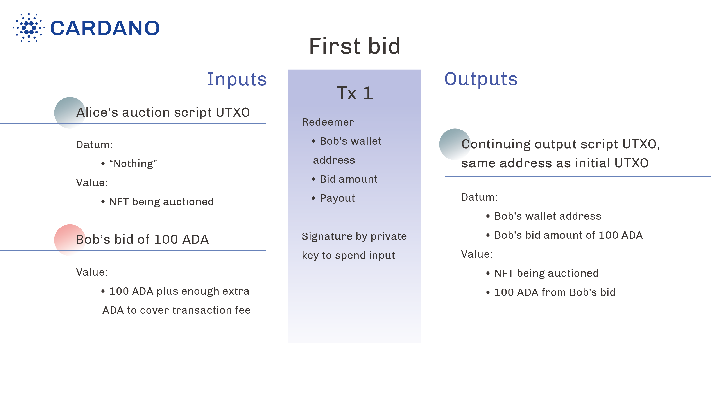
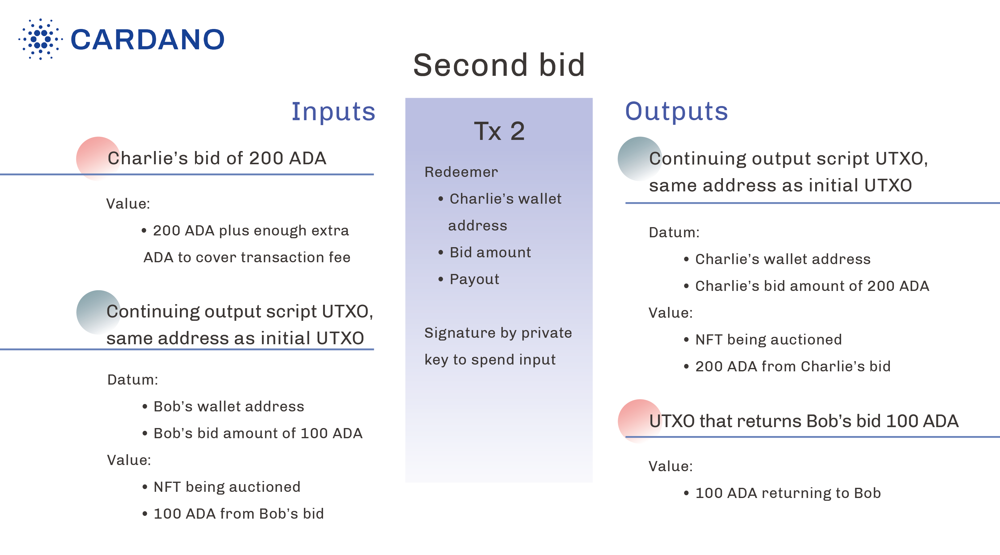
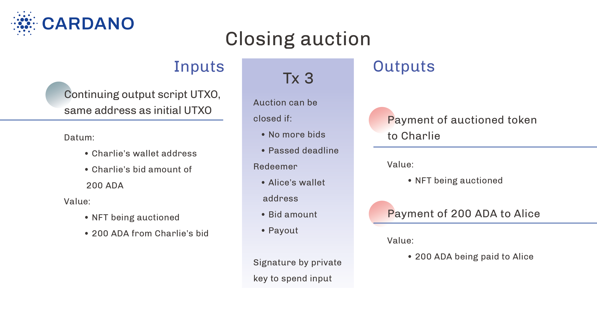

Simple example
===================

Plutus script for an auction smart contract 
-------------------------------------------------

Overview
~~~~~~~~~~~~

This example presents Plutus Tx code being written for a smart contract that controls the auction of an asset, which can be executed on the Cardano blockchain. In a sense, the smart contract is acting as the auctioneer in that it enforces certain rules and requirements in order for the auction to occur successfully. 

Plutus Tx is a high-level language for writing the validation logic of the contract, the logic that determines whether a transaction is allowed to spend a UTXO.
Plutus Tx is not a new language, but rather a subset of Haskell, and it is compiled into Plutus Core, a low-level language based on higher-order polymorphic lambda calculus.
Plutus Core is the code that runs on-chain, i.e., by every node validating the transaction, using an interpreter known as the CEK machine.
A Plutus Core program included in a Cardano transaction is often referred to as Plutus script or Plutus validator.

To develop and deploy a smart contract, you would also need off-chain code for building transactions, submitting transactions, deploying smart contracts, querying for available UTXOs on the chain and so on. 
You may also want a front-end interface for your smart contract for better user experiences.
In this example, we are not covering the front-end and back-end aspects of the off-chain part of smart contracts.

Before we get to the Plutus Tx code, let's briefly go over some basic concepts, including UTXO, EUTXO, datum, redeemer and script context.

The EUTXO model, datum, redeemer and script context
-----------------------------------------------------

On the Cardano blockchain, a transaction contains an arbitrary number of inputs and an arbitrary number of outputs.
The effect of a transaction is to consume inputs and produce new outputs.

UTXO (unspent transaction output) is the ledger model used by some blockchains, including bitcoin.
A UTXO is produced by a transaction, is immutable, and can only be spent once by another transaction.
In the original UTXO model, a UTXO contains a wallet address and a value (e.g., some amount of Ada and/or other tokens). 
Inside a transaction, a UTXO is uniquely identified by the wallet address.
It can be spent by a transaction if the transaction is signed by the private key of the wallet address.

The Extended UTXO model (EUTXO) extends the original model with a new kind of UTXO: script UTXO.
A script UTXO contains a value, a script (usually a Plutus script), a piece of data called *datum*, and is identified by the hash of the script.
For a transaction to spend it, the transaction must provide a piece of input data to the script, referred to as the *redeemer*.
The script is then run, and it must succeed in order for the transaction to be allowed to spend the UTXO.
In addition to the redeemer, the script also has access to the datum contained in the UTXO, as well as the details of the transaction trying to spend it. This is referred to as *script context*.

Note that the only thing a Plutus script does is to determine whether a transaction can spend the script UTXO that contains the script. It is *not* responsible for such things as deciding whether it can spend a different UTXO, checking that the input value in a transaction equals the output value, or updating the state of the smart contract.
Consider it a pure function that returns ``Bool``.
Checking transaction validity is done by the ledger rules, and updating the state of a smart contract is done by constructing the transaction to produce a new script UTXO with an updated datum.

The immutability of UTXOs leads to the extremely useful property of completely predictable transaction fees.
The Plutus script in a transaction can be run off-chain to determine the fee before submitting the transaction onto the blockchain.
When the transaction is submitted, if some UTXOs it tries to spend have already been spent, the transaction is immediately rejected without penalty.
If all input UTXOs still exist, and the Plutus script is invoked, the on-chain behavior would be exactly identical to the off-chain behavior.
This could not be achieved if transaction inputs were mutable, such as is the case in Ethereum's account-based model.

See also: 

   * `Plutus scripts <https://docs.cardano.org/plutus/plutus-scripts>`_ for further reading about scripts, and 
   * `Understanding the Extended UTXO model <https://docs.cardano.org/learn/eutxo-explainer>`_ 

Auction properties
----------------------

In this example, Alice wants to auction some asset she owns, represented as a non-fungible token (NFT) on Cardano.
She would like to create and deploy an auction smart contract with the following properties:

* there is a minimum bid amount
* each bid must be higher than the previous highest bid (if any)
* once a new bid is made, the previous highest bid (if it exists) is immediately refunded
* there is a deadline for placing bids; once the deadline has passed, new bids are no longer accepted, the asset can be transferred to the highest bidder (or to the seller if there are no bids), and the highest bid (if one exists) can be transferred to the seller.

Next, let's go through and discuss the Plutus Tx code we're using, shown below, for this specific example of an auction smart contract.

Plutus Tx code
---------------------

Recall that Plutus Tx is a subset of Haskell. It is the source language one uses to write Plutus validators.
A Plutus Tx program is compiled into Plutus Core, which is interpreted on-chain.
The full Plutus Tx code for the auction smart contract can be found at `AuctionValidator.hs <https://github.com/input-output-hk/plutus/blob/master/doc/read-the-docs-site/tutorials/AuctionValidator.hs>`_.

Data types
~~~~~~~~~~~~~~~~~~~~~~~

First, let's define the following data types and instances for the validator:

.. literalinclude:: tutorials/AuctionValidator.hs
   :start-after: BLOCK1
   :end-before: BLOCK2

The purpose of ``makeLift`` and ``unstableMakeIsData`` will be explained later.

Typically, writing a Plutus Tx validator script for a smart contract involves four data types:

Contract parameters
  These are fixed properties of the contract.
  In our example, it is the ``AuctionParams`` type, containing properties like seller and minimum bid.

Datum
  This is part of a script UTXO. It should be thought of as the state of the contract.
  Our example requires only one piece of state: the current highest bid. We use the ``AuctionDatum`` type to represent this.

Redeemer
  This is an input to the Plutus script provided by the transaction that is trying to spend a script UTXO.
  If a smart contract is regarded as a state machine, the redeemer would be the input that ticks the state machine.
  In our example, it is the ``AuctionRedeemer`` type: one may either submit a new bid, or request to close the auction and pay out the winner and the seller, both of which lead to a new state of the auction.

Script context
  This type contains the information of the transaction that the validator can inspect.
  In our example, our validator verifies several conditions of the transaction; e.g., if it is a new bid, then it must be submitted before the auction's end time; the previous highest bid must be refunded to the previous bidder, etc.

  The script context type is fixed for each Plutus language version. For Plutus V2, for example, it is ``PlutusLedgerApi.V2.Contexts.ScriptContext``.

.. note::
   When writing a Plutus validator using Plutus Tx, it is advisable to turn off Haskell's ``Prelude``.
   Usage of most functions and methods in ``Prelude`` should be replaced by their counterparts in the ``plutus-tx`` library, e.g., ``PlutusTx.Eq.==``.

Main validator function
~~~~~~~~~~~~~~~~~~~~~~~~~~~

Now we are ready to introduce our main validator function.
The beginning of the function looks like the following:

.. literalinclude:: tutorials/AuctionValidator.hs
   :start-after: BLOCK2
   :end-before: BLOCK3

Depending on whether this transaction is attempting to submit a new bid or to request payout, the validator validates the corresponding set of conditions.

The ``sufficientBid`` condition verifies that the bid amount is sufficient:

.. literalinclude:: tutorials/AuctionValidator.hs
   :start-after: BLOCK3
   :end-before: BLOCK4

The ``validBidTime`` condition verifies that the bid is submitted before the auction's deadline:

.. literalinclude:: tutorials/AuctionValidator.hs
   :start-after: BLOCK4
   :end-before: BLOCK5

Here, ``to x`` is the time interval ending at ``x``, i.e., ``(-∞, x]``.
``txInfoValidRange`` is a transaction property.
It is the time interval in which the transaction is allowed to go through phase-1 validation.
``contains`` takes two time intervals, and checks that the first interval completely includes the second.
Since the transaction may be validated at any point in the ``txInfoValidRange`` interval, we need to check that the entire interval lies within ``(-∞, apEndTime params]``.

The reason we need the ``txInfoValidRange`` interval instead of using the exact time the transaction is validated is due to `determinism <https://iohk.io/en/blog/posts/2021/09/06/no-surprises-transaction-validation-on-cardano/>`_.
Using the exact time would be like calling a ``getCurrentTime`` function and branching based on the current time.
On the other hand, by using the ``txInfoValidRange`` interval, the same interval is always used by the same transaction.

The ``refundsPreviousHighestBid`` condition checks that the transaction pays the previous highest bid to the previous bidder:

.. literalinclude:: tutorials/AuctionValidator.hs
   :start-after: BLOCK5
   :end-before: BLOCK6

It uses ``PlutusTx.find`` to find the transaction output (a UTXO) that pays to the previous bidder the amount equivalent to the previous highest bid, and verifies that there is at least one such output.

``singleton adaSymbol adaToken amt`` constructs a ``Value`` with ``amt`` Lovelaces (the subunit of the Ada currency).
``Value`` is a multi-asset type that represents a collection of assets, including Ada.
An asset is identified by a (symbol, token) pair, where the symbol represents the policy that controls the minting and burning of tokens, and the token represents a particular kind of token manipulated by the policy.
``(adaSymbol, adaToken)`` is the special identifier for Ada/Lovelace.

The ``correctNewDatum`` condition verifies that the transaction produces a *continuing output* containing the correct datum (the new highest bid):

.. literalinclude:: tutorials/AuctionValidator.hs
   :start-after: BLOCK6
   :end-before: BLOCK7

A "continuing output" is a transaction output that pays to the same script address from which we are currently spending.
Exactly one continuing output must be present in this example so that the next bidder can place a new bid. The new bid, in turn, will need to spend the continuing output and get validated by the same validator script.

If the transaction is requesting a payout, the validator will then verify the other three conditions: `validPayoutTime`, `sellerGetsHighestBid` and `highestBidderGetsAsset`.
These conditions are similar to the ones already explained, so their details are omitted.

Finally, we need to compile the validator written in Plutus Tx into Plutus Core, using the Plutus Tx compiler:

.. literalinclude:: tutorials/AuctionValidator.hs
   :start-after: BLOCK8
   :end-before: BLOCK9

The type of the compiled validator is ``CompiledCode (BuiltinData -> BuiltinData -> BuiltinData -> ())``, where type ``BuiltinData -> BuiltinData -> BuiltinData -> ()`` is also known as the *untyped validator*.
An untyped validator takes three ``BuiltinData`` arguments, representing the serialized datum, redeemer, and script context.
The call to ``PlutusTx.unsafeFromBuiltinData`` is the reason we need the ``PlutusTx.unstableMakeIsData`` shown before, which derives ``UnsafeFromData`` instances.
And instead of returning a ``Bool``, it simply returns ``()``, and the validation succeeds if the script evaluates without error.

Note that ``AuctionParams`` is an argument of neither the untyped validator nor the final UPLC program. ``AuctionParams`` contains contract properties that don't change, so it is simply built into the validator.

Since the Plutus Tx compiler compiles ``a`` into ``CompiledCode a``, we first use ``auctionUntypedValidator`` to obtain an untyped validator.
It takes ``AuctionParams``, and returns an untyped validator.
We then define the ``auctionValidatorScript`` function, which takes ``AuctionParams`` and returns the compiled Plutus Core program.

To create the Plutus validator script for a particular auction, we call ``auctionValidatorScript`` with the appropriate ``AuctionParams``.
We will then be able to launch the auction on-chain by submitting a transaction that outputs a script UTXO with ``Nothing`` as the datum.

.. note::
   It is worth noting that we must call ``PlutusTx.compile`` on the entire ``auctionUntypedValidator``, rather than applying it to ``params`` before compiling, as in ``$$(PlutusTx.compile [||auctionUntypedValidator params||])``.
   The latter won't work, because everything being compiled (inside ``[||...||]``) must be known at compile time, but ``params`` is not: it can differ at runtime depending on what kind of auction we want to run.
   Instead, we compile the entire ``auctionUntypedValidator`` into Plutus Core, then use ``liftCode`` to lift ``params`` into a Plutus Core term, and apply the compiled ``auctionUntypedValidator`` to it at the Plutus Core level.
   To do so, we need the ``Lift`` instance for ``AuctionParams``, derived via ``PlutusTx.makeLift``.

Life cycle of the auction smart contract
-------------------------------------------

With the Plutus script written, Alice is now ready to start the auction smart contract.
At the outset, Alice creates a script UTXO whose address is the hash of the Plutus script, whose value is the token to be auctioned, and whose datum is ``Nothing``.
Recall that the datum represents the highest bid, and there's no bid yet.
This script UTXO also contains the script itself, so that nodes validating transactions that
try to spend this script UTXO have access to the script.

Initial UTXO
~~~~~~~~~~~~~~~~~

Alice needs to create the initial UTXO transaction with the desired UTXO as an output.
The token being auctioned can either be minted by this transaction, or if it already exists in another UTXO on the ledger, the transaction should consume that UTXO as an input.
We will not go into the details here of how minting tokens works.

The first bid
~~~~~~~~~~~~~~~~~~

Suppose Bob, the first bidder, wants to bid 100 Ada for Alice's NFT.
In order to do this, Bob creates a transaction that has at least two inputs and at least one output.

The required inputs are (1) the script UTXO Alice created; (2) Bob's bid of 100 Ada.
The 100 Ada can come in one or multiple UTXOs.
Note that the input UTXOs must have a total value of more than 100 Ada, because in addition to the bid amount, they also need to cover the transaction fee.

The required output is a script UTXO with the same address as the initial UTXO (since the Plutus script itself remains the same), which is known as a *continuing output*.
This continuing output UTXO should contain:

* a datum that contains Bob's wallet address and Bob's bid amount (100 Ada).

  * Bob's wallet address is used to claim the token (if Bob ends up winning the auction) or receive the refund (if a higher bid is placed later).

* a value: the token being auctioned plus the 100 Ada from Bob's bid.

If the input UTXOs contain more Ada than 100 plus the transaction fee, then there should be additional output UTXOs that return the extra Ada.
Again, verifying that the input value of a transaction minus the transaction fee equals the output value (unless the transaction is burning tokens) is the responsibility of the ledger, not the Plutus script.

In order for Bob's transaction to be able to spend the initial script UTXO Alice created, Bob's transaction must also contain a redeemer.
As shown in the code above, there are two kinds of redeemers in our example: ``NewBid Bid`` and ``Payout``.
The redeemer in Bob's transaction is a ``NewBid Bid`` where the ``Bid`` contains Bob's wallet address and bid amount.

Once Bob's transaction is submitted, the node validating this transaction will run the Plutus script, which checks a number of conditions like whether the bid happens before the deadline, and whether the bid is high enough.
If the checks pass and everything else about the transaction is valid, the transaction will go through and be included in a block.
At this point, the initial UTXO created by Alice no longer exists on the ledger, since it has been spent by Bob's transaction.

The second bid
~~~~~~~~~~~~~~~~~~~~

Next, suppose a second bidder, Charlie, wants to outbid Bob. Charlie wants to bid 200 Ada.

Charlie will create another transaction.
This transaction should have an additional output compared to Bob's transaction: a UTXO that returns Bob's bid of 100 Ada.
Recall that this is one of the conditions checked by the Plutus script; the transaction is rejected if the refund output is missing.

Charlie's transaction needs to spend the script UTXO produced by Bob's transaction, so it also needs a redeemer. The redeemer is a ``NewBid Bid`` where ``Bid`` contains Charlie's wallet address and bid amount.
Charlie's transaction cannot spend the initial UTXO produced by Alice, since it has already been spent by Bob's transaction.

Closing the auction
~~~~~~~~~~~~~~~~~~~~~~~~~~~~~~~~~~~~~~~~~

Let’s assume that there won’t be another bid.
Once the deadline has passed, the auction can be closed.

In order to do that, somebody has to create another transaction.
That could be Alice, who wants to collect the bid, or it could be Charlie, who wants to collect the NFT.
It can be anybody, but Alice and Charlie have an incentive to create it.

This transaction has one required input: the script UTXO produced by Charlie's transaction, and two required outputs: (1) the payment of the auctioned token to Charlie; (2) the payment of 200 Ada to Alice.

Libraries for writing Plutus Tx scripts
-------------------------------------------

This auction example shows a relatively low-level way of writing scripts using Plutus Tx.
In practice, you may consider using a higher-level library that abstracts away some of the details.
For example, `plutus-apps <https://github.com/input-output-hk/plutus-apps>`_ provides a constraint library for writing Plutus Tx.
Using these libraries, writing a validator in Plutus Tx becomes a matter of defining state transactions and the corresponding constraints, e.g., the condition ``refundsPreviousHighestBid`` can simply be written as ``Constraints.mustPayToPubKey bidder (singleton adaSymbol adaToken amt)``.

Alternatives to Plutus Tx
-----------------------------

There are languages other than Plutus Tx that can be compiled into Plutus Core.
We list some of them here for reference. However, we are not endorsing them; we are not representing their qualities nor their state of development regarding their production-readiness. 

* `Aiken <https://github.com/txpipe/aiken/>`_
* `Hebi <https://github.com/OpShin/hebi>`_
* `Helios <https://github.com/hyperion-bt/helios>`_
* `OpShin <https://github.com/OpShin/opshin>`_
* `plu-ts <https://github.com/HarmonicLabs/plu-ts>`_
* `Plutarch <https://github.com/Plutonomicon/plutarch-core>`_
* `Pluto <https://github.com/Plutonomicon/pluto>`_

Off-chain code
-----------------------

Since the main purpose of this example is to introduce Plutus Tx and Plutus Core, we walked through only the on-chain code, which is responsible for validating transactions (in the sense of determining whether a transaction is allowed to spend a UTXO).

In addition to the on-chain code, one typically needs the accompanying off-chain code and services to perform tasks like building transactions, submitting transactions, deploying smart contracts, querying for available UTXOs on the chain, etc.

A full suite of solutions is `in development <https://plutus-apps.readthedocs.io/en/latest/plutus/explanations/plutus-tools-component-descriptions.html>`_. 
See the `plutus-apps <https://github.com/input-output-hk/plutus-apps>`_ repo and its accompanying `Plutus tools SDK user guide <https://plutus-apps.readthedocs.io/en/latest/>`_ for more details. 

Some other alternatives include `cardano-transaction-lib <https://github.com/Plutonomicon/cardano-transaction-lib>`_ and `lucid <https://github.com/spacebudz/lucid>`_.
All these are based on the `Cardano API <https://github.com/input-output-hk/cardano-node/tree/master/cardano-api>`_, a low-level API that provides the capability to do the off-chain work with a local running node.

See also: `Plutus application development <https://docs.cardano.org/plutus/dapp-development>`_, a high-level overview of resources for building DApps using Plutus.
A DApp is basically a smart contract plus a front end.

Further reading
-----------------------

The EUTXO model
~~~~~~~~~~~~~~~~~~~~~~~~~~~~~~~~~~~~~~~~~~~

* `The Extended UTXO Model <https://iohk.io/en/research/library/papers/the-extended-utxo-model/>`_ (Paper)
* `The EUTXO Handbook <https://www.essentialcardano.io/article/the-eutxo-handbook>`_
* Blog Post: Cardano's Extended UTXO accounting model---built to support multi-assets and smart contracts (`part 1 <https://iohk.io/en/blog/posts/2021/03/11/cardanos-extended-utxo-accounting-model/>`_, `part 2 <https://iohk.io/en/blog/posts/2021/03/12/cardanos-extended-utxo-accounting-model-part-2/>`_)
