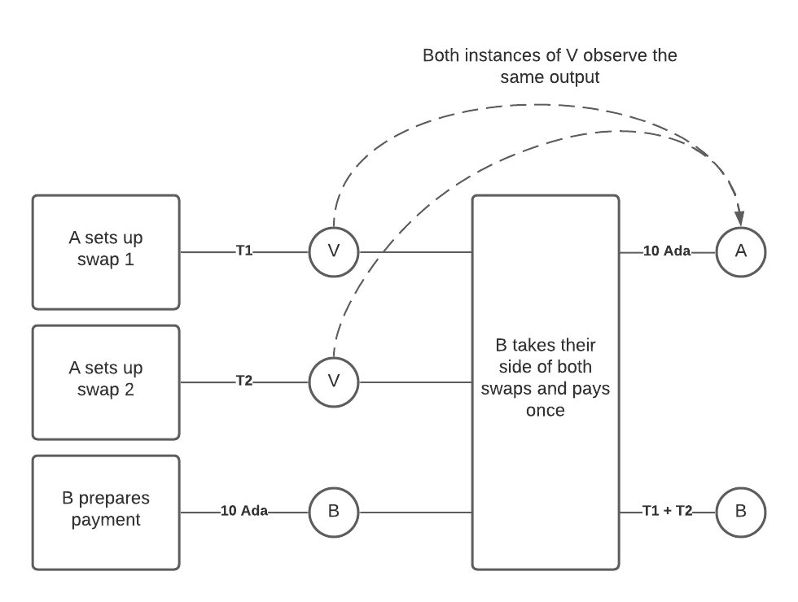

Double satisfaction
===================

Suppose we have a validator V that implements a typical “atomic swap” or “escrowed swap” between A and B where A goes first, i.e. V says:

    This output can only be spent if, in the same transaction, there is an output sending the agreed-upon payment (encoded in the output’s datum) to A.

Now suppose that A and B have two swaps in progress, one for a token T1 at the price of 10 Ada, and one for a token T2 at the same price.
That means that there will exist two outputs, both locked by V.

Now B constructs a transaction which spends both outputs, and creates one output addressed to A with 10 Ada (taking T1 and T2 for himself).

   A diagram showing the transaction setup for the double satisfaction of two swaps.

A naive implementation of V will just check that the transaction has *an* output to A with 10 Ada in it, and then be satisfied.
But this allows B to "double satisfy" the two validators, because they will both see the same output and be satisfied.
The end result is that B can get away with paying only 10 Ada to A, even though B's true liability to A is 20 Ada!

What is going wrong here?
~~~~~~~~~~~~~~~~~~~~~~~~~

It is difficult to say exactly what is going wrong here.
Neither validator’s expectations are explicitly being violated.

One way of looking at it is that this is a consequence of the fact that validators only *validate*, rather than *doing* things.
In a model like Ethereum's, where smart contracts *make transfers*, then two smart contracts would simply make two transfers, and there would be no problem.
But in the EUTXO model all a validator can do is try to ascertain whether its wishes have been carried out, which in this case is ambiguous.

Following this metaphor, we can see how the same problem could arise in the real world.
Suppose that two tax auditors from two different departments come to visit you in turn to see if you’ve paid your taxes.
You come up with a clever scheme to confuse them.
Your tax liability to both departments is $10, so you make a single payment to the tax office's bank account for $10.
When the auditors arrive, you show them your books, containing the payment to the tax office.
They both leave satisfied.

How do we solve this problem in the real world?
Well, the two tax offices might have different bank accounts, but more likely they would simply require you to use two different payment references!
That way, the payment that each auditor expect to see is unique, so they know it's for them.
We can do something similar in the EUTXO model, see the section on `Unique outputs`_ below.

Risks
~~~~~

This is a serious problem for many kinds of application.
Any application that makes payments to specific parties needs to ensure that those payments are correctly identified and don't overlap with other payments.

Solutions
~~~~~~~~~

It's possible that a solution will be developed that makes this weakness easier to avoid.
In the mean time, there are workarounds that developers can use.

Unique outputs
--------------

The simplest workaround is to ensure that the outputs which your scripts care about are unique.
This prevents them being confused with other outputs.

In the swap example, if A had used a different key hashes as their payment addresses in each, then one output could not have satisfied both validators, since each one would want an output addressed to a different key hash.

It is not too difficult to use unique outputs.
For payments to users, wallets typically already generate unique key hashes for every payment received.
For payments to script addresses it is a bit more complicated, and applications may wish to include the equivalent of a "payment reference" in the datum to keep things unique.

Ban other scripts
-----------------

A more draconian workaround is to for your script to insist that it runs in a transaction which is running no other scripts, so there is no risk of confusion.
Note that it is not enough to consider just validator scripts, minting and reward scripts must also be banned.

However, this prevents even benign usage of multiple scripts in one transaction, which stops people from designing interesting interactions, and may force users to break up transactions unnecessarily.
