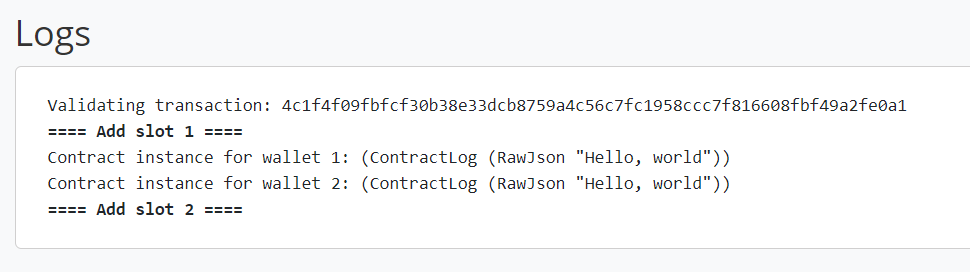

.. highlight:: haskell
.. _basic_apps_tutorial:

Writing a basic Plutus app in the Plutus Playground
===================================================

:term:`Plutus apps<contract application>` are programs that run off-chain and manage active contract instances.
They monitor the blockchain, ask for user input, and submit transactions to the blockchain.
If you are a contract author, writing a Plutus app is the easiest way to create and spend Plutus script outputs.

The Contract Monad
------------------

Plutus apps use the :hsobj:`Language.Plutus.Contract.Contract` monad.
``Contract`` encapsulates effects that are useful for managing contract instances.
A simple contract is one that prints a log message and then exits.

.. literalinclude:: HelloWorld.hs
   :start-after: BLOCK1
   :end-before: BLOCK2

Plutus apps produce JSON objects as log output.
``logInfo`` is polymorphic in the type of log messages, so we use the ``@`` operator to specify that we are entering a ``String``.

When :ref:`running this app in the Plutus playground<playground-compiling-hello-world>` we get the following log:

We can ask the user for input at any time while the app is running.
To achieve this we first need to tell the compiler about the type of data that we expect the user to provide.
This is what the contract's :term:`schema` does: It describes all :term:`endpoints <endpoint>` that the contract can use.
The schema is defined as a Haskell type.
We can build a schema using the ``Endpoint`` type family to construct individual endpoint types, and the ``.\/`` operator to combine them.

.. literalinclude:: BasicApps.hs
   :start-after: BLOCK2
   :end-before: BLOCK3

..
      TODO: How can I link to types from the prelude (such as Data.String.String)?

The ``DemoSchema`` type defined above has a single endpoint called "name", which expects a ``String``.

The Plutus app can request input from the endpoints it declared.
Doing so makes the endpoint :tem:`active <active endpoint>`.

The ``endpoint`` function exposes the endpoint and returns when input was provided.

* Activating endpoints
* Endpoint status
* Select / Or

Doing Blockchain Things
-----------------------

* Creating transactions
   - constraints
   - scripts
* Waiting for on-chain events
   - watch address
   - 