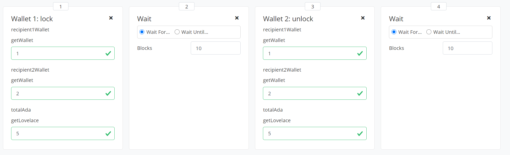

.. highlight:: haskell
.. _basic_apps_tutorial:

Writing a basic Plutus app in the Plutus Playground
===================================================

:term:`Plutus apps<contract application>` are programs that run off-chain and manage active contract instances.
They monitor the blockchain, ask for user input, and submit transactions to the blockchain.
If you are a contract author, building a Plutus app is the easiest way to create and spend Plutus script outputs.
In this tutorial you are going to write a Plutus app that locks some Ada in a script output and splits them evenly between two recipients.

.. literalinclude:: BasicApps.hs
   :start-after: BLOCK0
   :end-before: BLOCK1

Defining the types
------------------

You start by defining some data types that you're going to need for the _Split_ app.

.. literalinclude:: BasicApps.hs
   :start-after: BLOCK1
   :end-before: BLOCK2

``SplitData`` describes the two recipients of the funds, and the total amount of the funds denoted in Ada.

You are using the ``PubKeyHash`` type to identify the recipients.
When making the payment you can use the hashes to create two public key outputs.

Instances for data types
^^^^^^^^^^^^^^^^^^^^^^^^

The ``SplitData`` type has instances for a number of typeclasses.
These instances enable the serialisation of ``SplitData`` to different formats.
``ToJSON`` and ``FromJSON`` are needed for JSON serialisation.
JSON objects are passed between the frontend (for example, the Playground) and the app instance.
:hsobj:`Language.PlutusTx.IsData` is used for values that are attached to transactions, for example as the <redeemer> of a script output.
This class is used by the Plutus app at runtime to construct ``Data`` values.
Finally, :hsobj:`Language.PlutusTx.makeLift` is a Template Haskell statement that generates an instance of the :hsobj:`Language.PlutusTx.Lift.Class.Lift` class for ``SplitValue``.
This class is used by the Plutus compiler at compile-time to construct Plutus core programs.

Defining the validator script
-----------------------------

The validator script is the on-chain part of our Plutus app.
The job of the validator is to look at individual transactions in isolation and decide whether they are valid.
Plutus validators have the following type signature:

.. code-block:: haskell

   d -> r -> ValidatorCtx -> Bool

where ``d`` is the type of the <datum> and ``r`` is the type of the redeemer.

You are going to use the validator script to lock a script output that contains the ``amount`` specified in the ``SplitData``.

.. note::

   There is an n-to-n relationship between Plutus apps and validator scripts. Apps can deal with multiple validators, and validators can be used by different apps.

In this tutorial you only need a single validator.
Its datum type is ``SplitData`` and its redeemer type is ``()`` (the unit type).
The validator looks at the ``ValidatorCtx`` value to see if the conditions for making the payment are met:

.. literalinclude:: BasicApps.hs
   :start-after: BLOCK2
   :end-before: BLOCK3

The validator checks that the transaction, represented by ``valCtxTxInfo``, pays half the specified amount to each recipient.

You then need some boilerplate to compile the validator to a Plutus script (see :ref:`basic_validators_tutorial`).

.. literalinclude:: BasicApps.hs
   :start-after: BLOCK3
   :end-before: BLOCK4

The ``ScriptType`` class defines the types of the validator, and ``splitInstance`` contains the compiled Plutus core code of ``validateSplit``.

Asking for input
----------------

When you start the app, you want to ask the sender for a ``SplitData`` object.
In Plutus apps, the mechanism for requesting inputs is called :term:`endpoints <endpoint>`.

All endpoints that an app wants to use must be declared as part of the type of the app.
The set of all endpoints of an app is called the :term:`schema` of the app.
The schema is defined as a Haskell type.
You can build a schema using the ``Endpoint`` type family to construct individual endpoint types, and the ``.\/`` operator to combine them.

.. literalinclude:: BasicApps.hs
   :start-after: BLOCK4
   :end-before: BLOCK5

The ``SplitSchema`` defines two endpoints, ``lock`` and ``unlock``.
Each endpoint declaration contains the endpoint's name and its type.
Note that ``SplitData`` has two ``PubKeyHash`` fields for the recipients, whereas the endpoint has two ``Wallet`` fields (the wallet type is used in the Playground as the identity of a simulated agent).
You are going to convert the wallet values to their corresponding public key hashes in the ``Split`` app.
That way, the user can simply identify the recipient by a number and doesn't have to enter a public key into a text box.
This type of conversion from a nickname to a unique identifier is a common task for Plutus apps.

To use the ``lock`` endpoint in our app, you call the :hsobj:`Language.Plutus.Contract.Effects.ExposeEndpoint.endpoint` function:

.. literalinclude:: BasicApps.hs
   :start-after: BLOCK5
   :end-before: BLOCK6

``endpoint`` has a single argument, the name of the endpoint.
The name of the endpoint is a Haskell type, not a value, and you have to supply this argument using the type application operator ``@``.
This operator is provided by the `TypeApplications <https://gitlab.haskell.org/ghc/ghc/-/wikis/type-application>`_ GHC extension.

Next you need to turn the two ``Wallet`` values into their public key hashes so that you can get the ``SplitData`` value from the input that was supplied by the user.

.. literalinclude:: BasicApps.hs
   :start-after: BLOCK6
   :end-before: BLOCK7

Note that the :hsobj:`Wallet.Emulator.Wallet.walletPubKey` function and the :hsobj:`Wallet.Emulator.Wallet.Wallet` type are only available in the simulated environment used by the Plutus playground and by Plutus tests.
A real Plutus app would use the metadata server or a custom lookup function for such conversions.

Locking the funds
-----------------

With the ``SplitData`` that you got from the user you can now write a transaction that locks the requested amount of Ada in a script output.

.. literalinclude:: BasicApps.hs
   :start-after: BLOCK7
   :end-before: BLOCK8

Using the constraints library that comes with the Plutus SDK you specify a transaction ``tx`` in a single line.

.. code-block:: haskell

   tx = Constraints.mustPayToTheScript s (Ada.toValue amount)

After calling ``submitTxConstraints`` in the next line, the Plutus app runtime examines the transaction constraints ``tx`` and builds a transaction that fulfills them.
The runtime then sends the transaction to the wallet, which adds enough to cover the required funds (in this case, the ada amount specified in ``amount``).

Unlocking the funds
-------------------

All that's missing now is the code for retrieving the funds, and some glue to put it all together.

.. literalinclude:: BasicApps.hs
   :start-after: BLOCK8
   :end-before: BLOCK9

In ``unlockFunds`` you use the constraints library to build the spending transaction.
Here, ``tx`` combines three different constraints.
``collectFromScript`` takes the script outputs in ``unspentOutputs`` and adds them as input to the transaction, using the unit ``()`` as the redeemer.
The other two constraints use ``mustPayToPubKey`` to add payments for the recipients.

Deploying the app on the Playground
-----------------------------------

You have all the functions you need for the on-chain and off-chain parts of the app.
Every contract in the Playground must define its public interface like this:

.. literalinclude:: BasicApps.hs
   :start-after: BLOCK9
   :end-before: BLOCK10

The Playground server uses the ``endpoints`` definition to populate the UI (via the schema, in our case ``SplitSchema``) and to start the simulation.
``endpoints`` is the high-level definition of our app:

.. literalinclude:: BasicApps.hs
   :start-after: BLOCK9
   :end-before: BLOCK10

The ``select`` function acts like a choice between two branches.
The left branch starts with ``lock`` and the right branch starts with ``unlock``.
The app exposes both endpoints and proceeds with the branch that receives an answer first.
So, if you call the ``lock`` endpoint in one of the simulated wallets, it will call ``lockFunds`` and ignore the ``unlock`` side of the contract.

You also need a couple of declarations that generate glue code for the Playground.

.. code-block:: haskell
      
   mkSchemaDefinitions ''SplitSchema

   $(mkKnownCurrencies [])

And an additional import at the top of the file.

.. code-block:: haskell

   import Playground.Contract

After that, you can compile the contract and create a simulation.
The following action sequence results in two transactions that lock the funds and then distribute them to the two recipients.

  Simulation for the split app.

Exercise
--------

1. Extract the function that assigns funds to each recipient from ``unlockFunds`` and ``validateSplit`` to reduce redundancy in the code
2. Extend the contract to deal with a list of recipients instead of a fixed number of 2.