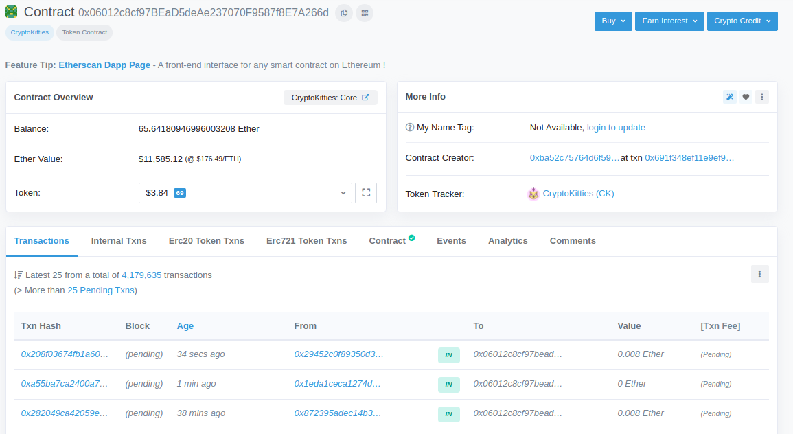
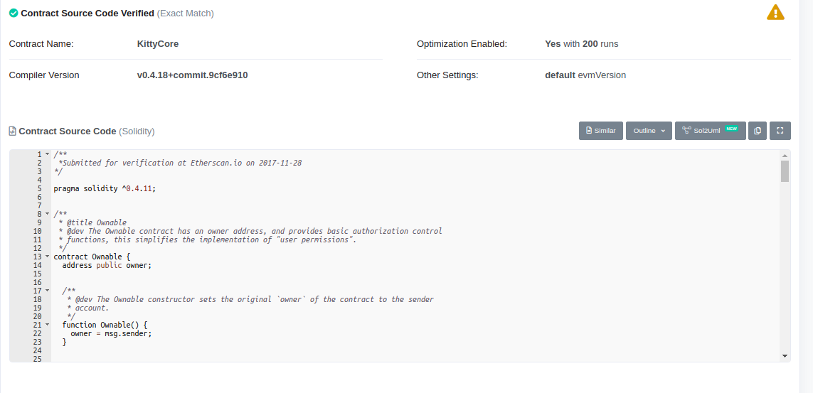

# Ethereum smart contracts in the wild

This document looks at Ethereum smart contracts which were actually
running on the Ethereum blockchain in August 2019.

## Some Ethereum background 

This section mentions a few things which it'll be useful to know about
later.  For detailed information on Ethereum, look at the [Ethereum
wiki](https://github.com/ethereum/wiki/wiki/) and especially the
[Ethereum white paper](https://github.com/ethereum/wiki/wiki/White-Paper).
Note that the blockchain is Ethereum and the currency is Ether.

The term **dapp** turns up quite a lot.  A dapp (the Ethereum people
seem to like spelling it "ÐApp") is a _decentralised application_: I
think this is essentially one or more smart contracts running on the
blockchain, generally with users interacting with the contracts via a
dedicated front end which they install on a phone/browser.  See
https://www.stateofthedapps.com/whats-a-dapp.

There are two Ethereum standards which are important for smart
contracts: [ERC-20](https://eips.ethereum.org/EIPS/eip-20) and
[ERC-721](https://eips.ethereum.org/EIPS/eip-721).  ERC-20 allows the
implementation of user-defined _token currencies_ on the Ethereum
chain and ERC-721 introduces non-fungible tokens which can be used to
represent ownership of some digital or physical asset.  To use either
of these you implement a smart contract which conforms to a specified
API which acts as the monetary policy.  For example in the case of
ERC-20 you implement a contract with functions which return the total
supply or the number of tokens owned by a specified individual, or
allow a user to transfer funds to another user, and so on.

There's a list of current ERC-20 tokens at
https://bloxy.info/list_tokens/ERC20 (this is just the top 2500:
there are lots more).

Users may wish to trade one ERC-20 currency for another, and this can be done
using a _decentralised exchange_ (or _DEX_): these are generally
implemented as smart contracts.  

There are also things called
[mixers](https://www.coindesk.com/vitalik-proposes-mixer-to-anonymize-one-off-transactions-on-ethereum)
which are used to anonymise transactions to make it difficult to work
out who's been spending how much and what they're been spending it on;
these are needed because Ethereum is account-based.

## Resources
There are a number of websites and articles which were helpful.

Firstly, http://etherscan.io lets you examine the Ethereum blockchain
in detail, including details of smart contracts ("Etherscan is the
leading Ethereum Blockchain Explorer. The core of Etherscan involves
extracting data from the Ethereum distributed ledger, indexing and
displaying the processed data in a concise and readable manner for the
masses and layperson.").

Users can upload smart contract source code to the website and
Etherscan will certify that they compile to particular bytecode
contracts, allowing you to examine the source code (more precisely,
the Solidity source for on-chain code) of at least some contracts
which you may find on the chain.

If you know the address of a smart contract then you can paste it into
the search bar at the top of the page and etherscan will give you lots
of information.

For example, the CryptoKitties contract has address 0x06012c8cf97bead5deae237070f9587f8e7a266d
and you can see information about it at https://etherscan.io/address/0x06012c8cf97bead5deae237070f9587f8e7a266d

Note the link "Contract" near the centre of the image.  In this case it
has a green tick attached which means that the Solidity source of the contract is available,
and clicking on the link will show it to you:

You can also go to https://etherscan.io/contractsVerified to see the last 500 contracts verified by Etherscan.

Etherscan also has a blog at https://medium.com/etherscan-blog/ which has some interesting articles.

---------------

There are a number of other Etheruem blockchain explorers, for example:

* https://bloxy.info/

* https://www.etherchain.org/

* https://ethplorer.io/

* https://enjinx.io/  (multiple blockchains, not just Ethereum).

----------------------------

There's an article talking about the usage of Ethereum smart contracts at
https://medium.com/@vikati/ranking-ethereum-smart-contracts-a27e6f622ac6

This contains links to pages showing the top 50 contracts by
[transactions](https://blockspur.com/ethereum_contracts/transactions),
["uniques"](https://blockspur.com/ethereum_contracts/uniques) (the
number of unique addresses interacting with the contract), and
[revenues](https://blockspur.com/ethereum_contracts/values) (this 
is just throughput, not necessarily profit).  Statistics are
available for the most recent calendar month.

Unfortunately these pages are slightly broken:  the addresses of the
contracts are clickable and look as if they should show you more information
on the contract, but this doesn't work.  Instead I had to copy the URLs,
extract the contract addresses, and paste them into Etherscan to find out about the contracts.

There's a more detailed look at the most popular contracts for August 2019 
[later](#popular-contracts-by-number-of-transactions-in-august-2019).

-----------------------

There's some more analysis of popularity of Ethereum contracts 
[here](https://blog.sfox.com/what-29-985-328-transactions-say-about-the-state-of-smart-contracts-on-ethereum-2ebdba4bea1c).

... and a site which tells you which contracts are currently using the most gas at https://ethgasstation.info/gasguzzlers.php.

There's a page with a ranking of Ethereum dapps at https://www.stateofthedapps.com/rankings.
The Ethereum wiki has descriptions of many dapps at  https://github.com/ethereum/wiki/wiki/Decentralized-apps-(dapps)

Another site with real-time statistics for Ethereum is
https://bloxy.info. In particular, they have a page of
[analytics](https://bloxy.info/analytics) which contains links to lots
of interesting information, including some [analysis of ERC-20
tokens](https://stat.bloxy.info/superset/dashboard/tokens/) and
[ERC-721 tokens](https://stat.bloxy.info/superset/dashboard/erc721/)
(ie, NFTs).  There's also a page with the [most popular methods and events in smart contracts](https://stat.bloxy.info/superset/dashboard/smart_contracts/).

Also, Google has large public databases of both
[Ethereum](https://cloud.google.com/blog/products/data-analytics/ethereum-bigquery-public-dataset-smart-contract-analytics
) and [Bitcoin](https://cloud.google.com/blog/products/gcp/bitcoin-in-bigquery-blockchain-analytics-on-public-data
) transactions which you can query yourself (although it might take some time to construct appropriate queries).

-----------------------------

### Popular contracts by number of transactions in August 2019

Here's Blockspur's list of top 50 contracts in August 2019 by number
of transactions (use left and right cursor arrow to scroll
horizontally).  In the original table the addresses were linked to other
Blockspur pages, but the links were broken.  I've replaced those with 
links to the Etherscan page for the relevant address.
There's more detailed analysis after the table.

|Rank|Change            | Address     |Name             |Symbol         |ERC20|Transactions |Uniques|"Revenues" in Ether|"Revenues" in USD|
|----|------------------|-------------|-----------------|---------------|-----|-------------|-------|-------------------|-----------------|
| 1|	N/A 		|[0x4f0100...](https://etherscan.io/address/0x4f01001cf69785d4c37f03fd87398849411ccbba)|			|		|No   |	301,256	    | 1	    | 0.00 ETH		| 0.00            |
| 2|	-1 		|[0x2a0c0d...](https://etherscan.io/address/0x2a0c0dbecc7e4d658f48e01e3fa353f44050c208)|Exchange		|		|No   |	290,452	    |17,889 |67,230.13 ETH	|$5,781,791	  |
| 3|	-1 		|[0xd1ceee...](https://etherscan.io/address/0xd1ceeeeee83f8bcf3bedad437202b6154e9f5405)|			|		|No   |	250,639	    |820    |34,972.39 ETH	|$3,007,625	  |
| 4|	+ 4 		|[0x8fdcc3...](https://etherscan.io/address/0x8fdcc30eda7e94f1c12ce0280df6cd531e8365c5)|CpcToken		| CPCT		|Yes  |	147,724	    |10,396 |0.00 ETH		|0.00		  |
| 5|	-2 		|[0x06012c...](https://etherscan.io/address/0x06012c8cf97bead5deae237070f9587f8e7a266d)|CryptoKitties	| CK 		|Yes  |	139,776	    | 2,416 | 386.17 ETH	|$33,211	  |
| 6|	+ 926 		|[0x993e6d...](https://etherscan.io/address/0x993e6d6c557ca24a00da507f56bda599a9886a44)| 		| 		|No   | 100,477	    |3,631  |0.01 ETH		|$1		  |
| 7|	0 		|[0x8d12a1...](https://etherscan.io/address/0x8d12a197cb00d4747a1fe03395095ce2a5cc6819)|EtherDelta	|		|No   |	91,653	    |10,593 |26,086.14 ETH	|$2,243,408	  |
| 8|	+ 4 		|[0x5da8d3...](https://etherscan.io/address/0x5da8d37485b4374fc338fc1f1ea31d07eb7bedd3)|Tuzy Coin	| TUC 		|Yes  |	90,009	    |1,788  |0.00 ETH		|0.00		  |
| 9|	+ 47 		|[0x14fbca...](https://etherscan.io/address/0x14fbca95be7e99c15cc2996c6c9d841e54b79425)|MatchingMarket	|		|No   |	77,747	    |859    |0.00 ETH		|0.00		  |
| 10|	+ 196 		|[0x6090a6...](https://etherscan.io/address/0x6090a6e47849629b7245dfa1ca21d94cd15878ef)|Registrar	|		|No   |	72,022	    |735    |83.89 ETH		|$7,215	  	  |
| 11|	+ 1325 		|[0x0be3e6...](https://etherscan.io/address/0x0be3e6e3d9e99036ccce4fd0b692016de860aa62)| 		| 		|No   |	70,390	    |5,920  | 2,562.10 ETH	|$220,341	  |
| 12|	+ 54 		|[0x891f46...](https://etherscan.io/address/0x891f460176f180836f53b729ffb27cfcc7d74d71)|VRT CHAIN TOKEN	| VRT 		|Yes  |	65,770	    |9,819  |0.00 ETH		|0.00		  |
| 13|	N/A 		|[0x62a364...](https://etherscan.io/address/0x62a364f7cba3be8fc9dcfdde12cabec8244af381)|    	 	| 	 	|No   |	62,401	    |43,361 |0.05 ETH		|$4   		  |
| 14|	+ 1 		|[0xa15c7e...](https://etherscan.io/address/0xa15c7ebe1f07caf6bff097d8a589fb8ac49ae5b3)|Pundi X Token	| NPXS 		|Yes  |	61,421	    |7,637  |0.00 ETH		|0.00		  |
| 15|	+ 3821 		|[0x08ceed...](https://etherscan.io/address/0x08ceed1e8db59acbb687a5752f0a7db815cfda5e)|Electronic Energy...	|E2C 	|Yes  |	58,200	    |5,407  |0.00 ETH		|0.00		  |
| 16|	-10 		|[0x1ce7ae...](https://etherscan.io/address/0x1ce7ae555139c5ef5a57cc8d814a867ee6ee33d8)|TokenStore	|		|No   |	54,623	    |3,429  |1,542.42 ETH	|$132,648	  |
| 17|	+ 31014 	|[0x14ddda...](https://etherscan.io/address/0x14ddda446688b73161aa1382f4e4343353af6fc8)|FXPay		| FXP 		|Yes  |	54,600	    |1,299  |0.00 ETH		|0.00		  |
| 18|	+ 61 		|[0xb64ef5...](https://etherscan.io/address/0xb64ef51c888972c908cfacf59b47c1afbc0ab8ac)|Storj		| STORJ 	|Yes  |	54,006	    |47,294 |0.00 ETH		|$0		  |
| 19|	+ 39 		|[0xba7435...](https://etherscan.io/address/0xba7435a4b4c747e0101780073eeda872a69bdcd4)|AirdropToken	| AIRDROP 	|Yes  |	52,841	    |55,723 |0.02 ETH		|$2		  |
| 20|	+ 183 		|[0x1f772d...](https://etherscan.io/address/0x1f772db718238d8413bad9b309950a9c5286fd71)| 		| 		|No   |	51,646	    |1,667  |290.30 ETH		|$24,966	  |
| 21|	+ 24 		|[0x410af2...](https://etherscan.io/address/0x410af23334e26aa13c1f3e630bae006bdd313264)|CLEAR Token	| CLEAR 	|Yes  |	49,540	    |489    |0.00 ETH		|0.00		  |
| 22|	N/A 		|[0x9af285...](https://etherscan.io/address/0x9af285f84645892dd57ae135af6e97f952a5922c)|      		| 		|No   |	48,155	    |24,217 |0.12 ETH		|$11		  |
| 23|	+ 7 		|[0xe7d7b3...](https://etherscan.io/address/0xe7d7b37e72510309db27c460378f957b1b04bd5d)|empowr		| EMPR		|Yes  |	44,634	    |3,642  |0.69 ETH		|$59		  |
| 24|	+ 4 		|[0x7415c7...](https://etherscan.io/address/0x7415c7bf3e2415fa9a55f1fd8b6fccf2914c39a6)|Coinage		|		|Yes  |	41,827	    |13,891 |279,296.27 ETH	|$24,019,480	  |
| 25|	-6 		|[0xa52e01...](https://etherscan.io/address/0xa52e014b3f5cc48287c2d483a3e026c32cc76e6d)| 		| 		|No   |	40,295	    |385    |7,190.89 ETH	|$618,416	  |
| 26|	+ 12 		|[0x827727...](https://etherscan.io/address/0x827727b4c3f75ea6eb6bd2cc256de40db2b13665)| 		| 		|No   |	39,532	    |4	    |0.00 ETH		|0.00		  |
| 27|	+ 75 		|[0x4f833a...](https://etherscan.io/address/0x4f833a24e1f95d70f028921e27040ca56e09ab0b)|			| 		|No   |	39,069	    |668    |0.00 ETH		|0.00		  |
| 28|	-12 		|[0xe41d24...](https://etherscan.io/address/0xe41d2489571d322189246dafa5ebde1f4699f498)|ZRX		| ZRX		|Yes  |	38,441	    |18,129 |0.00 ETH		|0.00		  |
| 29|	+ 40 		|[0x0d8775...](https://etherscan.io/address/0x0d8775f648430679a709e98d2b0cb6250d2887ef)|BAT		| BAT		|Yes  |	38,213	    |14,363 |0.00 ETH		|0.00		  |
| 30|	+ 31 		|[0xd26114...](https://etherscan.io/address/0xd26114cd6ee289accf82350c8d8487fedb8a0c07)|OmiseGO		| OMG		|Yes  |	38,178	    |17,458 |0.00 ETH		|0.00		  |
| 31|	+ 36 		|[0x891235...](https://etherscan.io/address/0x8912358d977e123b51ecad1ffa0cc4a7e32ff774)|Wisdom chain	| Wdc 		|Yes  |	37,999	    |7,007  |0.00 ETH		|0.00		  |
| 32|	+ 51 		|[0x7b45a5...](https://etherscan.io/address/0x7b45a572ea991887a01fd919c05edf1cac79c311)|       		| 		|No   |	37,961	    |2,027  |128,802.98 ETH	|$11,077,056	  |
| 33|	+ 52 		|[0x12459c...](https://etherscan.io/address/0x12459c951127e0c374ff9105dda097662a027093)|Exchange 	| 		|No   |	37,385	    |70	    |0.01 ETH		|$1		  |
| 34|	-1 		|[0xfa5227...](https://etherscan.io/address/0xfa52274dd61e1643d2205169732f29114bc240b3)| 		| 		|No   |	36,910	    |10,368 |324,224.21 ETH	|$27,883,282	  |
| 35|	+ 35 		|[0x0b9599...](https://etherscan.io/address/0x0b95993a39a363d99280ac950f5e4536ab5c5566)| 		| 		|No   |	35,185	    |298    |79.94 ETH		|$6,875		  |
| 36|	N/A 		|[0x105631...](https://etherscan.io/address/0x105631c6cddba84d12fa916f0045b1f97ec9c268)| 		| 		|No   |	33,753	    |11,734 |0.00 ETH		|0.00		  |
| 37|	N/A 		|[0x896b51...](https://etherscan.io/address/0x896b516eb300e61cfc96ee1de4b297374e7b70ed)| 		| 		|No   |	33,314	    |6	    |0.00 ETH		|0.00		  |
| 38|	N/A 		|[0xd97e47...](https://etherscan.io/address/0xd97e471695f73d8186deabc1ab5b8765e667cd96)|EmcoToken	| EMCO 		|Yes  |	32,917	    |3,061  |0.00 ETH		|0.00		  |
| 39|	N/A 		|[0x13552c...](https://etherscan.io/address/0x13552c7cc9ce39af665955412faa08f0e6555a29)| 		| 		|No   |	32,841	    |3,713  |0.00 ETH		|0.00		  |
| 40|	+ 3 		|[0xd73be5...](https://etherscan.io/address/0xd73be539d6b2076bab83ca6ba62dfe189abc6bbe)|BlockchainCuties | BC 		|Yes  |	32,327	    |845    |14.89 ETH		|$1,280		  |
| 41|	+ 9777 		|[0x8432a5...](https://etherscan.io/address/0x8432a5a61cf1cc5ca5bc5ab919d0665427fb513c)|Gabro Token	| GBO. 		|Yes  |	32,212	    |44	    |0.00 ETH		|0.00		  |
| 42|	-15 		|[0x9554ef...](https://etherscan.io/address/0x9554efa1669014c25070bc23c2df262825704228)|      		| 		|No   |	31,927	    |7,228  |13,189.37 ETH	|$1,134,286	  |
| 43|	+ 4 		|[0xd77bcd...](https://etherscan.io/address/0xd77bcd9cf4212a41defbcd2e2ff0f50fea2be643)|GA_chain		| GA 		|Yes  |	31,484	    |109    |0.00 ETH		|0.00		  |
| 44|	+ 27 		|[0xc02aaa...](https://etherscan.io/address/0xc02aaa39b223fe8d0a0e5c4f27ead9083c756cc2)|Wrapped Ether	| WETH 		|Yes  |	30,118	    |6,402  |191,654.28 ETH	|$16,482,268	  |
| 45|	N/A 		|[0xa3c1e3...](https://etherscan.io/address/0xa3c1e324ca1ce40db73ed6026c4a177f099b5770)|Controller 	| 		|No   |	30,062	    |2	    |0.00 ETH		|0.00		  |
| 46|	+ 7 		|[0x4672ba...](https://etherscan.io/address/0x4672bad527107471cb5067a887f4656d585a8a31)|Dropil		| DROP		|Yes  |	29,934	    |5,145  |0.00 ETH		|0.00		  |
| 47|	-6 		|[0x798abd...](https://etherscan.io/address/0x798abda6cc246d0edba912092a2a3dbd3d11191b)| 		| 		|No   |	29,850	    |1	    |0.00 ETH		|0.00		  |
| 48|	+ 208 		|[0x49a8ad...](https://etherscan.io/address/0x49a8adec52a92727f72b5ca8440b0c4379d171dc)|STOCK		| STO		|Yes  |	28,952	    |713    |0.00 ETH		|0.00		  |
| 49|	+ 41 		|[0x0777f7...](https://etherscan.io/address/0x0777f76d195795268388789343068e4fcd286919)| 		|  		|No   |	28,410	    |1,451  |487.16 ETH		|$41,896	  |
| 50|	+ 4273 		|[0x0c6373...](https://etherscan.io/address/0x0c6373e6724dc09ff175323a9aa04f2bc3461162)|NoteOfExchange	| NOE 		|Yes  |	28,311	    |21,983 |19.25 ETH		|$1,655		  |

  
#### ERC-20 contracts
Of the top 50, 24 involve ERC-20.    Many of these seem to be currencies for specialised purposes.
For example:
  
* CPCtoken: (CPC Chain: Distributed Internet of Things.  https://cpchain.io/ unrelated?)  

* VRT chain token: Virtual reality platform. See https://icobench.com/ico/vrt
  
* E2C: Green energy platform. https://electronicenergycoin.com/  
  
* FXPay: Foreign Exchange.  http://fxpay.io  
  
* Storj: Decentralised file storage. Coins used for payments to farmers who contribute storage space/bandwidth  
  See https://coincentral.com/storj-beginners-guide/ http://storj.io  

* ClearToken: https://clearfoundation.co.nz/

* Gabro: Aggregating/exchanging loyalty rewards. https://icobench.com/ico/gabro  

* Airdrop: In general, free coins to increase public interest in some new offering/service.  
  https://en.wikipedia.org/wiki/Airdrop_(cryptocurrency).  Not sure what this coin is for.

It's quite difficult to find information about some of these, despite the fact that 
they all have significant numbers of transactions.

#### ERC-721 contracts.  
The two most popular ERC-721 contracts are
[CryptoKitties](https://www.cryptokitties.co/) and
[BlockChainCuties](https://blockchaincuties.com/), both of which allow
you to collect virtual creatures, trade them, get them to take part
in puzzles and adventures, and so on.

#### Non-ERC-20 contracts
Here's a discussion of the non-ERC-20 contracts, which are probably of more
interest from the point of view of smart contracts.  Even though all of these have
large transaction numbers, it's very difficult to find out what some of them are for.
The identifiable ones mostly seem to be for DEXs and simple gambling games.

1: [0x4f01001cf69785d4c37f03fd87398849411ccbba](https://etherscan.io/address/0x4f01001cf69785d4c37f03fd87398849411ccbba).
is number one, but I can't work out what it is.

2: [0x2a0c0DBEcC7E4D658f48E01e3fA353F44050c208](https://etherscan.io/address/0x2a0c0DBEcC7E4D658f48E01e3fA353F44050c208)
This is a DEX: https://idex.market/eth/idex
There are some interesting comments at https://etherscan.io/address/0x2a0c0dbecc7e4d658f48e01e3fa353f44050c208#comments.

3: [0xd1ceeeeee83f8bcf3bedad437202b6154e9f5405](https://etherscan.io/address/0xd1ceeeeee83f8bcf3bedad437202b6154e9f5405).
This belongs to Dice2Win (https://dice2.win/) and implements a number of very simple games, like
rolling a die, flipping a coin etc.  The house takes 1%.
The games are advertised as being "provably fair", and examining the
contract source [here](https://etherscan.io/address/0xd1ceeeeee83f8bcf3bedad437202b6154e9f5405#code) 
shows that the implemetation is very straightfoward.  Despite the simplicity of the games they get a lot of traffic.

6: [0x993e6d6c557ca24a00da507f56bda599a9886a44](https://etherscan.io/address/0x993e6d6c557ca24a00da507f56bda599a9886a44)
belongs to Omniscience Dedication Financial.  The contract source isn't available.  Google takes us to
[reddit](https://www.reddit.com/r/ethereum/comments/9ueh6i/what_is_this_token_that_are_taking_11_of_the/)
which suggests that "It’s a securitised asset which is being launched on ethereum and distributed to its holders".

7: [0x8d12a197cb00d4747a1fe03395095ce2a5cc6819](https://etherscan.io/address/0x8d12a197cb00d4747a1fe03395095ce2a5cc6819)
This is another DEX, EtherDelta (implemented as a single contract):
https://etherdelta.com/.  See [this
story](https://hackernoon.com/how-one-hacker-stole-thousands-of-dollars-worth-of-cryptocurrency-with-a-classic-code-injection-a3aba5d2bff0)
about for an attack on this through the browser.

13: [0x62a364f7cba3be8fc9dcfdde12cabec8244af381](https://etherscan.io/address/0x62a364f7cba3be8fc9dcfdde12cabec8244af381).
The appears to be called "coToken affiliate", but I don't know what it does.
It has 62,401 transactions.

16: [0x1ce7ae555139c5ef5a57cc8d814a867ee6ee33d8](https://etherscan.io/address/0x1ce7ae555139c5ef5a57cc8d814a867ee6ee33d8).
This is another DEX, TokenStore: https://token.store/.

20: [0x1f772db718238d8413bad9b309950a9c5286fd71](https://etherscan.io/address/0x1f772db718238d8413bad9b309950a9c5286fd71).
No contract, don't know what it is.

22: [0x9af285f84645892dd57ae135af6e97f952a5922c](https://etherscan.io/address/0x9af285f84645892dd57ae135af6e97f952a5922c).
No contract, don't know what it is.

25: [0xa52e014b3f5cc48287c2d483a3e026c32cc76e6d](https://etherscan.io/address/0xa52e014b3f5cc48287c2d483a3e026c32cc76e6d). This is a simple dice-rolling game, Etheroll: https://etheroll.com.

26: [0x827727b4c3f75ea6eb6bd2cc256de40db2b13665](https://etherscan.io/address/0x827727b4c3f75ea6eb6bd2cc256de40db2b13665).
No contract, don't know what it is.

27: [0x4f833a24e1f95d70f028921e27040ca56e09ab0b](https://etherscan.io/address/0x4f833a24e1f95d70f028921e27040ca56e09ab0b).
This seems to be an obsolete contract for another DEX, 0x: see https://0x.org/.  The contract source contains over 3800 lines of Solidity.

32: [0x7B45a572EA991887A01fd919c05EdF1Cac79C311](https://etherscan.io/address/0x7B45a572EA991887A01fd919c05EdF1Cac79C311). This
is called R1Exchange and looks like onther DEX, but I can't find details.

33: [0x12459C951127e0c374FF9105DdA097662A027093](https://etherscan.io/address/0x12459C951127e0c374FF9105DdA097662A027093).
 This describes itself as "0x Protocol's v1 exchange contract".  See number 27.

34:
[0xfa52274dd61e1643d2205169732f29114bc240b3](https://etherscan.io/address/0xfa52274dd61e1643d2205169732f29114bc240b3).
No source, but see
https://www.reddit.com/r/ethereum/comments/60mmb8/anybody_know_what_contract_this_is_my_friends/.
This seems to be a "splitter" contract called ReplaySafeSplit, used to
interact with the Ethereum Classic blockchain (the original version of
the Ethereum blockchain after the fork due to the [DAO
exploit](https://en.wikipedia.org/wiki/The_DAO_(organization)).  This
particular contract seems to be needed to avoid a replay attack while
doing this.

35: [0x0be3e6e3d9e99036ccce4fd0b692016de860aa62](https://etherscan.io/address/0x0be3e6e3d9e99036ccce4fd0b692016de860aa62).
Another dice-rolling game, FCK Dice: https://www.stateofthedapps.com/dapps/fck.  Contract source available.
 
36: [0x105631c6cddba84d12fa916f0045b1f97ec9c268](https://etherscan.io/address/0x105631c6cddba84d12fa916f0045b1f97ec9c268).  No idea.

37: [0x896b516eb300e61cfc96ee1de4b297374e7b70ed](https://etherscan.io/address/0x896b516eb300e61cfc96ee1de4b297374e7b70ed)
Not sure, has something to do with MYOUToken.

39: [0x13552c7cc9ce39af665955412faa08f0e6555a29](https://etherscan.io/address/0x13552c7cc9ce39af665955412faa08f0e6555a29).
Don't know.

42: [0x9554efa1669014c25070bc23c2df262825704228](https://etherscan.io/address/0x9554efa1669014c25070bc23c2df262825704228).
ReplaySafeSplit again: see number 34.

45: [0xa3C1E324CA1ce40db73eD6026c4A177F099B5770](https://etherscan.io/address/0xa3C1E324CA1ce40db73eD6026c4A177F099B5770)
This is called "Controller".  No idea what it does, but there are 20M calls from 700,000 callers.
The source is visible at the link above.

47: [0x798abda6cc246d0edba912092a2a3dbd3d11191b](https://etherscan.io/address/0x798abda6cc246d0edba912092a2a3dbd3d11191b).
This is called "ConversionRates", which would suggest that it has to do with a DEX or something similar.  I can't find any details 
though.

49: [0x0777f76d195795268388789343068e4fcd286919](https://etherscan.io/address/0x0777f76d195795268388789343068e4fcd2869190x0777f6).
This seems to be related to [Gods Unchained](https://godsunchained.com/), "A competitive trading card game powered by the Ethereum Blockchain".

-------------

### Popular contracts by revenue in August 2019

Despite the title, I think these are actually the cumulative revenues
up to August 2019, not just the revenue in the last month.  Many 
of the contracts in the table haven't been accessed for months.

|Rank|Change            | Address     |Name             |Symbol         |ERC20|Transactions |Uniques|"Revenues" in Ether|"Revenues" in USD|
|----|------------------|-------------|-----------------|---------------|-----|-------------|-------|-------------------|-----------------|
| 1  |	0		|[0xfa5227...](https://etherscan.io/address/0xfa52274dd61e1643d2205169732f29114bc240b3)|		        |		|No   |36,910	    |10,368 |324,224.21 ETH	| $47,012,510     |
| 2  |	0		|[0x7415c7...](https://etherscan.io/address/0x7415c7bf3e2415fa9a55f1fd8b6fccf2914c39a6)|Coinage		|               |Yes  |41,827	    |13,891 |279,296.27 ETH	| $40,497,960     |
| 3  |	0		|[0x6fc82a...](https://etherscan.io/address/0x6fc82a5fe25a5cdb58bc74600a40a69c065263f8)| 		|		|No   |6,273	    |2,255  |234,689.97 ETH	| $34,030,045	  |
| 4  |	+1		|[0xc02aaa...](https://etherscan.io/address/0xc02aaa39b223fe8d0a0e5c4f27ead9083c756cc2)|Wrapped Ether	|WETH 		|Yes  |30,118	    |6,402  |191,654.28 ETH	| $27,789,870	  |
| 5  |	-1		|[0x07c62a...](https://etherscan.io/address/0x07c62a47ebe0fa853bb83375e488896ce71266df)|        		|		|No   |412	    |5	    |183,226.63 ETH	| $26,567,861	  |
| 6  |	+10		|[0x7b45a5...](https://etherscan.io/address/0x7b45a572ea991887a01fd919c05edf1cac79c311)| 		|		|No   |37,961	    |2,027  |128,802.98 ETH	| $18,676,432	  |
| 7  |	0		|[0x2a0c0d...](https://etherscan.io/address/0x2a0c0dbecc7e4d658f48e01e3fa353f44050c208)|Exchange		|		|No   |290,452	    |17,889 |67,230.13 ETH	| $9,748,369	  |
| 8  |	0		|[0xabbb6b...](https://etherscan.io/address/0xabbb6bebfa05aa13e908eaa492bd7a8343760477)|ReplaySafeSplit	|		|No   |12,117	    |1,938  |64,995.39 ETH	| $9,424,331	  |
| 9  |	+1		|[0xff6b1c...](https://etherscan.io/address/0xff6b1cdfd2d3e37977d7938aa06b6d89d6675e27)| 		|		|No   |10,418	    |2,261  |41,054.78 ETH	| $5,952,943	  |
| 10 |	+15		|[0xd9b20c...](https://etherscan.io/address/0xd9b20cfed69e76acae3fa1c2ee1faafafcb41f55)| 		| 		|No   |76	    |23	    |35,639.78 ETH	| $5,167,768	  |
| 11 |	+4		|[0xd1ceee...](https://etherscan.io/address/0xd1ceeeeee83f8bcf3bedad437202b6154e9f5405)| 		|		|No   |250,639	    |820    |34,972.39 ETH	| $5,070,996	  |
| 12 |	+2		|[0x02cace...](https://etherscan.io/address/0x02caceb4bfc2669156b2eb3b4d590e7ac10a4e73)| 		|		|No   |668	    |12	    |34,494.86 ETH	| $5,001,754	  |
| 13 |	-7		|[0x209c47...](https://etherscan.io/address/0x209c4784ab1e8183cf58ca33cb740efbf3fc18ef)| 		|		|No   |11,669	    |3,677  |32,639.37 ETH	| $4,732,709	  |
| 14 |	+514		|[0xd64979...](https://etherscan.io/address/0xd64979357160e8146f6e1d805cf20437397bf1ba)| 		|		|No   |378	    |362    |32,303.86 ETH	| $4,684,060	  |
| 15 |	-2		|[0x8d12a1...](https://etherscan.io/address/0x8d12a197cb00d4747a1fe03395095ce2a5cc6819)| EtherDelta	|		|No   |91,653	    |10,593 |26,086.14 ETH	| $3,782,490	  |
| 16 |	+22		|[0x0b65c5...](https://etherscan.io/address/0x0b65c5f6f3a05d6be5588a72b603360773b3fe04)| 		|		|No   |20	    |13	    |18,936.99 ETH	| $2,745,864	  |
| 17 |	+1		|[0x94e179...](https://etherscan.io/address/0x94e17901b6dfae329c63edd59447e2882e55aca6)| 		|		|No   |121	    |17	    |18,298.20 ETH	| $2,653,239	  |
| 18 |	+2		|[0x9554ef...](https://etherscan.io/address/0x9554efa1669014c25070bc23c2df262825704228)| 		|		|No   |31,927	    |7,228  |13,189.37 ETH	| $1,912,458	  |
| 19 |	+66		|[0x1fe175...](https://etherscan.io/address/0x1fe1751d26fda707ad29894a866f7aa3e1ffe628)| Reversible Ether|RETH 		|Yes  |35	    |12	    |10,018.15 ETH	| $1,452,632	  |
| 20 |	N/A		|[0xfe3c50...](https://etherscan.io/address/0xfe3c50207b9e4f6008f94a6d11956a853f09e173)|		   	|		|No   |7	    |3	    |10,000.30 ETH	| $1,450,044	  |
| 21 |	+18		|[0x24e2b1...](https://etherscan.io/address/0x24e2b1d415e6e0d04042eaa45dc2a08fc33ca6cd)| 	   	|		|No   |2,534	    |382    |9,674.58 ETH	| $1,402,815	  |
| 22 |	N/A		|[0x7bd0ce...](https://etherscan.io/address/0x7bd0ce1c4c0bb344bbc71e8364845eeb211b99c4)|		   	|		|No   |4,724	    |261    |9,116.65 ETH	| $1,321,914	  |
| 23 |	+494		|[0xe8ed91...](https://etherscan.io/address/0xe8ed915e208b28c617d20f3f8ca8e11455933adf)| 	   	|		|No   |358	    |1	    |8,575.00 ETH	| $1,243,375	  |
| 24 |	-7		|[0xa52e01...](https://etherscan.io/address/0xa52e014b3f5cc48287c2d483a3e026c32cc76e6d)| 	   	|		|No   |40,295	    |385    |7,190.89 ETH	| $1,042,679	  |
| 25 |	+29		|[0x352e50...](https://etherscan.io/address/0x352e504813b9e0b30f9ca70efc27a52d298f6697)| 	   	|		|No   |3,019	    |1,909  |7,069.20 ETH	| $1,025,034	  |
| 26 |	+25848		|[0xd48165...](https://etherscan.io/address/0xd48165de9d697ae724e93a7fb2f44caa77610fa6)| 	   	|		|No   |91	    |33	    |6,978.38 ETH	| $1,011,866	  |
| 27 |	+62		|[0xb5e17d...](https://etherscan.io/address/0xb5e17df16932c451998d46a544580e321c91cd98)| 	   	|		|No   |134	    |48	    |6,287.28 ETH	| $911,656	  |
| 28 |	-1		|[0x0dc96e...](https://etherscan.io/address/0x0dc96e8356d7fb4dc03c0fa5392a5b1028e7fc5c)| 	   	|		|No   |89	    |19	    |6,187.30 ETH	| $897,159	  |
| 29 |	+2		|[0xe94b04...](https://etherscan.io/address/0xe94b04a0fed112f3664e45adb2b8915693dd5ff3)| ReplaySafeSplit |		|No   |12,329	    |1,938  |5,314.69 ETH	| $770,631	  |
| 30 |	-4		|[0x494152...](https://etherscan.io/address/0x494152d5f50f91aa3e74e0d48c3291c19854e4c4)|			|		|No   |5	    |4	    |5,262.06 ETH	| $762,999	  |
| 31 |	+9		|[0x818e6f...](https://etherscan.io/address/0x818e6fecd516ecc3849daf6845e3ec868087b755)|			|		|No   |11,083	    |2,073  |5,204.75 ETH	| $754,688	  |
| 32 |	0		|[0x867ffb...](https://etherscan.io/address/0x867ffb5a3871b500f65bdfafe0136f9667deae06)|			|		|No   |11,627	    |2,692  |4,295.81 ETH	| $622,893	  |
| 33 |	N/A		|[0x094614...](https://etherscan.io/address/0x094614f22c71c830ffd1be8ac1fb62381dbebcab)|			|		|No   |588	    |132    |4,002.00 ETH	| $580,290	  |
| 34 |	+96		|[0x121eff...](https://etherscan.io/address/0x121effb8160f7206444f5a57d13c7a4424a237a4)|			|		|No   |299	    |2	    |4,000.00 ETH	| $580,000	  |
| 35 |	N/A		|[0xcd43a1...](https://etherscan.io/address/0xcd43a19ea5e4f9fcf229df53f86747ad2c5613be)|			|		|No   |11	    |3	    |3,209.87 ETH	| $465,431	  |
| 36 |	+21		|[0x0ff27d...](https://etherscan.io/address/0x0ff27d0fda162617203e6acc91bc6de9bf782e1a)|			| 		|No   |46	    |8	    |3,039.11 ETH	| $440,671	  |
| 37 |	+163		|[0x0be3e6...](https://etherscan.io/address/0x0be3e6e3d9e99036ccce4fd0b692016de860aa62)| 		|		|No   |70,390	    |5,920  |2,562.10 ETH	| $371,504	  |
| 38 |	+88		|[0x7c21d7...](https://etherscan.io/address/0x7c21d723af0f4594d4f8821aa16bc27c8ea6cec7)| DUBIex 		|		|No   |797	    |73	    |2,469.59 ETH	| $358,091	  |
| 39 |	+53		|[0x793ebb...](https://etherscan.io/address/0x793ebbe21607e4f04788f89c7a9b97320773ec59)| ProxyCreationAndE...|		|No   |339	    |319    |2,418.17 ETH	| $350,635	  |
| 40 |	+29206		|[0xb7c2e4...](https://etherscan.io/address/0xb7c2e4047fb76508d4137be787daf28b013f00e6)|	                |		|No   |4,271	    |884    |2,390.73 ETH	| $346,656	  |
| 41 |	+82		|[0x0e55c5...](https://etherscan.io/address/0x0e55c54249f25f70d519b7fb1c20e3331e7ba76d)| NectarController|		|No   |21	    |2	    |2,104.00 ETH	| $305,080	  |
| 42 |	+30		|[0xd4a097...](https://etherscan.io/address/0xd4a0972123ee41e8304ae3cbcc85420e02015ff4)|			|		|No   |18	    |7	    |2,099.98 ETH	| $304,498	  |
| 43 |	+29422		|[0xfe4478...](https://etherscan.io/address/0xfe4478dcd52d8c1308de1960463417bd74425a24)|			|		|No   |246	    |125    |1,971.84 ETH	| $285,917	  |
| 44|	N/A		|[0x690858...](https://etherscan.io/address/0x690858a9ab0d9afa707f1438fc175cca6be1a1db)|			|		|No   |433	    |63	    |1,821.72 ETH	| $264,150	  |
| 45 |	N/A		|[0x3ac440...](https://etherscan.io/address/0x3ac44081afbfcf47916f66dc73cb23f94d8f7329)|			|		|No   |2,114	    |190    |1,812.00 ETH	| $262,740	  |
| 46 |	+55		|[0x61d62e...](https://etherscan.io/address/0x61d62ebfcf133ba8f9e3d04756eca226b2619d04)|			|		|No   |2,628	    |1,115  |1,791.81 ETH	| $259,812	  |
| 47 |	+67		|[0x7f27b0...](https://etherscan.io/address/0x7f27b0598949dbf9e539bbd217f15bf3f5e97999)|			|		|No   |709	    |34	    |1,747.36 ETH	| $253,367	  |
| 48 |	+103		|[0xaa7427...](https://etherscan.io/address/0xaa7427d8f17d87a28f5e1ba3adbb270badbe1011)|			|		|No   |469	    |172    |1,742.11 ETH	| $252,606	  |
| 49 |	N/A		|[0xcfdd01...](https://etherscan.io/address/0xcfdd01ba346153f4992cad0fb55fdfd3c151fbd7)|			|		|No   |1,242	    |244    |1,687.45 ETH	| $244,680	  |
| 50 |	+103		|[0x38ff96...](https://etherscan.io/address/0x38ff96eec0a5d05fcfcb646f4019fb093d0831b4)|			|		|No   |1,062	    |548    |1,567.34 ETH	| $227,264	  |

It's immediately noticeable that only 3 out of the 50 contracts with the largest revenue are ERC-20 tokens.
Several of the most popular non-ERC-20 contracts seem to be used for infrastructure purposes.

The three ERC-20 contracts are as follows:

 * 2: [0x7415c7bf3e2415fa9a55f1fd8b6fccf2914c39a6](https://etherscan.io/address/0x7415c7bf3e2415fa9a55f1fd8b6fccf2914c39a6): 
   Coinage.  This appears to be a currency associated with something
   called [Faythe](https/::www.faythe.io).  "Faythe is a decentralised
   AI, blockchain and cryptocurrency project. The Faythe Protocol
   delivers massive advantages compared to the initial and current
   iterations of the blockchain. The Faythe Protocol is managed by a
   network based AI that is able to compute on encrypted information
   greatly improving speed, resource use and security over the
   network."  Hmmm...  The most recent transaction was 115 days ago, 
   so this is probably some sort of ICO/fundraising thing.

 * 4: [0xc02aaa39b223fe8d0a0e5c4f27ead9083c756cc2](https://etherscan.io/address/0xc02aaa39b223fe8d0a0e5c4f27ead9083c756cc2):
   Wrapped Ether.  The Ether currency is not itself an ERC-20
   currency, so it's not immediately tradeable on DEXs for example.
   This currency wraps standard Ether into an ERC-20 currency.

 * 19: [0x1fe1751d26fda707ad29894a866f7aa3e1ffe628](https://etherscan.io/address/0x1fe1751d26fda707ad29894a866f7aa3e1ffe628): Reversible
   Ether.  This gives you a way of making Ether payments which can be
   revoked within 15 minutes (the receiver has to accept the currency
   in order for you to do this, so you can't just pay for something
   and then get your money back).  The most recent transaction was 214 days ago.

Apart from these we have the following.  Many are DEXs, there are a
few gambling contacts, and quite a lot of contracts that have seen a
lot of revenue some time ago and then become inactive: I think many of
these are associated with ICOs.  There are also quite a lot of contracts
that it's hard to find anything out about at all.

1: [0xfa52274dd61e1643d2205169732f29114bc240b3](https://etherscan.io/address/0xfa52274dd61e1643d2205169732f29114bc240b3).
This appears to be forwarding things to a DEX called [Kraken](https://www.kraken.com/en-gb/).  See some Reddit speculation 
[here](https://www.reddit.com/r/ethereum/comments/60mmb8/anybody_know_what_contract_this_is_my_friends/).

3: [0x6fc82a5fe25a5cdb58bc74600a40a69c065263f8](https://etherscan.io/address/0x6fc82a5fe25a5cdb58bc74600a40a69c065263f8).
I'm not sure what this is, but all of the payments are to something
called "Gemini 2".  This belongs to https://gemini.com/. It may be a _fiat gateway_, allowing 
the exchange of Ether and/or other tokens for real currency.

5: [0x07c62a47ebe0fa853bb83375e488896ce71266df](https://etherscan.io/address/0x07c62a47ebe0fa853bb83375e488896ce71266df).
This is called MultiSigWalletWithDailyLimit, which should explain itself.

6: [0x7b45a572ea991887a01fd919c05edf1cac79c311](https://etherscan.io/address/0x7b45a572ea991887a01fd919c05edf1cac79c311).
This is the same contract as R1Exchange, a DEX.

7: [0x2a0c0dbecc7e4d658f48e01e3fa353f44050c208](https://etherscan.io/address/0x2a0c0dbecc7e4d658f48e01e3fa353f44050c208).  This is IDEX again:  https://idex.market/eth/idex.

8: [0xabbb6bebfa05aa13e908eaa492bd7a8343760477](https://etherscan.io/address/0xabbb6bebfa05aa13e908eaa492bd7a8343760477).  ReplaySafeSplit again.

9: [0xff6b1cdfd2d3e37977d7938aa06b6d89d6675e27](https://etherscan.io/address/0xff6b1cdfd2d3e37977d7938aa06b6d89d6675e27).  This is a DEX operated by a company called [AllBit](https://allbit.com/). Seems to be associated with a currency called [Nexo](https://nexo.io) ("Better than any bank account").

10: [0xd9b20cfed69e76acae3fa1c2ee1faafafcb41f55](https://etherscan.io/address/0xd9b20cfed69e76acae3fa1c2ee1faafafcb41f55). No idea, but > $5M "revenue".

11: [0xd1ceeeeee83f8bcf3bedad437202b6154e9f5405](https://etherscan.io/address/0xd1ceeeeee83f8bcf3bedad437202b6154e9f5405). Dice2Win again.

12: [0x02caceb4bfc2669156b2eb3b4d590e7ac10a4e73](https://etherscan.io/address/0x02caceb4bfc2669156b2eb3b4d590e7ac10a4e73).
Something called DistributeETH which looks like a contract that distributes a list quantities of Ether to a list of accounts.

13: [0x209c4784ab1e8183cf58ca33cb740efbf3fc18ef](https://etherscan.io/address/0x209c4784ab1e8183cf58ca33cb740efbf3fc18ef).
Poloniex Exchange, a centralised exchange (see https://poloniex.com/)

14: [0xd64979357160e8146f6e1d805cf20437397bf1ba](https://etherscan.io/address/0xd64979357160e8146f6e1d805cf20437397bf1ba). SaiProxyCreateAndExecute
([Reddit](https://www.reddit.com/r/ethereum/comments/6feib0/introducing_sai_makerdais_first_generation/): "Introducing Sai, MakerDai's first generation stablecoin")

15: [0x8d12a197cb00d4747a1fe03395095ce2a5cc6819](https://etherscan.io/address/0x8d12a197cb00d4747a1fe03395095ce2a5cc6819).  The EtherDelta DEX again.

16: [0x0b65c5f6f3a05d6be5588a72b603360773b3fe04](https://etherscan.io/address/0x0b65c5f6f3a05d6be5588a72b603360773b3fe04).  No idea.

17: [0x94e17901b6dfae329c63edd59447e2882e55aca6](https://etherscan.io/address/0x94e17901b6dfae329c63edd59447e2882e55aca6).  No idea.

18: [0x9554efa1669014c25070bc23c2df262825704228](https://etherscan.io/address/0x9554efa1669014c25070bc23c2df262825704228).  ReplaySafeSplit again.

19: (Reversible Ether)

20: [0xfe3c50207b9e4f6008f94a6d11956a853f09e173](https://etherscan.io/address/0xfe3c50207b9e4f6008f94a6d11956a853f09e173).  Don't know: last used 300 days ago.

21: [0x24e2b1d415e6e0d04042eaa45dc2a08fc33ca6cd](https://etherscan.io/address/0x24e2b1d415e6e0d04042eaa45dc2a08fc33ca6cd).
This looks like it has to do with Augur (https://www.augur.net/),
"Augur is a decentralized oracle and peer to peer protocol for
prediction markets."  I think this is people betting on the outcome of
future events.

22: [0x7bd0ce1c4c0bb344bbc71e8364845eeb211b99c4](https://etherscan.io/address/0x7bd0ce1c4c0bb344bbc71e8364845eeb211b99c4).  Don't know.

23: [0xe8ed915e208b28c617d20f3f8ca8e11455933adf](https://etherscan.io/address/0xe8ed915e208b28c617d20f3f8ca8e11455933adf). "ShapeShift's Poloniex deposit address"

24: [0xa52e014b3f5cc48287c2d483a3e026c32cc76e6d](https://etherscan.io/address/0xa52e014b3f5cc48287c2d483a3e026c32cc76e6d).  Etheroll again (gambling games).

25: [0x352e504813b9e0b30f9ca70efc27a52d298f6697](https://etherscan.io/address/0x352e504813b9e0b30f9ca70efc27a52d298f6697).  Don't know.

26: [0xd48165de9d697ae724e93a7fb2f44caa77610fa6](https://etherscan.io/address/0xd48165de9d697ae724e93a7fb2f44caa77610fa6).
This is something called "Sovereign Wallet: Token Sale".  It looks as
if this is involved in sales of a token called MUI to finance the Sovereign Wallet project: https://sovereignwallet.network/

27: [0xb5e17df16932c451998d46a544580e321c91cd98](https://etherscan.io/address/0xb5e17df16932c451998d46a544580e321c91cd98).
This belongs to https://ico.kuende.com/, maybe used for an ICO.  
"Kuende is the first blockchain fueled social network that uses gamified challenges to reward real-life social interaction"

28: [0x0dc96e8356d7fb4dc03c0fa5392a5b1028e7fc5c](https://etherscan.io/address/0x0dc96e8356d7fb4dc03c0fa5392a5b1028e7fc5c).  Don't know.  Last used over 200 days ago.

29: [0xe94b04a0fed112f3664e45adb2b8915693dd5ff3](https://etherscan.io/address/0xe94b04a0fed112f3664e45adb2b8915693dd5ff3). ReplaySafeSplit.

30: [0x494152d5f50f91aa3e74e0d48c3291c19854e4c4](https://etherscan.io/address/0x494152d5f50f91aa3e74e0d48c3291c19854e4c4).  Don't know.  Last used over 200 days ago.

31: [0x818e6fecd516ecc3849daf6845e3ec868087b755](https://etherscan.io/address/0x818e6fecd516ecc3849daf6845e3ec868087b755).
This is called "Kyber Network: Proxy".  See https://kyber.network/ : "Kyber is an on-chain liquidity protocol that aggregates liquidity from a wide range of reserves, powering instant and secure token exchange in any decentralized application."

32:
[0x867ffb5a3871b500f65bdfafe0136f9667deae06](https://etherscan.io/address/0x867ffb5a3871b500f65bdfafe0136f9667deae06).
This is called "LocalEthereumEscrows".  [LocalEthereum](https://localethereum.com/): "LocalEthereum is how people exchange ETH peer-to-peer".
There's a blog post explaining their escrow contracts [here](https://blog.localethereum.com/how-our-escrow-smart-contract-works/).

33: [0x094614f22c71c830ffd1be8ac1fb62381dbebcab](https://etherscan.io/address/0x094614f22c71c830ffd1be8ac1fb62381dbebcab).
This is a contract called "CryptojoyToken" and the contract source
suggests that it's a token currency that doesn't quite conform to
ERC-20.

34:
[0x121effb8160f7206444f5a57d13c7a4424a237a4](https://etherscan.io/address/0x121effb8160f7206444f5a57d13c7a4424a237a4).
This is a tiny contract with over 22,000 identical contracts on the
Etheruem blockchain.  It just seems to delegate whatever you're doing
to [0x5b9e8728e316bbeb692d22daaab74f6cbf2c4691](https://etherscan.io/address/0x5b9e8728e316bbeb692d22daaab74f6cbf2c4691#code)
which is a contract called "WalletSimple". This says it's a "Basic
multi-signer wallet designed for use in a co-signing environment where
2 signatures are required to move funds."

35: [0xcd43a19ea5e4f9fcf229df53f86747ad2c5613be](https://etherscan.io/address/0xcd43a19ea5e4f9fcf229df53f86747ad2c5613be).
Don't know.  Not used for 289 days.

36: [0x0ff27d0fda162617203e6acc91bc6de9bf782e1a](https://etherscan.io/address/0x0ff27d0fda162617203e6acc91bc6de9bf782e1a).
Don't know.

37: [0x0be3e6e3d9e99036ccce4fd0b692016de860aa62](https://etherscan.io/address/0x0be3e6e3d9e99036ccce4fd0b692016de860aa62).  FCK Dice again.

38: [0x7c21d723af0f4594d4f8821aa16bc27c8ea6cec7](https://etherscan.io/address/0x7c21d723af0f4594d4f8821aa16bc27c8ea6cec7). 
This seems to be a DEX, [DUBIex](https://dubiex.com).

39: [0x793ebbe21607e4f04788f89c7a9b97320773ec59](https://etherscan.io/address/0x793ebbe21607e4f04788f89c7a9b97320773ec59).
This is called "ProxyCreationAndExecute" and belongs to
[MakerDAO](https://makerdao.com/en/): "Maker is comprised of a
decentralized stablecoin, collateral loans, and community
governance.".  They have a currency called DAI.  The contract source
is on GitHub at
https://github.com/makerdao/oasis-direct-proxy/tree/master/src.

40: [0xb7c2e4047fb76508d4137be787daf28b013f00e6](https://etherscan.io/address/0xb7c2e4047fb76508d4137be787daf28b013f00e6).
Not sure. Has something to do with something called Escape Plan.

41: [0x0e55c54249f25f70d519b7fb1c20e3331e7ba76d](https://etherscan.io/address/0x0e55c54249f25f70d519b7fb1c20e3331e7ba76d).
This is called NectarController.  It appears to belong to an organisation called [ETHFINEX](https://www.ethfinex.com/) and
th Nectar token looks like shares in the organisation.  The controller is the thing that implements the monetary policy.
The full source is [here](https://github.com/ethfinex/nectar/blob/master/contracts/NectarController.sol).

42: [0xd4a0972123ee41e8304ae3cbcc85420e02015ff4](https://etherscan.io/address/0xd4a0972123ee41e8304ae3cbcc85420e02015ff4).
No idea.

43: [0xfe4478dcd52d8c1308de1960463417bd74425a24](https://etherscan.io/address/0xfe4478dcd52d8c1308de1960463417bd74425a24).
This is called "QuinadsCrowdsale".  This looks like an ICO for
[Quinads](https://quinads.com/): " Quinads is an advertisement
platform with blockchain based consists with contents of video,
picture, and text. Quinads wants to be the pioneer of Indonesia’s advertising by
utilizing blockchain technology and the development of cryptocurrency
which is getting so much better in the world and Indonesia for
specific".  OK....

44: [0x690858a9ab0d9afa707f1438fc175cca6be1a1db](https://etherscan.io/address/0x690858a9ab0d9afa707f1438fc175cca6be1a1db).
This is called "EbcFund". See https://ebcfund.io/.  "This is a community of ordinary people for voluntarily mutual
financial support. It is established based on the Blockchain
technology and Smartcontract. "

45: [0x3ac44081afbfcf47916f66dc73cb23f94d8f7329](https://etherscan.io/address/0x3ac44081afbfcf47916f66dc73cb23f94d8f7329).
No idea. Not used for over 280 days.

46: [0x61d62ebfcf133ba8f9e3d04756eca226b2619d04](https://etherscan.io/address/0x61d62ebfcf133ba8f9e3d04756eca226b2619d04).
Don't know.

47: [0x7f27b0598949dbf9e539bbd217f15bf3f5e97999](https://etherscan.io/address/0x7f27b0598949dbf9e539bbd217f15bf3f5e97999).
I think this is another Augur thing. The contract looks as if it's issuing shares/tokens.

48: [0xaa7427d8f17d87a28f5e1ba3adbb270badbe1011](https://etherscan.io/address/0xaa7427d8f17d87a28f5e1ba3adbb270badbe1011).
This is called "WrapperLockEth".  I think it's related to Wrapped Ether.

49: [0xcfdd01ba346153f4992cad0fb55fdfd3c151fbd7](https://etherscan.io/address/0xcfdd01ba346153f4992cad0fb55fdfd3c151fbd7).
Don't know.

50: [0x38ff96eec0a5d05fcfcb646f4019fb093d0831b4](https://etherscan.io/address/0x38ff96eec0a5d05fcfcb646f4019fb093d0831b4).
Don't know.
