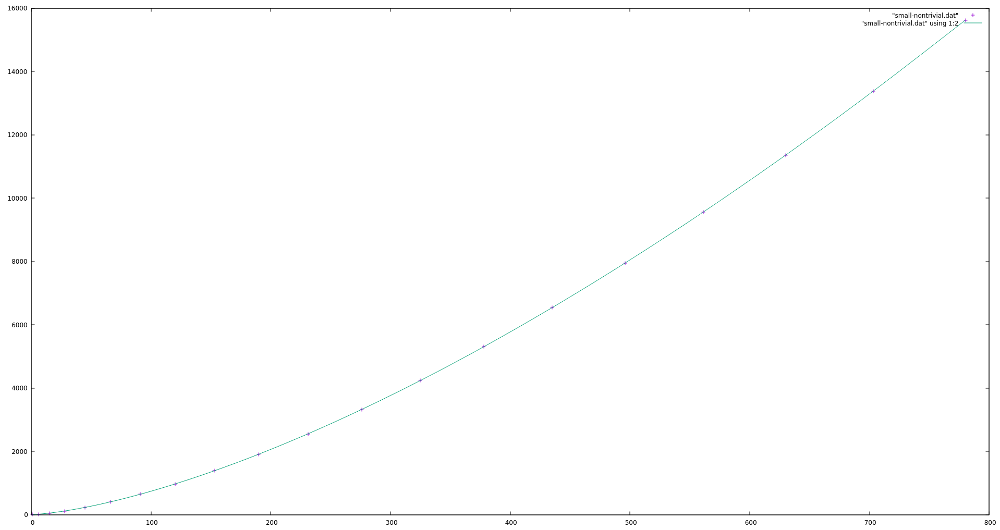
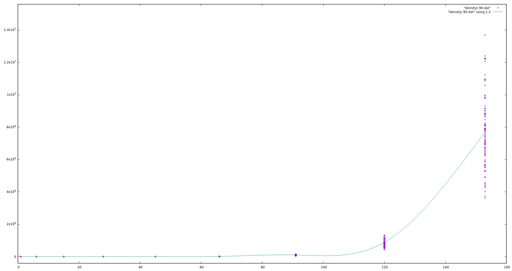

# Term Expansion When Removing Mutual Recursion

## Simple Example
```
ghci> runExample fgh
before: size = 28
f = (all a . 1 + f a * h a)
g = (all a . h a * g a + 1)
h = (all a . f a * g a)
----------
after: size = 183
f = (mu f.(all a . 1 + f a * (mu h.(all a . f a * (mu g.(all a . h a * g a + 1)) a)) a))
g = (mu g.(all a . (mu h.(all a . (mu f.(all a . 1 + f a * h a)) a * g a)) a * g a + 1))
h = (mu h.(all a . (mu f.(all a . 1 + f a * h a)) a * (mu g.(all a . h a * g a + 1)) a))
```

We can also compute the degree to which a system is properly mutually recursive by partitioning it into it's properly mutually recursive subsystems. For example, in `fgh`, the whole thing is properly mutually recursive:
```
ghci> map length (partitionMRec fgh)
[3]
```
Whereas, if we consider a larger system of (mostly unrelated) types:
```
ghci> runExample multi
before: size = 72
binarytree = (all a . 1 + binaryTree a * a * binaryTree a)
f = (all a . 1 + f a * h a)
forest = (all a . 1 + tree a * forest a)
g = (all a . h a * g a + 1)
h = (all a . f a * g a)
list = (all x . 1 + list x * x)
rosetree = (all a . 1 * list rosetree a)
tree = (all a . 1 + a * forest a)
----------
after: size = 268
binarytree = (mu binarytree.(all a . 1 + binaryTree a * a * binaryTree a))
f = (mu f.(all a . 1 + f a * (mu h.(all a . f a * (mu g.(all a . h a * g a + 1)) a)) a))
forest = (mu forest.(all a . 1 + (mu tree.(all a . 1 + a * forest a)) a * forest a))
g = (mu g.(all a . (mu h.(all a . (mu f.(all a . 1 + f a * h a)) a * g a)) a * g a + 1))
h = (mu h.(all a . (mu f.(all a . 1 + f a * h a)) a * (mu g.(all a . h a * g a + 1)) a))
list = (mu list.(all x . 1 + list x * x))
rosetree = (mu rosetree.(all a . 1 * list rosetree a))
tree = (mu tree.(all a . 1 + a * (mu forest.(all a . 1 + tree a * forest a)) a))
```
it conists of multiple independent systems, each of which is properly mutually recursive (some by virtue of containing only one type):
```
ghci> map length (partitionMRec multi)
[1,3,2,1,1]
```

## Explanation of Generated Examples

A system of N mutually recursive types t1,t2,...,tN can be thought of as a system of fixed point equations

t1 = T1(t1,t2,...,tN)

t2 = T2(t1,t2,...,tN)

...

tN = TN(t1,t2,...,tN)

and from such a system of fixed point equations we can construct an NxN matrix

t1,1 t1,2 ... t1,N

t2,1 t2,2 ... t2,N

...

tN,1 tN,2 ... tN,N

where ti,j is 1 in case tj occurs in T1(t1,t2,...,tN), and is 0 otherwise. Conversely, from such a matrix, we can construct a system of N types that would yield the matrix. For example, if the matrix is

1 1 0 1

0 1 0 0

0 1 1 0

1 0 1 1

then the system 

t1 = t1 + t2 + 1  + t4

t2 = 1  + t2 + 1  + 1

t3 = 1  + t2 + t3 + 1

t4 = t1 + 1  + t3 + t4

yields that matrix. The main thing determining how large the representation of a system of types becomes when mutual recursion is removed seems to be this matrix. 

## Deterministic Tests

Individual tests have been plotted as points, with the X coordinate being the size (in number of constructors required to represent) of the system of mutually recursive equations under consideration, and the Y coordinate being the size of the system once mutual recursion has been removed. 

The worst case considered is the case in which the matrix consists entirely of 1. Plotting the result of removing mutual recursion from the system corresponding to this matrix of size 1..10 yields: 


The shape of the graph tells us two things. First, the worst case for a system of 10 types is gigantic (about size 1.9*10^8, with initial size ~180). Second, the function this graph plots is growing absurdly fast (the little dip is caused by the line being a spline. The function never decreases).

The worst case probably never occurs in practice. I've certainly never seen a system of 10 mutually recursive types in which each type directly references each other type in the wild. It also makes sense to consider the system in which ti refers directly to ti+1, and tN refers to t1, creating a cycle. This is one of the sparser systems in which every type refers to every other type. Plotting this system for (N in [1..20]) types yields:



It looks like a polynomial function. This isn't terrible.

As a sort of control, I've also plotted the system where each type refers only to itself (no mutual recursion) for (N in [1..20]) types:


It seems to be growing linearly, as expected. (It isn't quite Y=X, but it's very, very close). 

## Random Tests

Given p a value between 0 and 1, we can easily generate an NxN matrix in which each entry is 1 with probability p, and is 0 with probability (p-1). (p is now something like the "density" of the generated matrix). For p in [10,20,30,..,90], I've used such matrices to generate 100 systems of N types for N in [1..9], and plotted the result as before. 

While the curve looks more or less the same across all densities tested (becoming slightly steeper at higher density), and the X-scale remains the same, the Y-scale grows very quickly. That a randomly generated system (density 50) with initial size ~150 has size ~500000 is worrying. 

Density 10:


Density 20:


Density 30:


Density 40:


Density 50:


Density 60:


Density 70:


Density 80:


Density 90:



## Large Systems Found in the Wild

The best source of large systems of mutually recursive types seems to be parsers. The [BNFC website](https://bnfc.digitalgrammars.com) links to four large examples, and I've transcribed (uncarefully) three of them to use as test cases. (The omitted grammar is for the C language. It's 350 lines long, and I'm hoping the Java grammar will be similar enough to justify not spending the time transcribing the C grammar).

The (transcribed) [Java grammar](http://people.cs.uchicago.edu/~mrainey/java.cf) is:
```
ghci> prettySignature javaSig
args = list exp
arrAcc = list 1 * exp + specExp * exp
arrayInits = variableInits + arrayInits * variableinits + arrayInits
body = list lVarStatement
bracketsOpt = 1
catch = typeSpec * 1 * body + typeSpec * body
classHeader = list modifier * 1 + list modifier * 1 * list typeName + list modifier * 1 + list modifier * 1 * list typeName + list modifier * 1 + list modifier * 1 * list typeName + list modifier * 1 * list typeName + list modifier * 1 * list typeName * list typeName
declaratorName = 1 + list bracketsOpt
dimExpr = exp
elseIf = exp * stm
exp = exp * 1 * exp + exp * typeName + exp * exp * exp + exp * exp + exp * exp + exp * exp + exp * exp + exp * exp + exp * exp + exp * exp + exp * exp + exp * exp + exp * exp + basicType * exp + exp * exp + list 1 * list bracketsOpt * exp + 1 * exp + exp + exp + exp + exp + 1 + arrAcc + mthCall + fieldAcc + 1 + 1 + newAllow + list 1
fieldAcc = specExp * 1 + newAlloc * 1 + list 1 + list 1 + basicType
fieldDeclaration = list modifier * typeSpec * list varDecl + list modifier * typeSpec * methodDecl * methodBody + list modifier * typeSpec * methodDecl * list typeName * methodBody + list modifier * 1 * list parameter * body + list modifier * 1 * list parameter * list typeName * body + body + typeDecl + body
forInit = list exp + typeSpec * list varDecl + typeSpec * list varDecl
guardStm = exp * body + body * list catch + body * list catch * body
import = list ident * list 1 + list ident * list 1
iterStm = exp * stm + stm * exp + forInit * list exp * list exp * stm + list exp + typeSpec * list varDecl + typeSpec * list varDecl
jumpStm = 1 + 1 * 1 + 1 + 1 * 1 + 1 + 1 * exp + 1 * exp
lVarStatement = typeSpec * list varDecl + typeSpec * list varDecl + stm + 1
methodBody = 1 + body
methodDecl = declaratorName * list parameter + methodDecl * bracketsOpt
modifier = 1 + 1 + 1 + 1 + 1 + 1 + 1 + 1 + 1 + 1
mthCall = list 1 * args + specExpNp * args + 1 * args
newAlloc = typeName * args + typeName * args * list fieldDeclaration + typeName * list dimExpr + typeName * list dimExpr + typeName * list dimExpr * arrayInits
parameter = typeSpec * declaratorName + typeSpec * declaratorName
programFile = list 1 * list 1 * list import * list typeDecl + list import * list typeDecl
selectionStm = exp * stm * list elseIf + exp * stm * list elseIf * stm + exp * body
specExp = exp + specExpNp + 1
specExpNp = 1 + arrAcc + mthCall + fieldAcc
stm = 1 + 1 + exp + 1 + exp + list lVarStatement + jumpStm + guardStm + iterStm + selectionStm
typeDecl = classHeader * list fileDeclaration
typeName = 1 + list 1
typeSpec = typeName * list bracketsOps + typeName
varDecl = declaratorName * variableInits + 1
variableInits = exp + 1 + arrayInits
```

and the size after mutual recursion has been removed is 45127:
```
ghci> onlySizes javaSig
before: size = 603
after:  size = 45127
```
which is much larger than the initial size of 603. This is the worst practical example I've found. It's also one of the larger examples that exists, I think, so if we can live with this one then we're probably okay overall. Remarkably, this system has a subsystem of 24 properly mutually recursive types:
```
ghci> map length (partitionMRec javaSig)
[24,1,1,1,1,1,1,1,1,1,1,1]
```

I've also transcribed an [Alfa grammar](https://github.com/BNFC/bnfc/tree/master/examples/Alfa):

```
ghci> prettySignature alfaSig
arrow = 1 + 1
binding = 1 * exp
bound = 1 + 1
branch = 1 * list 1 * exp + 1 * 1 * 1 * exp + 1 * exp
constructor = 1 * list typing + 1
decl = list defAttr * def + import
def = 1 * list varDecl * exp * exp + 1 * exp + 1 * list typing * packageBody + exp * list openArg + 1 * list typing * list constructor + 1 * list typing * exp + 1 * list typing * exp + list def + comment
defAttr = 1 + 1 + 1 + 1
exp = 1 + 1 + 1 + 1 + 1 + 1 + 1 + 1 + 1 + 1 + 1 + exp * 1 + exp * exp + exp * 1 * exp + list fieldDecl + list binding + list constructor + varDecl * arrow * exp + exp * arrow * exp + varDecl * arrow * exp + list 1 * arrow * exp + list decl * exp + exp * list openArg * exp + exp * list branch + list varDecl * list indConstructor + comment * exp + exp * comment + 1 + integer
fieldDecl = 1 * exp
import = 1
indConstructor = 1 * list typing * list exp
list = (all a . 1 + a * list a)
module = list decl
openArg = list defAttr * 1 + list defAttr * 1 * exp + list defAttr * 1 * exp + list defAttr * 1 * exp * exp
packageBody = list decl * exp
typing = varDecl + exp
varDecl = list bound * exp
```

for which the size after mutual recursion has been removed is 3692:
```
ghci> onlySizes alfaSig
before: size = 289
after:  size = 3692
```
which is barely 10 times larger than the initial size of 289. This system is also highly mutually recursive:
```
ghci> map length (partitionMRec alfaSig)
[1,12,1,1,1,1,1]
```

The final large example I transcribed was the grammar for [BNFC itself](https://github.com/BNFC/bnfc/blob/master/examples/LBNF/LBNF.cf), but this turned out not to be mutually recursive at all:
```
ghci> map length (partitiomMRec bnfcSig)
[1,1,1,1,1,1,1,1,1,1,1]
```
and so the size difference was negligible:
```
ghci> onlySizes bnfcSig
before: size = 132
after:  size = 143
```

## Conclusion

I think that if we can stomach the size increase of the Java grammar, them we can go ahead without product kinds. If not, we should probably add product kinds. While many of the randomly generated examples are worrying, I suspect that the Java grammar is near the upper end of complexity for systems of mutually recursive types that people actually write.
