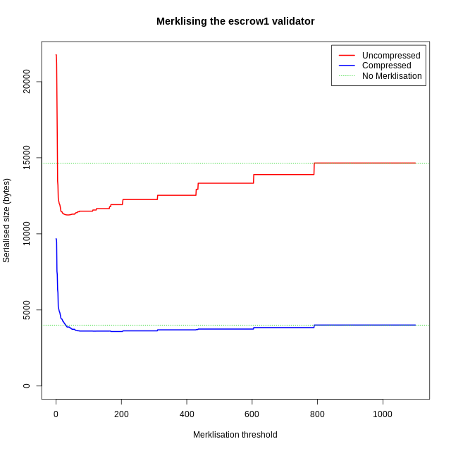
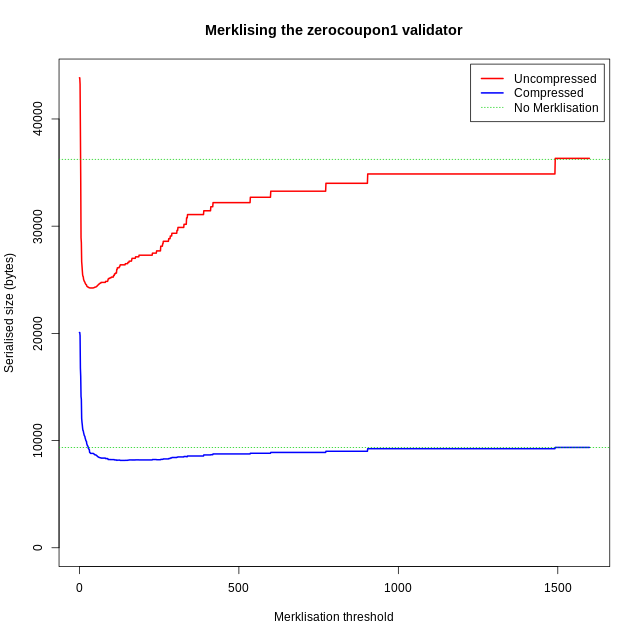

## 3. Merklising Programs

### Introduction

This document carries on from the previous notes on [Merklised
Abstract Syntax Trees](./Merklisation-notes.md) and looks at the
effects of Merklising programs.

The document mentioned above and the one examining
[erasure](Erasure.md) of types and other information from Plutus Core
ASTs both contain statistics for validation code from the sample
contracts in
[`plutus-use-cases`](https://github.com/input-output-hk/plutus/tree/master/plutus-use-cases).
However, those documents deal with unapplied validators, which are
just functions.  To study the full potential of Merklisation we
require executable validators, which are obtained by applying
validators to suitable arguments (a redeemer, a data value, and a
`PendingTx` object containing information about the transaction being
validated).  Once these arguments have been supplied a it become
possible to run a validator, and when it is run some parts of the AST
(depending on the arguments) may not be required and can safely be
Merklised away, reducing the size of the on-chain validation code.

It can be quite difficult to construct suitable inputs, but
fortunately `plutus-use-cases` contains a comprehensive set of tests
which execute sample contracts on the mockchain.  There are generally
a number of tests for each contract, exercising different behaviours
of the contract.  By modifying the testing code slightly I was able to
insert code to carry out Merklisation experiments on applied
validators.

#### Basic Validator Sizes
For reference, the table below shows the sizes of the on-chain validators for the 
various Plutus sample contracts and also for the Marlowe interpreter (which is implemented 
as a single Plutus contract).  For each contract, the table shows 
   * The size of the serialised version of the full AST in its original form
   * The size of the serialised version of the minimised typed AST
   * The size of the serialised version of the minimised type-erased AST

Here "minimised" means that the names in the AST have been replaced with integer de Bruijn indices. 

The sizes of the full AST differ from those shown in earlier documents.  There are (at least) four reasons for this.
   * Recall that every node in the AST contains an annotation field, which is the Haskell unit value
     at the point when validators are ready for transmission to the chain.  In some of the earlier
     experiments, these were included in the serialisation, adding and extra byte for every 
     node (both terms and types) in the AST.  Unit annotations have been omitted from all of the
     serialised ASTs here.
   * For the purposes of the earlier experiments I exported validator code from 
     each contract.  The exported validator code wasn't always exactly the same 
     as the validator in the contract (sometimes parameters are required to construct 
     the actual validator which aren't statically available in the contract).
   * The validator has to be extended to include extra code, for example for 
     decoding `Data` objects.
   * Types are normalised in on-chain code.  It looks as if this typically 
     _reduces_ the size of the code, mainly because type instantiations are 
     removed (type variables are replaced with actual types in the bodies of abstractions).

Some of the contracts below have multiple validators.  This is because the tests sometimes
involve multiple transactions.  Repeated transactions (eg, pay to a public key) have been
removed, but validators of different sizes for a single test have been retained.

| Contract | Compression | Full AST | Typed, minimised | Untyped, minimised |
| :------- | :---------- | -------: | ---------------: | -----------------: |
| Crowdfunding | Uncompressed | 165312 | 53091 | 13489 | 
| | Compressed | 33243 | 12788 | 3591 | 
| Currency | Uncompressed | 122942 | 40909 | 10822 | 
| | Compressed | 24677 | 10831 | 3033 | 
| Escrow | Uncompressed | 173698 | 55570 | 14654 | 
| | Compressed | 33452 | 13565 | 4005 | 
| Future (1) | Uncompressed | 122930 | 40897 | 10810 | 
| | Compressed | 24668 | 10814 | 3018 | 
| Future (2) | Uncompressed | 174401 | 55840 | 14840 | 
| | Compressed | 33606 | 13739 | 4167 | 
| Future (3) | Uncompressed | 249530 | 83850 | 22849 | 
| | Compressed | 47798 | 20633 | 5974 | 
| Game | Uncompressed | 78864 | 24069 | 6624 | 
| | Compressed | 15043 | 7457 | 2111 | 
| Game state machine | Uncompressed | 171856 | 58452 | 16527 | 
| | Compressed | 33994 | 14280 | 4160 | 
| Multisig | Uncompressed | 92399 | 28749 | 8411 | 
| | Compressed | 18528 | 8681 | 2749 | 
| Multisig state machine | Uncompressed | 238219 | 81118 | 23385 | 
| | Compressed | 47516 | 20692 | 6176 | 
| Pubkey | Uncompressed | 84645 | 26496 | 7608 | 
| | Compressed | 16595 | 8106 | 2426 | 
| Token account (1) | Uncompressed | 122847 | 40869 | 10797 | 
| | Compressed | 24666 | 10811 | 3016 | 
| Token account (2) | Uncompressed | 134609 | 43786 | 9920 | 
| | Compressed | 27513 | 10426 | 2698 | 
| Vesting | Uncompressed | 172463 | 55413 | 13851 | 
| | Compressed | 34236 | 13131 | 3672 | 
| Marlowe interpreter | Uncompressed | 409249 | 122402 | 36328 | 
| | Compressed | 73825 | 28247 | 9360 | 

### Merklisation

This section includes figures for Merklised versions of the above validators, 
based on actual executions of the Plutus and Marlowe contract tests.  These 
execute multiple contract scenarios, which typically lead to different 
execution paths in the validators (eg, the crowdfunding example has a test
in which the target is met and the donations are collected by the organiser,
and another in which the target is not met and the donations are reclaimed 
by the donors; other properties are checked as well, including not being able to collect
too early or too late).  The figures which occur later are all for ASTs from which types
have been erased because the results in [Merklisation-notes.md](./Merklisation-notes.md)
(and other experimental results
which have not been included here) show that Merklising types always leads to validators 
which are substantially larger than type-erased ones.  

#### Methodology

To perform Merklisation based on execution paths, I used a modified
version of the CEK machine which executes a Plutus Core program and
records which AST nodes are evaluated.  This was used to execute the 
_applied_ validators in the use-case tests, and the information obtained was 
used to replace unused nodes in the AST of the _unapplied_ validator
with their Merkle hashes (using a new AST node type called `Prune` 
which contains the hash of the deleted subtree).  This strategy 
reflects what would happen in practice: a (deterministic) validator
would be applied to its expected arguments and evaluated off-chain 
to determine which parts of the AST are actually required, and 
then a Merklised version of the validator would be transmitted for
on-chain evaluation.

#### Merklisation thresholds
Experimentation showed that Merklising every unused term was a bad idea.
Merklised types and terms take up 34 bytes when serialised (two header bytes
and a 32-byte hash), and so Merklising everything can increase the size 
of the validator substantially (increasing the size of the uncompressed serialised validator 
by 20-100% and the size of the compressed version by 100-240%).  
I carried out some experiments where only nodes whose serialised size 
would be greater than a given threshold were
Merklised, and varied the threshold to see which size gave a maximal reduction
in serialised sizes.  I did this for every transaction in every test (both Plutus and Marlowe).

Graphs of the results for one validation of the Plutus escrow contract and one validation of the 
Marlowe zero coupon contract are shown below.  All of the other results showed a broadly similar pattern
(but note the differing horizontal scales here).

For uncompressed validators, Merklisation was most effective with a threshold of about 34
bytes, as might be expected.  For compressed validators, a larger threshold is more effective.
For the zero coupon example above, with a threshold of 34, the compressed serialised AST took up 8852 bytes;
the minimal size (8149 bytes) occurred for thresholds between 128 and 143, and then the size
increased to a maximum of 9360 for large thresholds where nothing was Merklised at all.

When all of the validators were examined, it turned out that the
uncompressed validator was always smallest with a threshold of 34 (and
nearby values). The minimal size of the compressed version occurred at
different thresholds, but a threshold of 150 always gave something
less than 50 bytes larger than the optimal one.  The figures in the
next section use these thresholds in order to get Merklisation results
close to the best possible so that we can see how well Merklisation
performs in comparison with doing no Merklisation at all.

### Results
The table below shows various numbers for the validators appearing in the tests.  As an experiment
I also measured what happened when unused nodes were discarded completely and replaced with the `Error` term.
The columns are as follows

  1. The contract name
  2. The number of bytes in the serialised version of the full typed validator
  3. The number of term nodes in the validator
  4. The number of term nodes actually used during execution
  5. The number of bytes in the serialised un-Merklised minimised validator
  6. The number of bytes in the serialised Merklised minimised validator (Merklissation threshold 34)
  7. The number of bytes in the serialised minimised validator after all unused nodes were replaced with `Error`
  8. The number of bytes in the compressed serialised un-Merklised minimised validator
  9. The number of bytes in the compressed serialised Merklised minimised validator (Merklisation threshold of 150)
 10. The number of bytes in the compressed serialised minimised validator with unused nodes replaced with `Error` 

All validators concerned were converted into an untyped AST and then names were replaced with
de Bruijn indices, since (as we have already seen) this reduces the size of the AST substantially
but still gives us an executable validator (although we would need to undo the de Bruijn transformation
to execute the code on the CEK machine).

Certain validators reappeared numerous times during the tests, so I've
removed duplicates.  The compressed sizes of identically-sized
validators sometimes varied by a few bytes (presumably because
differences in identically sized pieces of data within the validators
would make the serialised version slightly more or less compressible),
so I've removed those as well.  Note that for a given use-case,
validators with significantly different sizes may appear: this is
because multiple different types of transaction can occur during a
test and these have different validators (for example, the
Crowdfunding example performs transactions which collect from and pay
to scripts in addition to the main validator).

Here are the results (if the table's too wide for the page you can click on
it and use the left and right arrow keys to scroll it horizontally).

| Validator | Full AST | Total term nodes | Used term nodes| Minimised, un-Merklised | Minimised, Merklised | Minimised, unused nodes discarded | Mininimised, un-Merklised, compressed | Mininimised, Merklised, compressed | Mininimised, unused nodes discarded, compressed |
| :---- | ----: | ----: | ----: | ---: | ---: | ----: | ----: | ----: | ----: |
  **Crowdfunding**
| | 165312 | 9329 | 6261 | 13489 | 11835 | 9041 | 3591 | 3577 | 2452 | 
| | 165312 | 9329 | 4693 | 13489 | 10136 | 7034 | 3591 | 3439 | 2084 | 
  **Currency**
| | 122942 | 7412 | 5851 | 10822 | 10429 | 8656 | 3033 | 3077 | 2369 | 
  **Escrow**
| | 173698 | 9957 | 5845 | 14654 | 11336 | 8472 | 4005 | 3612 | 2395 | 
| | 173698 | 9957 | 5851 | 14654 | 11336 | 8481 | 4005 | 3612 | 2396 | 
| | 173698 | 9957 | 4480 | 14654 | 9827 | 6735 | 4005 | 3488 | 2066 | 
  **Futures**
| (1) | 122930 | 7412 | 5851 | 10810 | 10417 | 8644 | 3018 | 3064 | 2353 | 
| (2) | 174401 | 9993 | 6126 | 14840 | 11903 | 9051 | 4167 | 3830 | 2682 | 
| (3) | 249530 | 15220 | 7981 | 22849 | 16078 | 11756 | 5974 | 5064 | 3220 | 
| | 249530 | 15220 | 7771 | 22849 | 15921 | 11449 | 5974 | 5174 | 3165 | 
| | 249530 | 15220 | 7671 | 22849 | 15807 | 11239 | 5974 | 4987 | 3051 | 
  **Game**
| | 78864 | 4487 | 3116 | 6624 | 6340 | 4737 | 2111 | 2121 | 1493 | 
| | 78864 | 4487 | 3121 | 6624 | 6340 | 4742 | 2111 | 2121 | 1496 | 
  **Game state machine**
| | 171856 | 11039 | 5752 | 16527 | 11562 | 8441 | 4160 | 3817 | 2339 | 
| | 171856 | 11039 | 6858 | 16527 | 12602 | 9921 | 4160 | 3775 | 2619 | 
| | 171856 | 11039 | 6865 | 16527 | 12602 | 9932 | 4160 | 3775 | 2620 | 
| | 171856 | 11039 | 4597 | 16527 | 10079 | 6966 | 4160 | 3390 | 1997 | 
  **Multisig**
| | 92399 | 5533 | 3951 | 8411 | 7792 | 6144 | 2749 | 2697 | 2040 | 
| | 92399 | 5533 | 3880 | 8411 | 7782 | 6034 | 2749 | 2697 | 2009 | 
  **Multisig state machine**
| | 238219 | 15554 | 7981 | 23385 | 16074 | 11754 | 6176 | 5211 | 3215 | 
| | 238219 | 15554 | 8449 | 23385 | 16902 | 12454 | 6176 | 5456 | 3395 | 
| | 238219 | 15554 | 8466 | 23385 | 16897 | 12483 | 6176 | 5456 | 3404 | 
| | 238219 | 15554 | 8682 | 23385 | 17011 | 12699 | 6176 | 5499 | 3434 | 
| | 238219 | 15554 | 5630 | 23385 | 13563 | 8680 | 6176 | 4993 | 2583 | 
| | 238219 | 15554 | 7681 | 23385 | 15894 | 11246 | 6176 | 5253 | 3075 | 
  **Pubkey**
| | 84645 | 5079 | 3450 | 7608 | 6980 | 5269 | 2426 | 2387 | 1678 | 
  **Token account**
| (1) | 122847 | 7401 | 5796 | 10797 | 10404 | 8578 | 3016 | 3061 | 2342 | 
| (2) | 134609 | 7007 | 5402 | 9920 | 9633 | 7701 | 2698 | 2704 | 2082 | 
  **Vesting**
| | 172463 | 9626 | 6806 | 13851 | 12330 | 9786 | 3672 | 3669 | 2675 | 
| | 172463 | 9626 | 6670 | 13851 | 12187 | 9566 | 3672 | 3668 | 2600 | 
  **Marlowe Zero Coupon Bond**
| | 409249 | 23142 | 11595 | 36328 | 24530 | 17489 | 9360 | 8227 | 4686 | 
| | 409249 | 23142 | 10548 | 36328 | 22520 | 15825 | 9360 | 7616 | 4197 | 
  **Marlowe Trust Fund**
| | 409249 | 23142 | 12021 | 36328 | 25628 | 18344 | 9360 | 8736 | 4942 | 
| | 409249 | 23142 | 10708 | 36328 | 23009 | 16056 | 9360 | 7645 | 4208 | 

### Comments
* On average, only 60% of the AST nodes in the validators are used during
  evaluation; 21%-64% are unused.

* Merklisation reduces the size of the AST accordingly, but the
  Merklised syntax trees are always significantly larger than what we
  get if we compress without minimising (typically at least 3 times
  the size).

*  If we're careful about the Merklisation threshold, we can get
   compressed Merklised ASTs which are smaller than the compressed un-Merklised ASTs.
   * The compressed Merlkised ASTs are 80%-101% of the size of the un-Merklised ones, with a mean of about 91%.

* If we just discard all of the unused nodes then we get proportionate size reductions  

##### Remark
The results here are slightly inaccurate because they're based on a
version of Plutus Core with the value restriction, and the
type-erasure procedure discards all types and type-related operations.
We have recently removed the value restriction from Plutus Core,
meaning that type abstraction and instantiation now effect
computation: in a type-level abstraction`Λt.e`, the body `e` is now
allowed to be a non-value, and it will not compute until the type
variable `t` is instantiated.  If we decide to use untyped ASTs then
this behaviour will have to be preserved.  I tried some experiments,
firstly replacing `tyAbs` and `tyInst` by new operations `delay` and
`force`, and then replacing `tyAbs` by a term-level lambda abstraction
over a unit variable and `tyInst` by a term-level application to a
variable of type `unit`.  The first approach increased the sizes of
compressed miminised validators by about 10% and the second by about
12%; for uncompressed validators the figures were 13% and 35%.

## Overall conclusions

  * Type information takes up a great deal of space in Plutus Core ASTs
(typically of the order of 70% of the serialised AST); discarding types
  makes things much smaller.

 * Type-erased validators can be made much smaller by performing some simple 
    transformations on the AST (not serialising unit annotations, replacing names
    with de Bruijn indices and discarding textual names).
  * These transformations make the AST representation very sparse and thus very amenable to compression.  We're reluctant to do on-chain decompression, but if the space reduction is significant enough we may wish to reconsider this.
  * Merklisation doesn't seem to be very effective (especailly in conjunction with compression), 
    probably because Merklised nodes are replaced with large incompressible hashes.
    * The maximum size reductions from Merklisation are only about an extra 10-20% for compressed validators.
    * To get optimal Merklisation, we have to introduce a threshold below which some unused nodes are retained. 
    * If you don't Merklise everything that's unused, you lose the privacy
      advantages that are sometimes put forward as a positive feature of Merklisation.
    * Computing Merkle hashes is expensive: I estimate that they
      require about 10 times more cryptographic operations than
      straightforward hashing of a serialised AST.

* Discarding unused nodes entirely does save a lot of space, and
  retains the privacy aspects of full Merklisation.  However, doing
  this will change validator hashes, which we probably don't want.

 
### Questions

* If we use any of these techniques, what will be the definitive
  version of a script?  It seems likely that we won't want to have
  typed Plutus Core on chain, so the untyped version may have to be
  canonical.  However, one could easily check off chain that a typed
  AST typechecks successfully and that the hash of the erased version
  corresponds to the hash of the on-chain validator.  Would it make
  sense to do this kind of thing? (I'm not very clear on how
  validators will be distributed, and who will get to see what on- and
  off-chain).

* Would it still make sense to use Merklisation off-chain for privacy?
  If someone wants to convince you that a partial validator AST is
  correct they could publish a Merkle hash along with the standard
  hash of the validator, and then they could provide you with a fully
  Merklised AST off-chain and publish a version with Merklised nodes
  discarded on the chain.  It would be easy to check that the Merkle
  hash of the off-chain Merklised validator is the same as the Merkle
  hash of the full validator and that if you discard the hashes from
  the off-chain version you get the thing that's been put on the
  chain.  This would allow you to have small partial validators on
  chain and check off-chain that they correspond to the full
  validator. The logistics might be rather complicated (or even
  infeasible) though, and again you have the issue that the (normal)
  hash of the validator changes when you throw part of it away.

