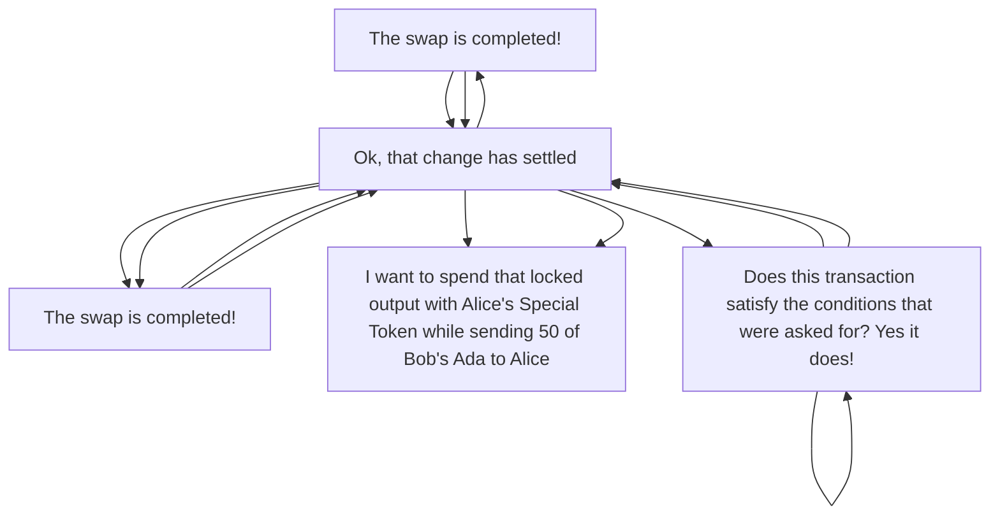

# Plutus platform

The Plutus platform is a platform for writing *applications* that interact with a *distributed ledger* featuring *scripting* capabilities, in particular the [Cardano](../reference/glossary.md#cardano) blockchain.

## Applications

What sort of "applications" are we talking about here? 
As an example, let's think about a pair of users, Alice and Bob, who want to engage in an atomic swap of some assets stored on Cardano.

Alice and Bob don't interact directly, nor do they directly interact with the ledger. 
Very few "smart" blockchain systems encourage their users to interact directly with the chain themselves, since this is usually complex and error-prone. 
Rather, the users interact with some *application* that presents the world in a form that they can understand and interact with.

Of course, such an application must want to do something with the ledger, otherwise you wouldn't need anything new. 
Simple applications might do nothing more than submit basic transactions that transfer assets&mdash;imagine a simple "regular payments" application. 
However, our main focus is on applications that *do* use smart features in order to have a kernel of trusted code that is validated as part of the ledger.

This enables applications that are not possible otherwise. 
Alice and Bob need trusted logic in order to perform their swap: a "dumb" application could submit the transactions transferring the assets, but would have no recourse against Bob defecting. 
Using the smart features of the ledger ensures that Bob can't take Alice's token unless he *really does* send her the money, and it does this without involving a trusted third party.

Creating and using the trusted kernel of code is the most technically difficult and security-sensitive part of the whole operation.
Nonetheless, writing the rest of the application contains plenty of complexity. 
Amongst other things, an application needs to deal with the software around the ledger (wallets, nodes, etc.); distributed systems issues such as settlement delays, inconsistent state between parties, and rollbacks; and simple user-experience issues like upgrades, state management and synchronization. 
Furthermore, while none of these are quite as security-critical as the trusted kernel, users certainly *can* be attacked through such applications, and even non-malicious bugs are likely to be quite upsetting when a user's money is at stake.

Even simple applications must deal with this complexity, and for more advanced applications that deal with state across time, the difficulty is magnified.

## Why we call it a platform

This is why the Plutus Platform is a *platform*. 
Rather than just providing a few tools to make the bare minimum possible, we aim to support application development in its entirety, all the way through from authoring to testing, runtime support, and (eventually) verification. 

Conceptually, the Platform breaks down based on which part of the system we're interested in:

- [Plutus Foundation](plutus-foundation.md): support for writing the trusted kernel of code, and executing it on the chain
- [The Plutus Application Framework](https://github.com/IntersectMBO/plutus-apps): support for writing applications ("Plutus Applications") in a particular style

*A high-level architecture of the Plutus Platform, with an emphasis on applications*

## Additional resources

- Michael Peyton-Jones and Jann Mueller introduce the Plutus platform in [this session](https://youtu.be/usMPt8KpBeI?si=4zkS3J7Bq8aFxWbU) from the Cardano 2020 event. 

- The design of the platform is discussed in the [Plutus technical report](https://ci.iog.io/job/input-output-hk-plutus/master/x86_64-linux.packages.plutus-report/latest/download/1).

