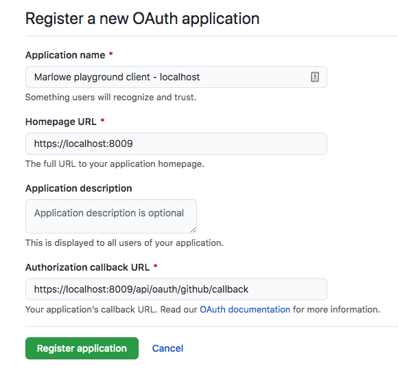

# Marlowe Playground

The Marlowe Playground consists of a Purescript front-end and a Haskell backend. The backend is split into 3 components, [./marlowe-symbolic](../marlowe-symbolic) which runs symbolic analysis on Marlowe contracts, [./web-ghc](../web-ghc) which is a web service that runs GHC source code and [./marlowe-playground-server](../marlowe-playground-server) which contains other endpoints such as the Actus generators. These components are deployed to different places however a local webserver can be run that makes all these endpoints available on localhost.

## Configure a github application
In order to have github integration and be able to load and store the project as `gists`, you need to create a new OAuth application. You can do this by filling [this form](https://github.com/settings/applications/new)



Once created, you need to generate a new client secret. With these information you can configure the following environment variables

```bash
export GITHUB_CLIENT_ID= <client id>
export GITHUB_CLIENT_SECRET= <client secret>
export JWT_SIGNATURE= <random string>
export FRONTEND_URL=https://localhost:8009
export GITHUB_CALLBACK_PATH="/#/gh-oauth-cb"
```

The random string for `JWT_SIGNATURE` can be generated with the following command

```bash
openssl rand -hex 40
```

## Running local server

Once the environment variables are created, the server can be run with the following command:
```bash
$(nix-build -A marlowe-playground.server-invoker)/bin/marlowe-playground webserver
```

You can now reach the server on [http://localhost:8080]() however you probably want to run the web front-end, see the [Marlowe Playground Client](../marlowe-playground-client/README.md) for instructions on how to do this.
