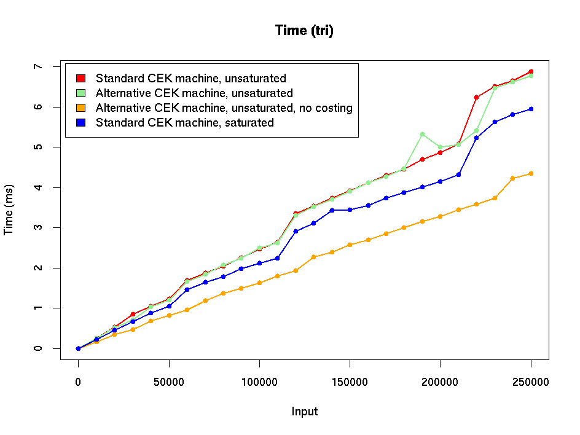
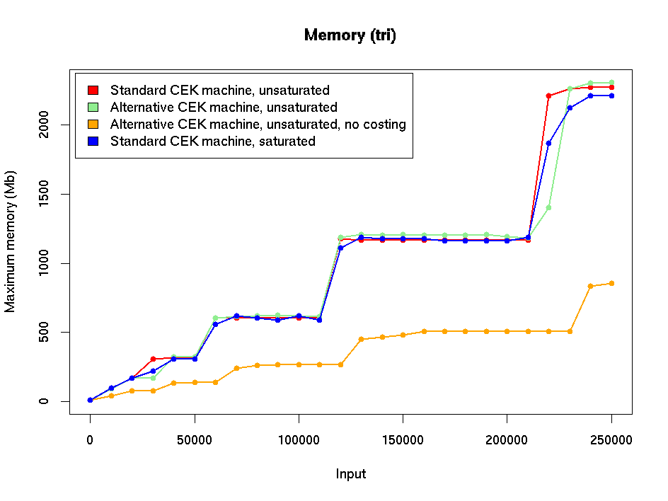
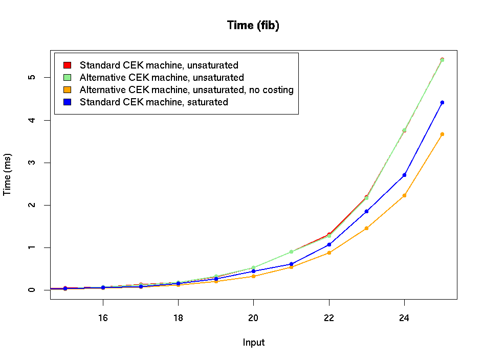
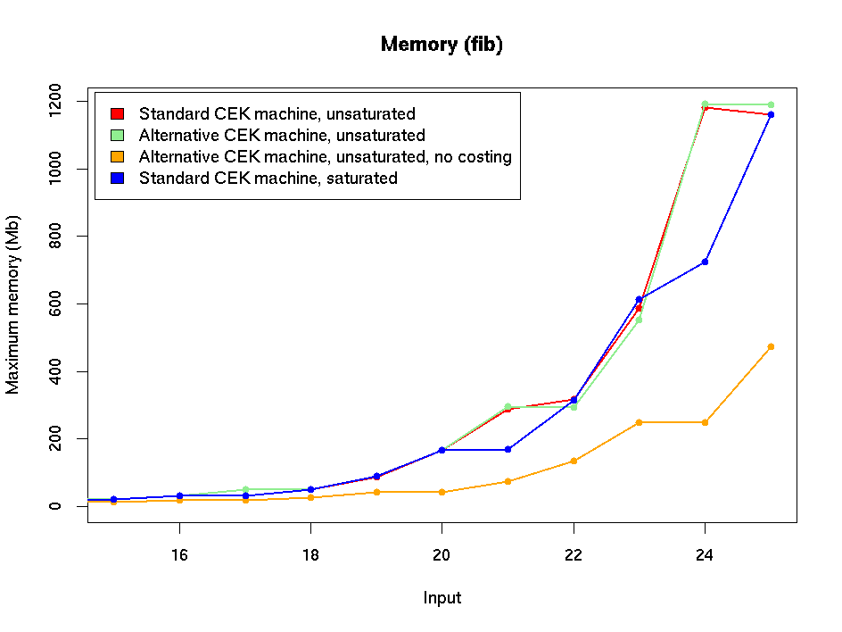
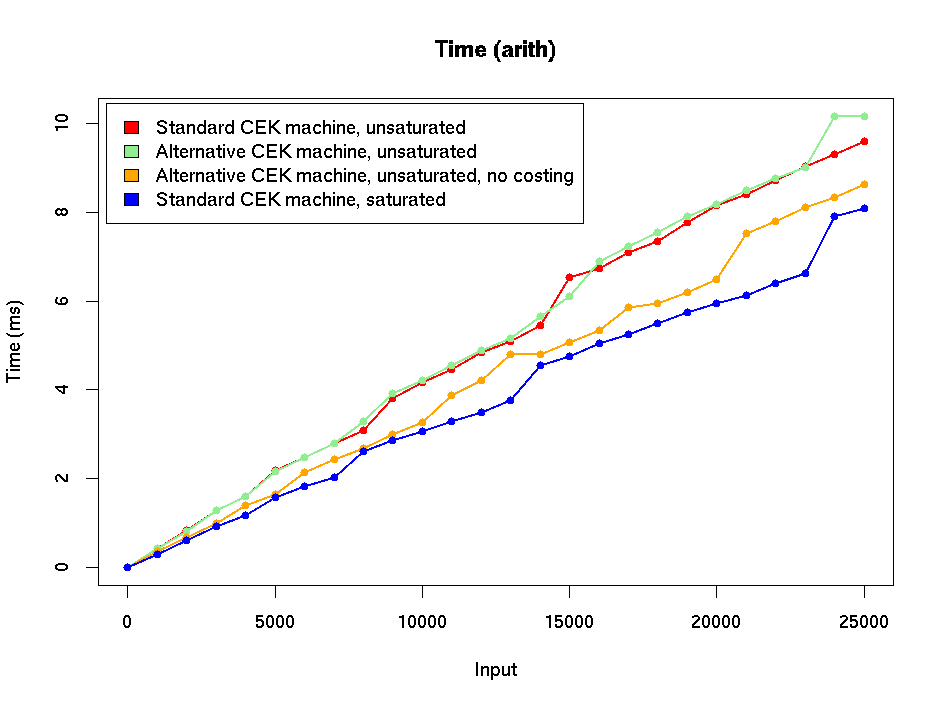
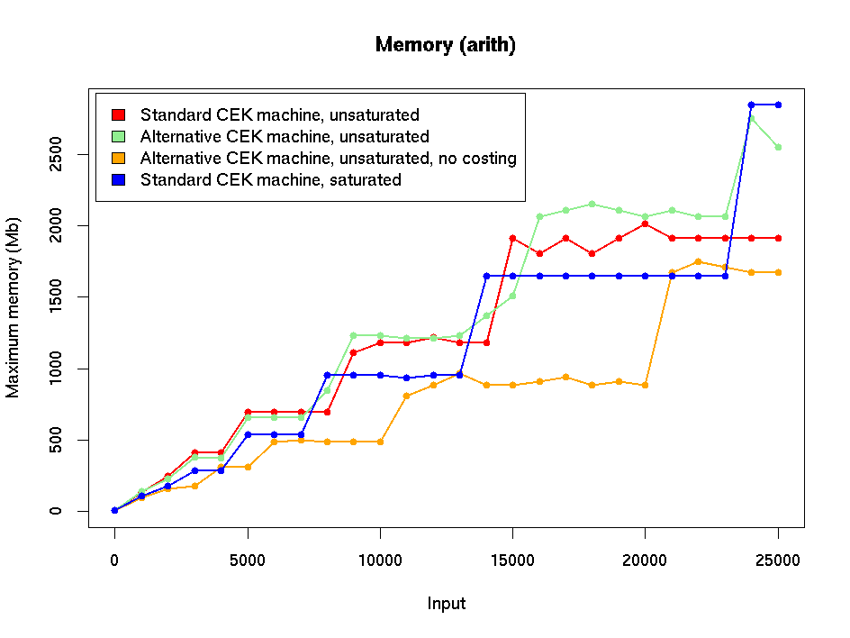

# Experiments with variations on the CEK machine - initial version

This document contains performance graphs for the initial version of
the alternative CEK machine at the start of July 2002.  THESE ARE
PRESENTED FOR INFORMATION ONLY: the machine implementations have now
been updated and new data can be found in
[CEK-variations-stats.md](./CEK-variations-stats.md).

The graphs contain data for
* The standard CEK machine.
* The alternative CEK machine.
* The standard CEK machine with saturated builtins.
* The standard CEK machine with the costing mechanism (ie gas
  consumption tracking) removed: this was done as an experiment to get
  an idea of the overhead due to costing and how this compared with
  variations due to different builtin evaluation strategies.

