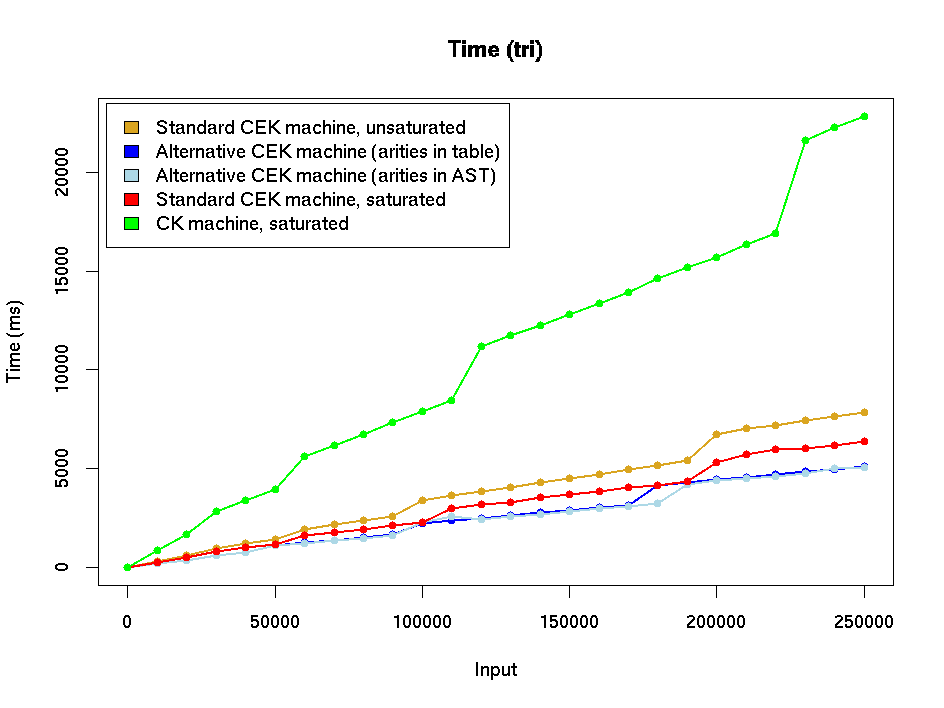
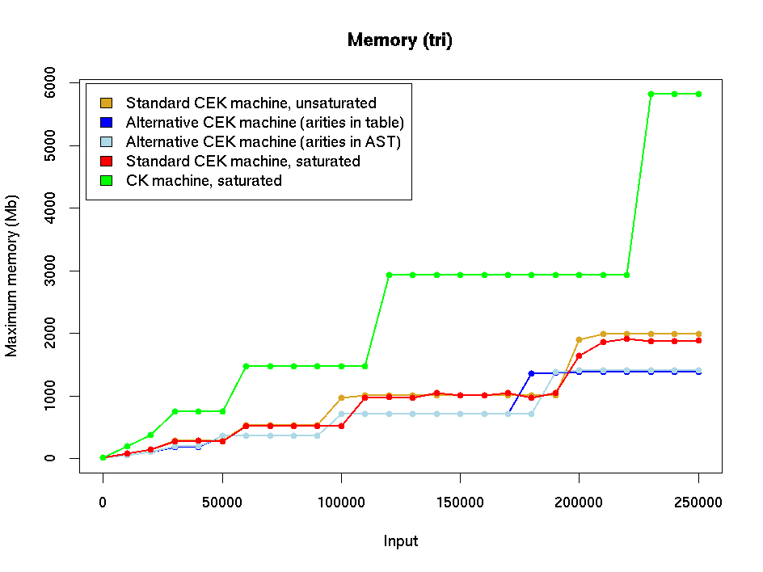
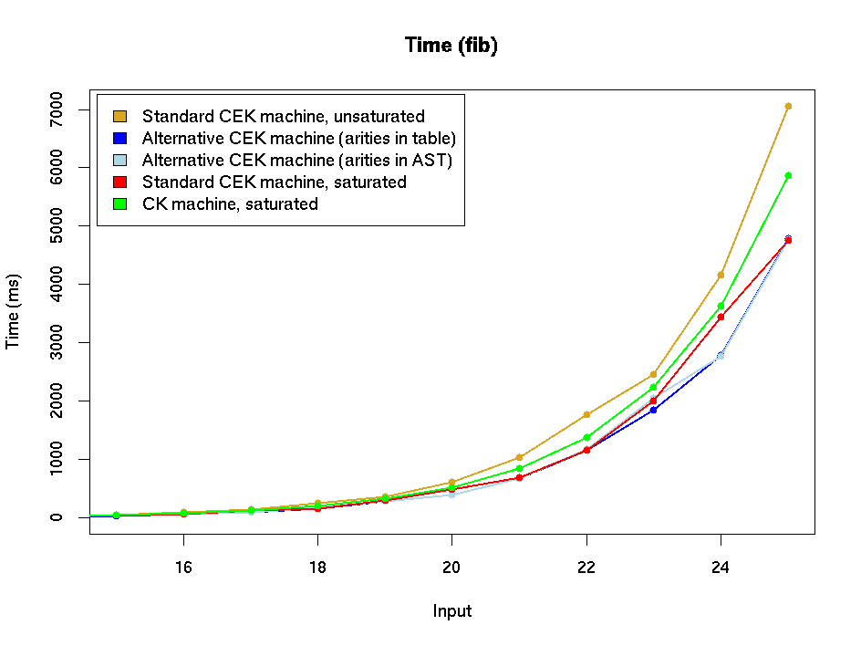
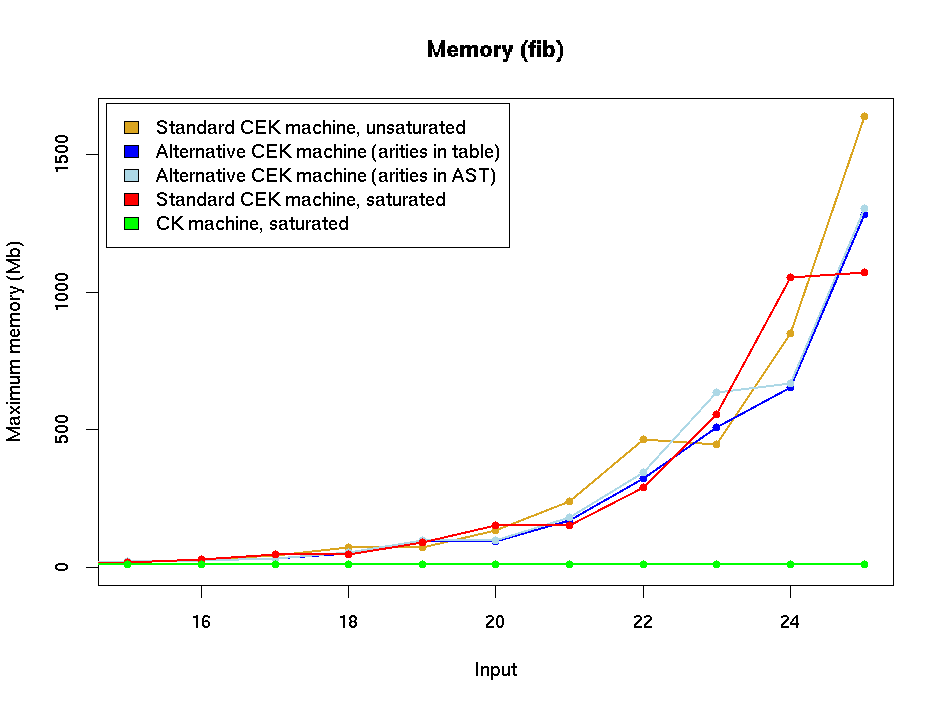
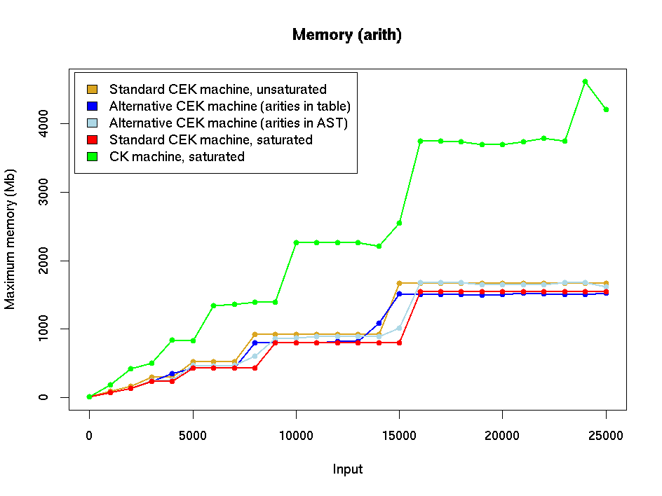

# Experiments with variations on the CEK machine - initial version

This document contains performance graphs for the initial version of
the alternative CEK machine at the start of July 2002.  THESE ARE
PRESENTED FOR INFORMATION ONLY: the machine implementations have now
been updated and new data can be found in
[CEK-variations-stats.md](./CEK-variations-stats.md).

