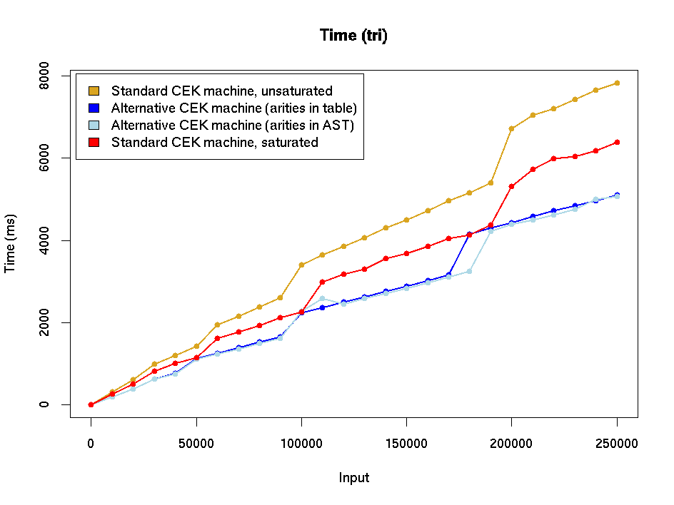
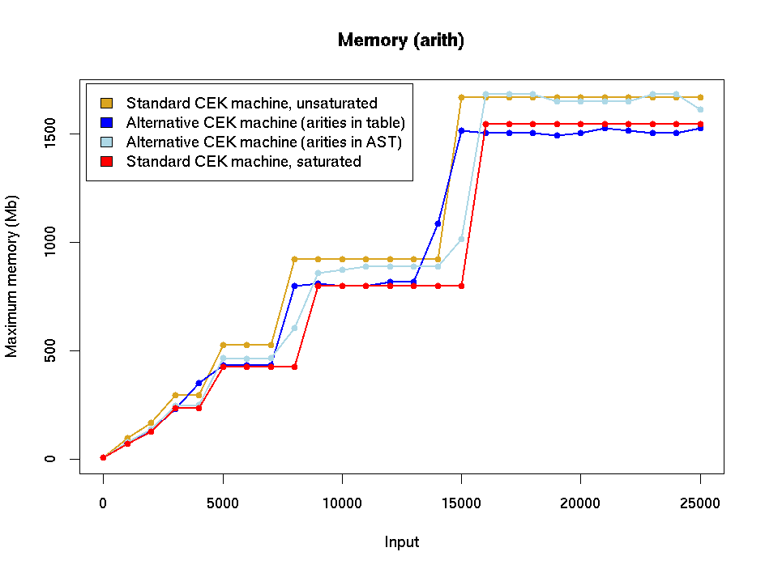

# Experiments with variations on the CEK machine, July 2020.

This document describes some experiments with variations on the CEK
machine, including the one proposed in [this note](./alternative-CEK.md), where
instead of closures of the form `(V,ρ)`, an alternative form of
closure is used where environments only appear under binders, and are
not stored with every value.

### Efficiency of builtin application.

The mechanism for evaluating builtins in the original CEK machine (and
the version currently in the `master` branch) was somewhat
inefficient.  When evaluating a builtin `b` applied to a list of terms
`t_1, ..., t_n`, it would first evaluate `t_1` to a value `v_1` then
hand off the application `builtin b v_1` to the constant application
machinery (ie, the code which evaluates the Haskell function
underlying a builtin), which would attempt to evaluate it; if this
succeeded then the result would be returned to the CEK machine for
further processing, but if it failed a `stuck` result would be
returned to the machine, which would then evaluate the next argument
and try again, and so on (this is an approximation, since sometimes
partially-applied builtins were stored in closures for later use).

The repeated calls to the constant application machinery took quite a
lot of time, and the branch with saturated builtins was considerably
faster because it only needed to call the constant application
machinery once, when it had collected the correct number of arguments.
(See the graphs in
[CEK-variations-stats-old.md](./CEK-variations-stats-old.md) for the
results of our initial experiments, but be aware that these have been
superseded by the graphs below).

Roman observed that with the alternative version of the CEK machine,
this problem could be avoided while still supporting unsaturated
builtins. The idea is that the machine knows the arities of each
builtin and doesn't attempt to call the constant application machinery
until it has the correct number of arguments.  A difficulty is that
the machine has to keep track of how many arguments are available for
a builtin call, but with the alternative CEK machine this information
can be stored in the modified "closures" use by the machine.  We've
implelemented this (in fact, two different versions), and run some tests. 

Time and memory figures are given for four different CEK machines:

* The current version in `master` (at 21st July 2020), with standard closures and unsaturated builtins.
  See `master` at `872238f1`.
* A modification of the alternative machine which has a table of builtin arities as described above.
  See `kwxm/alternative-cek`.
* Another version of the alternative machine in which the builtin arities are stored in the
  `Builtin` constructor, avoiding the use of the table.    See `kwxm/alternative-cek-arities`.
* A version with saturated builtins (and standard closures).  See `kwxm/saturated-builtins`.

I think it should also be possible to modify the standard CEK machine to
use the argument-counting strategy, but I haven't done this (yet).  The
experiments here are designed to test the efficiency of builtin application,
and do not have large and complicated environments of the sort that might
be expected to show up differences in the environment-storages strategy.
We might wish to take another look at this when we have more complicated
benchmarks (and this shouldn't be too difficult because it would only involve
modifying the CEK machine, not the entire AST).

Note also that during the course of all this, Roman made some
improvements to the constant application machinery in preparation for
the introduction of untyped PLC: these have been incorporated in all
of the machines reported on here, so there shouldn't be any
inconsistencies because of that.

### Experiments

The machines were run with three different examples:
* Fibonacci: a naive recursive implementation.
* Triangle: a program calculating `n + (n-1) + ... + 1`. This is
  essentially the factorial program with multiplication replaced
  by addition.  This performs a reasonable amount of recursion and calculation
  without the time being dominated by computations invloving very large integers.
* Arith: a program which evaluates an arithmetic expression with 100 terms involving
  the four usual arithmetic operators.  The (hand-written) expression is random but does
  not generate large intermediate results.  For the experiments, the expression was
  contained in a loop which calculated it repeatedly.  This example is dominated by
  evaluation of built-in functions, so is useful for seeing how variations in
  the built-in evaluation strategy affect running time and memory consumption.

Each example loops using the Z combinator, and in the experiments
each program was run with a sequence of increasing inputs: for each
input the statstics were averaged over five runs.  The inputs were
provided as CBOR files in an attempt to avoid lengthy parsing
times. Two main figures were recorded:

* The execution time.  The CEK machine was extended to record the time
just before and just after evaluation of its input (excluding time for
deserialisation and other setup (I hope: it's tricky to tell with lazy
evaluation)), and the difference was reported.  The numbers are
usually slighly larger than those reported by the `time` command since
the latter reports the CPU time used by a process, not the real-world
elapsed time.  I did record this time as well, and the results (for
the entired execution, including deserialisation time) were similar to those
reported by the CEK machine.

* Maximum memory usage as reported by the `M` option of
`/usr/bin/time` on Linux (not the shell builtin `time`, which is more
limited). The figure reported is the _maximum resident set size_, which
appears to be a reasonable measure of memory usage. 

### Results

See [CEK-variations-stats-appendix.md](./CEK-variations-stats-appendix.md)
for versions of these graphs including figures for the CK machine (with
saturated builtins).

### Comments

With the old builtin application method, saturated builtins were
clearly faster than unsaturated ones: however the argument-counting
technique seems to solve this problem and make unsaturated builtins at
least as efficient as saturated ones, so there doesn't seem to be any
compelling reason to adopt saturated ones.

Our conclusion is that it seems reasonable to abandon saturated
builtins and proceed with the alternative CEK machine.  Let's keep an
eye on the performance of the machine though. It would be helpful to
have a large and varied set of benchmarks designed specifically for
evaluating the performance of the machine so that we can check how
changes to the machine affect its performance.

