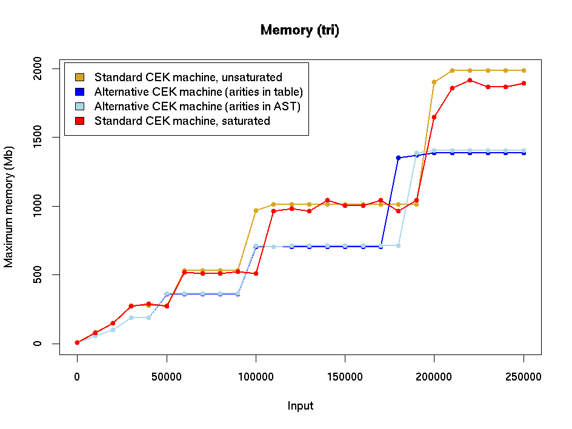
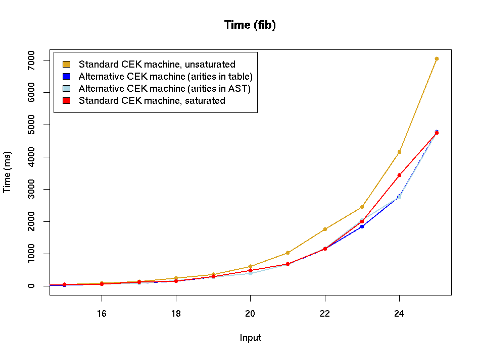
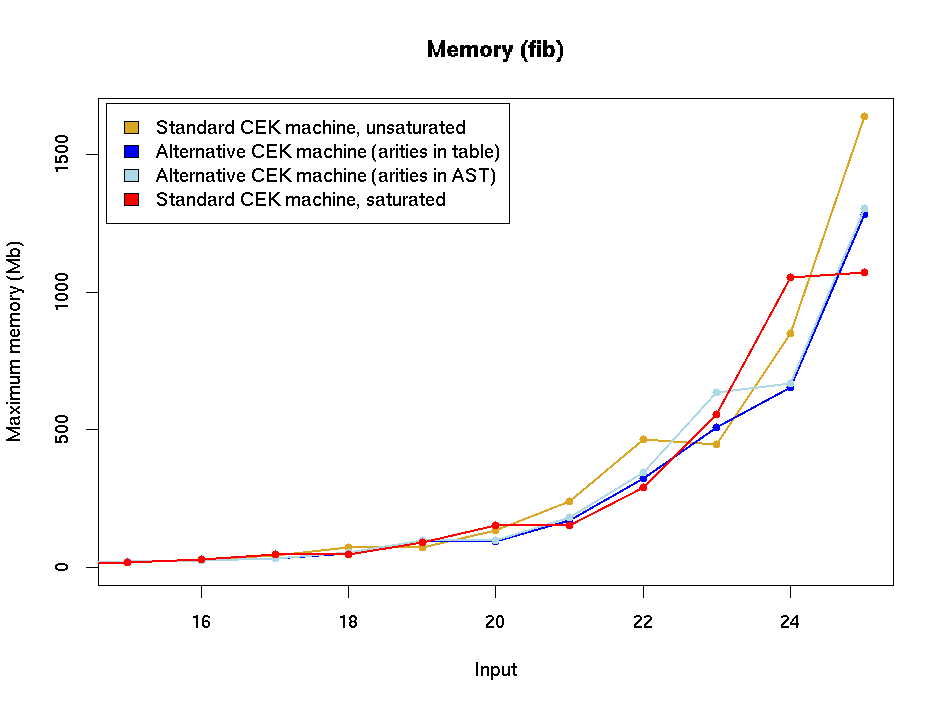
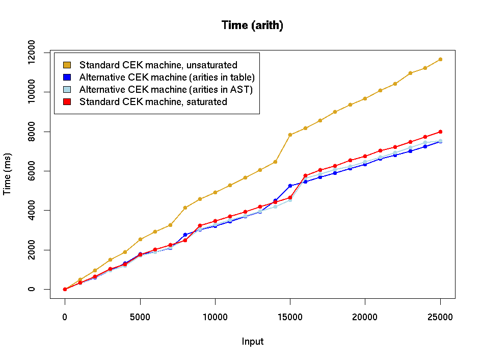

# Experiments with variations on the CEK machine

This document describes some experiments with variations on the CEK
machine, including the one proposed in [this note](./CEK.md).

Time and memory figures are given for four different CEK machines:

* The current version in `master` (at the start of July 2020), with closures and unsaturated builtins.
* A modification of the current version which uses values,
  with environments only appearing under binders.
* The version above with the costing code commented out.  The implementation
  of the CEK machine is more complicated than the theoretical version, and
  this version was a quick experiment to get  idea of how much overhead the
  extra machinery adds.
* A version with saturated builtins (and closures).

### Implementation

The CEK version described in the note mentioned above assumes that all
built-in functions are fully-applied.  However, the figures here are
for a machine with _unsaturated_ builtins.  Ideally there'd also be a
version with saturated builtins and values instead of closures, but
this doesn't exist (yet).  The implementation introduces a new kind of value,

```
   builtin b [A] [V] ρ
```

representing the builtin function `b` instantiated at a list of types
and (perhaps partially) applied to a list of values `[V]` ("values" in
the sense of the [note](./CEK.md) mentioned above).  When we encounter
an application `[(builtin b) A₁ ... Aₖ M₁ ... Mₙ]`, `M₁` is evaluated
to a value `V₁`, and a structure containing the name of the builtin
and `V₁` is fed to the constant evaluation mechanism, which either
succeeds in evaluating the function or becomes stuck because
insufficiently many arguments have been provided.  In the latter case,
`V₁` and the current environment are stored in a `builtin` value of
the form shown above and evaluation continues with the next argument;
longer and longer `builtin` values are generated until evaluation
eventually succeeds.  [Technical note: the information contained in
the `builtin` values is essentially the same as that in the
`primIterApp` mechanism used in the existing CEK machine, and we
bypass the latter, going directly to the constant evaluation mechanism.
Thus the evaluation strategy doesn't introduce any new ineffiency into
the machine.]


### Experiments

The machines were run with three different examples:
* Fibonacci: a naive recursive implementation.
* Triangle: a program calculating `n + (n-1) + ... + 1`. This is
  essentially the factorial program with multiplication replaced
  by addition.  This performs a reasonable amount of recursion and calculation
  without the time being dominated by computations invloving very large integers.
* Arith: a program which evaluates an arithmetic expression with 100 terms involving
  the four usual arithmetic operators.  The (hand-written) expression is random but does
  not generate large intermediate results.  For the experiments, the expression was
  contained in a loop which calculated it repeatedly.  This example is dominated by
  evaluation of built-in functions, so is useful for seeing how variations in
  the built-in evaluation strategy affect running time and memory consumption.

Each example loops using the Z combinator, and in the experiments
each program was run with a sequence of increasing inputs: for each
input the statstics were averaged over five runs.  The inputs were
provided as CBOR files in an attempt to avoid lengthy parsing
times. Two main figures were recorded:

* The execution time.  The CEK machine was extended to record the time
just before and just after evaluation of its input (excluding time for
deserialisation and other setup (I hope: it's tricky to tell with lazy
evaluation)), and the difference was reported.  The numbers are
usually slighly larger than those reported by the `time` command since
the latter reports the CPU time used by a process, not the real-world
elapsed time.  I did record this time as well, and the results (for
the entired execution, including deserialisation time) were similar to those
reported by the CEK machine.

* Maximum memory usage as reported by the `M` option of
`/usr/bin/time` on Linux (not the shell builtin `time`, which is more
limited). The figure reported is the _maximum resident set size_, which
appears to be a reasonable measure of memory usage. 


### Results











See [CEK-variations-stats-appendix.md](./CEK-variations-stats-appendix.md)
for versions of these graphs including figures for the CK machine (with
unsaturated builtins).

### Comments

There's no discernible difference between execution times of the
original and alternative machines (and this is backed up by
examination of the actual numbers).  The alternative machine does seem
to use a little less memory, but it's not drastically different.  The
reason for the similarity of performance is possibly that there's a
lot of extra stuff going on in the implementation which drowns out any
differences due to evaluation strategy: for example, it is clear that
the version with costing removed performs significantly better
(especially in terms of memory usage) than either of the full
versions.  Of course, we need the costing, but these figures suggest
that it might be worthwhile spending time to optimise this and other
features of the machine.

It also seems that saturated builtins give a noticeable improvement in
speed, probably because repeated calls to the constant evaluation
mechanism with partially-evaluated applications aren't required.  The
examples here are simple and quite heavy on arithmetic, so gains from
evaluation of builtin functions are quite noticeable.  The gains are
likely to be less in the code produced by the PlutusTx compiler,
especially in view of the fact that builtins are currently always called
indirectly, via an η-expanded (and usually nested) lambda term.  


I also ran all of the `plutus-use-cases` tests with each version fo
the machine, but wasn't able to see any real difference in evaluation
times.  This is possibly because validation only accounts for a small
fraction of the time taken: a lot of time is occupied by blockchain
simulation, serialisation/deserialisation, and so on.

