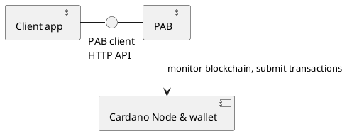

# PAB Client Interaction

Many Plutus apps want to bring their own UI and run the PAB in the background, possibly alongside other server processes.
Interactions between the frontend and the PAB use the PAB client HTTP API.
In this document we sketch a number of typical user flows involving the PAB client HTTP API.

## System description

On a high level we have the following components.



The client app communicates with the Plutus application backend (PAB).
The PAB manages the state of Plutus contracts.
It connects to a Cardano node to receive notifications about transactions, and to a wallet that manages any funds that are used by contracts running on the PAB.

### Structure of the PAB

The internal state of the PAB consists of a chain index, a database, any number of contract instances, and a coordinating process called the runtime.

```plantuml

interface "PAB client\nHTTP API" as pabclient

package "PAB" {
  database "DB" as db

  [Contract instances]
  [PAB runtime]
  [Chain index] - [PAB runtime]
  [PAB runtime] <..> [Contract instances] : manage endpoints
  [PAB runtime] <..> db : store contract state
  pabclient - [PAB runtime]
}

[PAB runtime] ..> [Cardano node & wallet] : "monitor blockchain, submit transactions"
```

#### Chain index

The chain index maintains a consistent view of a subset of the blockchain.
It keeps track of a set of interesting unspent transaction outputs (UTXOs) and, crucially, of any datum and script values that were included in past transactions.
We often need preimage of a datum hash because it represents the on-chain state of a contract.
Such preimages may be submitted as part of Goguen transactions, but only their hashes stay in the UTXO set.
The values are discarded by the node.
Therefore the PAB maintains an index of datum values that it encountered.

#### Contract instances

Each of the contracts that are installed in the PAB can have zero or more *contract instances* running at any point in time.

PAB clients can start, stop and inspect contract instances using the PAB client HTTP API.

The PAB can be distributed with pre-installed contracts, and new contracts can be installed in the PAB at runtime.

For example, the Marlowe app has a PAB with a single contract pre-installed (the Marlowe contract).
This PAB will have many instances of that one contract.
It does not need to install any additional contracts at runtime.

#### Database

The chain index and contract instances state is saved in a sqlite database.

## User flows

In the following we describe some typical user flows, using the PAB client HTTP API.
Blue arrows indicate websocket communication.

### Starting a new instance of a contract

```plantuml

autonumber

participant "client app" order 1
participant PAB order 2
participant "contract instance" order 3

"client app" -> PAB: start new instance
PAB -> "contract instance": Start

autonumber stop
"contract instance" -> PAB

autonumber 3
PAB -> "client app": instance ID
"client app" -> "contract instance": open websocket
"contract instance" -[#0000ff]> "client app": status
```

1. The client app makes a request to the "new-instance" HTTP route. It expects two parameters: The wallet, and the contract ID.
2. The PAB runtime generates an instance ID and starts the instance.
3. The PAB runtime returns the instance ID to the client app.
4. The client app uses the instance ID to open a websocket connection on the PAB client HTTP API.
5. The contract instance starts sending updates to the client app.

### Calling a endpoint

```plantuml

autonumber

participant "client app" order 1
participant "contract instance" order 2

"contract instance" -[#0000ff]> "client app": status
note left of "client app"
The status message
includes a list of
active endpoints
end note
"client app" -> "client app": Select an endpoint to call
"client app" -[#0000ff]> "contract instance": Call endpoint
"contract instance" -[#0000ff]> "client app": status
```

1. The contract instance notifies the client app of the endpoints that are currently active.
2. The client app decides which of the endpoints to call.
3. The PAB performs the actual call on the instance and returns the result.

### Inspecting instance logs

The logs produced by the instance can be retrieved either via the HTTP API or via the websockets protocol.
Requests to the HTTP API always return the entire list of log messages of the instance.
Status updates delivered through the websocket protocol only include the new log messages that have been added since the last status update.

1. The user calls the "logs" route on the HTTP API, or
2. The PAB pushes instance logs to the user.

### Terminating an instance

1. Call "terminate" on the instance