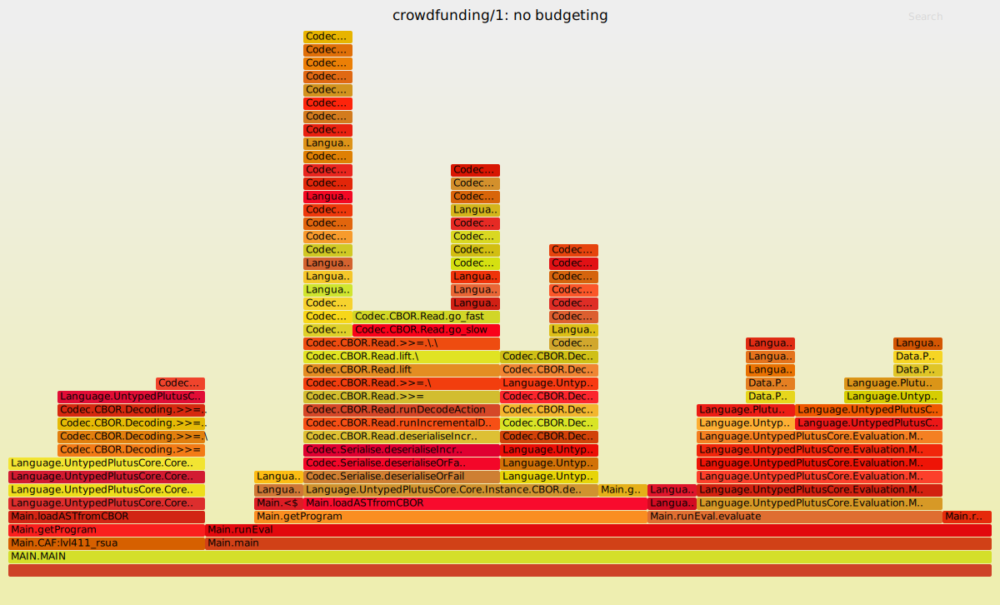

## Budgeting costs in the CEK machine

[December 2020, Plutus repository at c5e5cb6]

While trying to fix a memory leak in the CEK machine, it transpired that
budgeting was taking up a surprisingly large proportion of the CEK execution
time.  This document investigates what's going on.

[Update: see [CostingDetails.md](./CostingDetails.md) for some experiments
trying to work out what's going on wrt costing].

### Budgeting strategy

The (untyped) CEK machine in
`plutus-core/untyped-plutus-core/scrc/UntypedPlutusCore/Evaluation/Machine/Cek.hs`
monitors execution costs by defining a type

``` data ExBudgetCategory fun =
    BForce
  | BApply
  | BVar
  | BBuiltin fun
  | BAST
```

with a constructor for each of the Plutus Core AST node types.  This implements
the `SpendBudget` class from
`PlutusCore.Evaluation.Machine.ExBudgeting` which provides a
`spendBudget` method which knows the CPU and memory costs of each operation. The
machine can run in two modes: `Counting`, in which calling `spendBudget` adds
the cost of the current operation to a cumulative total so that the overall cost
of executing a program can be calculated; and `Restricting`, in which the cost
of each operation is subtracted from a pre-specified budget limit, with
execution being terminated if the budget falls below zero.

The `spendBudget` function is called in two places: (1) in `Cek.hs`, whenever
`computeCek` is called, and (2) in the `applyTypeSchemed` function in
`PlutusCore.Constant.Apply`, which is called to execute a built-in
function once all of its arguments are available.


### Benchmark results

I ran the `validation` and `nofib` benchmark suites a number of times with
different benchmarking strategies:


  * A: all calls to `spendBudget` removed
  * B: `spendBudget _ _ = pure ()`
  * C: Budgeting run in `Counting` mode
  * D: Budgeting run in `Restricting` mode with a large initial limit


The benchmarks were run on commit 844f3073 (10th December 2020), and the results
are in the tables below.  All times are in milliseconds.  The times are
extracted from Criterion output, so they're averages over multiple runs and
don't include any overhead from parsing or deserialisation.


#### Validation

Benchmark             |      A   |    B   |    C   |     D
----------------------|---------:|-------:|-------:|--------:
crowdfunding/1        |    2.268 |  2.289 |  6.531 |   6.800
crowdfunding/2        |    2.262 |  2.297 |  6.601 |   6.597
crowdfunding/3        |    2.243 |  2.301 |  6.591 |   6.630
crowdfunding/4        |    1.012 |  1.133 |  3.850 |   3.862
crowdfunding/5        |    1.019 |  1.060 |  3.875 |   3.870
future/1              |    1.144 |  1.282 |  3.909 |   3.967
future/2              |    2.587 |  2.633 |  7.800 |   7.923
future/3              |    2.598 |  2.652 |  7.805 |   7.907
future/4              |    3.255 |  4.101 |  10.57 |   10.58
future/5              |    4.081 |  4.330 |  13.12 |   12.67
future/6              |    3.467 |  3.782 |  10.49 |   10.53
future/7              |    4.139 |  4.310 |  12.48 |   12.67
multisigSM/1          |    2.542 |  2.655 |  7.510 |   7.529
multisigSM/2          |    2.697 |  2.835 |  7.617 |   7.609
multisigSM/3          |    2.765 |  2.972 |  7.660 |   7.708
multisigSM/4          |    2.744 |  3.107 |  7.805 |   7.945
multisigSM/5          |    3.119 |  3.571 |  9.177 |   9.381
multisigSM/6          |    2.555 |  2.905 |  7.536 |   7.576
multisigSM/7          |    2.689 |  2.885 |  7.606 |   7.686
multisigSM/8          |    2.753 |  2.871 |  7.749 |   7.765
multisigSM/9          |    2.709 |  2.841 |  7.792 |   7.825
multisigSM/10         |    3.033 |  3.149 |  9.376 |   9.274
vesting/1             |    2.316 |  2.338 |  6.765 |   6.698
vesting/2             |    2.118 |  2.313 |  5.895 |   5.949
vesting/3             |    2.257 |  2.391 |  6.633 |   6.703
marlowe/trustfund/1   |    6.292 |  6.728 |  21.41 |   21.53
marlowe/trustfund/2   |    4.916 |  5.240 |  16.48 |   16.69
marlowe/zerocoupon/1  |    6.554 |  6.888 |  22.23 |   22.45
marlowe/zerocoupon/2  |    4.442 |  5.342 |  15.37 |   15.33

#### Nofib

Benchmark             |     A    |     B    |    C    |    D
----------------------|---------:|---------:|--------:|--------:
clausify/formula1     |   67.03  |   70.70  |  336.8  |   347.7
clausify/formula2     |   83.96  |   90.26  |  416.5  |   430.2
clausify/formula3     |   232.6  |   246.0  | 1155.0  |  1188.0 
clausify/formula4     |   325.3  |   339.7  | 1544.0  |  1592.0 
clausify/formula5     |   1510.0 |  1557.0  | 7510.0  |  7726.0 
knights/4x4           |   214.7  |   237.3  |  917.7  |   950.1
knights/6x6           |   612.1  |   675.4  | 2821.0  |  2935.0 
knights/8x8           |   1019.0 |  1125.0  | 4804.0  |  5049.0 
primetest/05digits    |   164.3  |   187.4  |  549.8  |   556.4
primetest/08digits    |   316.2  |   362.7  | 1011.0  |  1024.0 
primetest/10digits    |   467.0  |   538.4  | 1433.0  |  1462.0 
primetest/20digits    |   989.9  |  1121.0  | 2981.0  |  2882.0 
primetest/30digits    |   1477.0 |  1666.0  | 4293.0  |  4401.0 
primetest/40digits    |   2114.0 |  2376.0  | 6019.0  |  6095.0 
queens4x4/bt          |   36.79  |   40.20  |  157.5  |   163.3
queens4x4/bm          |   47.34  |   52.01  |  203.5  |   211.1
queens4x4/bjbt1       |   43.71  |   49.09  |  187.7  |   195.6
queens4x4/bjbt2       |   45.12  |   49.08  |  194.4  |   202.7
queens4x4/fc          |   93.58  |   101.6  |  431.5  |   450.3
queens5x5/bt          |   497.9  |   550.6  | 2128.0  |  2214.0 
queens5x5/bm          |   516.4  |   579.2  | 2304.0  |  2393.0 
queens5x5/bjbt1       |   566.3  |   629.0  | 2456.0  |  2539.0 
queens5x5/bjbt2       |   587.1  |   655.4  | 2532.0  |  2638.0 
queens5x5/fc          |   1176.0 |  1333.0  | 5516.0  |  5753.0

### Discussion
Comparison of columns A and B shows that there is a not insignificant
overhead from calling a typeclass method, even when it doesn't do any
real work: times are increased by an average of 7.5% for the validation
benchmarks and 10% for the nofib benchmarks.

However, budgeting costs increase the time very significantly.  For the
`validation` benchmarks, execution time increases by a factor of 2.8x to 3.8x
(mean 3.08x) in `Counting` mode (column C) compared to the version budgeting
completely removed; for the `nofib` benchmarks execution time increases by a
factor of 2.8x to 5.0x, with a mean of 4.2x.

The figures for `Restricting` mode (column D), which is what we'll be using to
limit on-chain fuel consumption, are very similar to those for `Counting` mode.
For the validation benchmarks the difference isn't very noticeable: the ratio
D/C lies between 0.97 and 1.04, with a mean of 1.006; for nofib the figures are
similar: 0.97-1.05, with a mean of 1.03.   

## Detailed profiling

Why is budgeting taking up so much time?  I looked in more detail at three
examples: the `crowdfunding/1` and `zerocoupon/1` validation benchmarks, and the
`primetest/20digits` nofib benchmark.  I compiled the CEK machine in profiling
mode and ran these examples once each. Some care is needed in interpreting the
results because the programs were loaded in CBOR form and the reading and
deserialisation time is included in the profiling information, which wasn't the
case in the earlier results (I should have used `flat`, but it's too late now.
I don't believe that'll have a significant effect on the results here because
I've discounted deserialisation time in the discussions).

Each benchmark was profiled in three budgeting modes: with all budgeting code
removed, in Counting mode, and in Restricting mode (corresponding to columns A,
C, and D above).  [Flame graphs](http://www.brendangregg.com/flamegraphs.html)
for each are shown below; these were obtained by building `plutus-core` with
profiling turned on, then running the CEK machine with `stack exec --profile --
plc evaluate <args> +RTS -p`; the `.prof` file produced by this was then
converted into a flame graph using the `ghc-prof-flamegraph` command.  These are
interactive SVG images: you can hover over part of the graph to see what
percentage of the execution time the relevant function consumes, and you can
click to zoom in (click on `Reset Zoom` in the top left corner to zoom back
out).  Unfortunately this doesn't seem to work when viewing the files on GitHub,
but it does work if you use a browser to open the files in a local copy of the
repository.

The graphs for `Counting` and `Restricting` mode for each example are presented
first since the budgeting overhead is what we're mostly interested in here, and
we start with the `primetest/20digits` example because it runs for quite a long
time and CBOR overhead is negligible.

Graphs for no budgeting are included at the end, together with some comments
on possible CEK machine optimisations which they suggest.


### primetest/20digits


In `Counting` mode, `unsafeEvaluateCek` takes up 95.8% of the execution time,
with the rest being accounted for by initialisation code, including setting up a
tables of built-in function meanings.  `spendBudget` takes up a total of 11.25%
+ 53.45% = 64.7% of the execution time (there are two entries, one inside
`PlutusCore.Constant.Apply.applyTypeSchemed` (on the left) for costs of
builtin functions, and a more obvious one accounting for most of the right hand
side of the graph).  This suggests that budgeting accounts for about 2/3 of the
execution time, and this agrees well with the earlier table of benchmark results,
which shows that this benchmark takes 989.9ms without budgeting and 2981.0ms with
budgeting, an increase of 3x.

In the main occurrence of `spendBudget`, the cost is mostly accounted for by three functions:

  1. `Data.HashMap.Internal.Singleton`  (14.19% of total runtime)
  2. `Data.Profunctor.Unsafe.#.` (28.17%)
  3. `PlutusCore.Evaluation.Machine.ExBudgeting.<>` (5.0%)

The instance of `spendBudget` in `Cek.hs` begins

```
    spendBudget key budget = do
        modifying exBudgetStateTally
                (<> (ExTally (singleton key budget)))
        newBudget <- exBudgetStateBudget <%= (<> budget)
        ...
```

I think that item 1 comes from the use of `singleton` above, item 2 comes
from the lens function `<%=` (zooming in on item 2 in the graph shows that it's
calling `ExBudgeting.<>` again, presumably where it says `<> budget`), and item
3 comes from `<> (ExTally (singleton key budget))`.

The occurrence of `spendBudget` on the left of the graph, where it's being called
while executing builtins, is slightly different.  That accounts for 11.39% of
the execution time, with `singleton` taking up 5.19% and `ExBudgeting.<>` taking
1.7%; in this case, `Data.Profunctor.Unsafe.#.` takes only 0.3% whereas it took
twice as long as `singleton` in the main usage of `spendBudget`.  I think this
is using the same instance of `SpendBudget` as in `Cek.hs`, so I'm not sure why
there's a discrepancy.

The graph for `Restricting` mode is broadly similar, except that a total of
11.5% (1.50% + 10.10%) of the execution time is consumed by
`ExBudgeting.exceedsBudget`, which is called at the end of every invocation of
`spendBudget` to check that the budget limits have not been exceeded.  There's
some disagreement with the figures for this benchmark in the earlier table :
there the mean execution time in `Counting` mode was 2981ms but in `Restricting`
mode it was _less_, at 2882ms.  For all the other benchmarks `Restricting` took
longer than `Counting`, as would be expected (on average, 3.3% longer)).


### crowdfunding/1


The crowdfunding validation example is much faster than the primality testing
example (6.5ms vs. 2981ms in `Counting` mode).  In this case there's quite a lot
of overhead from CBOR deserialisation and `evaluateCek`, the main function
of the CEK machine, only takes 79.6% of the total evaluation time;  1.88% + 55.39%
= 57.27% of the total evaluation time is consumed by `spendBudget`, which means that
it occupies almost 72% of the CEK time. (This suggests that we could expect a slowdown
of 1.0/0.28 = 3.57, but the slowdown in the table for the validation benchmarks is
6.531/2.268 = 2.87; this roughly the same order of magnitude, but the correspondence
is less accurate than for the primetest example.  We're dealing with very short
periods of time here, so perhaps we shouldn't expect high accuracy?)

Again the majority of the budgeting time is spent in things related to hashmaps and
`<>`.  Also, 7.42% of the total runtime is spent in `ExMemory.memoryusage`, which
wasn't visible in the primetest example (closer examination of the profiling
data suggests it took something like 0.6% of the execution time).  This is startup
overhead: it's called when the initial AST is annotated with the memory usage of nodes
(and I didn't remove this in the versions with `spendBudget` removed).

The picture for `Restricting` mode is very similar to that for `Counting`.

### marlowe/zerocoupon/1


The graphs for the zerocoupon example are a little strange, with some
data floating in midair.  This is for CBOR decoding functions called via
typeclasses; I'm not sure why it's not attached to the main graph.

The situation is broadly similar to the crowdfunding example.  The main
CEK function `evaluateCek` takes 73.6% of the total evaluation time
and `spendBudget` takes 40.7%  (29.7% + 1%), so it takes up 55%
of the main CEK evaluation function (again, this would suggest a 2x slowdown,
but we saw a 3.39x slowdown in the benchmark table).


## Conclusions on budgeting

It seems clear that budgeting is taking a lot of time in the CEK machine,
particularly where hashmaps are used.  We should probably try to simplify things
as much as possible, possibly using some other data structure and reducing the
use of lenses, monads, and typeclasses.


### No budgeting

The graphs below show what happens when we have no budgeting, and so give some
idea of what's taking time in the basic CEK machine.




For the two validation examples much of the time is consumed by startup
overhead: in both the crowdfunding example and the zerocoupon example only 25%
of the total execution time is spent in `evaluateCek`; in contrast, the much
longer-running primetest example spends 94% of its time there.  We should
definitely try to make deserialisation as efficient as possible.  I've used CBOR
here, but fortunately Radu's benchmarks suggest that `flat` deserialisation is
generally faster, taking about 75-95% of the time required to deserialise CBOR.

Quite a lot of time seems to be spent looking up names in environments and
inserting new names (about 80% for crowdfunding, 60% for zerocoupon, 25% for
primetest).  Using de Bruijn levels could help with this: we already know that
de Bruijn _indices_ help to reduce script sizes, and presumably the same would
apply for levels.  However, it seems plausible that we could compute directly
with de Bruijn levels (avoiding the re-indexing costs associated with de Bruijn
indices), and this would avoid having to translate back to the named form on the
chain: we should think about this a bit more carefully.

Another thing to optimise would be execution of built-in functions, although
this doesn't seem to occur very often in the validation examples.  In the
crowdfunding example `applyTypeSchemed` isn't mentioned at all in the graph, and
for zerocoupon it takes about 13%.  In the primetest example (which is doing a
lot of computation) it takes about 34% of the evaluation time, but this is
perhaps a rather unrealistic example.  We should do some more profiling
to investigate this.

### Addendum: builtin evaluation statistics

The previous section mentions that there doesn't seem to be a lot of time spent
evaluating builtins in the validation examples, and particularly in the
crowdfunding example.  I have a version of the OCaml CEK machine which records
how often the machine encounters the different PLC node types (among other things).
Here's what it says for the examples we've been looking at here.

#### Crowdfunding

```
   24,088 calls to compute_cek
   15,460 calls to return_cek

   Var:     6,888
   Lam:     6,524
   Apply:   6,495
   Const:   117
   Delay:   1,484
   Force  : 2,469
   Builtin: 111
   Error  : 0
```

#### Zerocoupon

```
   70,640 calls to compute_cek
   45,607 calls to return_cek

   Var:     20,419
   Lam:     19,056
   Apply:   19,353
   Const:   283
   Delay:   4,217
   Force  : 6,900
   Builtin: 412
   Error  : 0
```


#### Prime20

```
   7,334,166 calls to compute_cek
   5,692,258 calls to return_cek

   Var:     1,958,665
   Lam:     1,006,700
   Apply:   2,667,199
   Const:   374,748
   Delay:   349,664
   Force  : 357,859
   Builtin: 619,331
   Error  : 0
```

This confirms that there's not a lot of builtin evaluation happening in these
validation examples, so improving builtin evaluation time maybe shouldn't be the
most urgent thing on our list.
