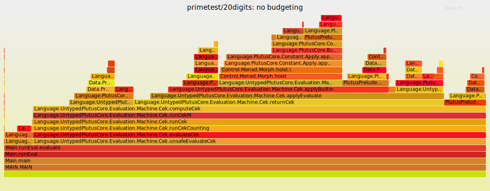
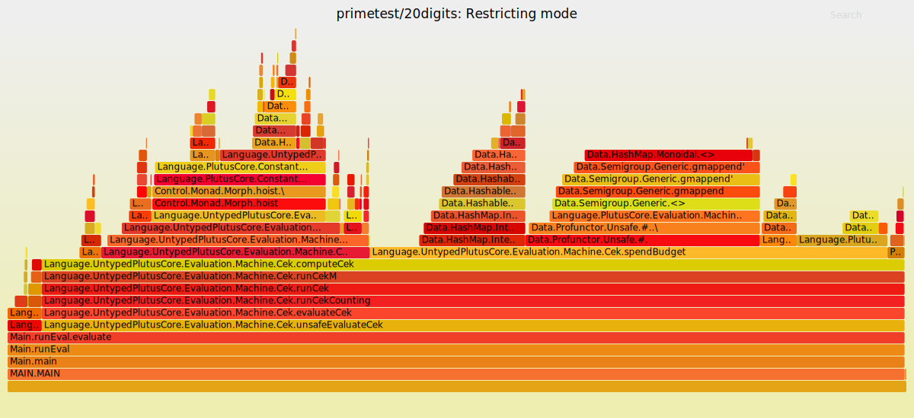

## Budgeting costs in the CEK machine

[December 2020, Plutus repository at c5e5cb6]

While trying to fix a memory leak in the CEK machine, it tranpsired that
budgeting was taking up a surprisingly large proportion of the CEK execution
time.  This document investigates what's going on.

### Budgeting strategy

The (untyped) CEK machine in
`plutus-core/untyped-plutus-core/Language/UntypedPlutusCore/Evaluation/Machine/Cek.hs`
monitors execution costs by defining a type ``` data ExBudgetCategory fun =
BForce | BApply | BVar | BBuiltin fun | BAST ``` with a constructor for each of
the Plutus Core AST node types.  This implements the `SpendBudget` class from
`Language.PlutusCore.Evaluation.Machine.ExBudgeting` which provides a
`spendBudget` method which knows the CPU and memory costs of each operation. The
machine can run in two modes: `Counting`, in which calling `spendBudget` adds
the cost of the current operation to a cumulative total so that the overall cost
of executing a program can be calculated; and `Restricting`, in which the cost
of each operation is subtracted from a pre-specified budget limit, with
execution being terminated if the budget falls below zero.

The `spendBudget` function is called in two places: (1) in `Cek.hs`, whenever
`computeCek` is called, and (2) in the `applyTypeSchemed` function in
`Language.PlutusCore.Constant.Apply`, which is called to execute a built-in
function once all of its arguments are avaliable.


### Benchmark results

I ran the `validation` and `nofib` benchmark suites a number of times with
different benchmarking strategies:


  * A: all calls to `spendBudget` removed
  * B: `spendBudget _ _ = pure ()`
  * C: Budgeting run in `Counting` mode
  * D: Budgeting run in `Restricting` mode with a large initial limit


The benchmarks were run on commit 844f3073 (10th December 2020), and the results
are in the tables below.  All times are in milliseconds.  The times are
extracted from Criterion output, so they're averages over mulitple runs and
don't include any overhead from parsing or deserialisation.


#### Validation

Benchmark             |      A   |    B   |    C   |     D
----------------------|---------:|-------:|-------:|--------:
crowdfunding/1        |    2.268 |  2.289 |  6.531 |   6.800
crowdfunding/2        |    2.262 |  2.297 |  6.601 |   6.597
crowdfunding/3        |    2.243 |  2.301 |  6.591 |   6.630
crowdfunding/4        |    1.012 |  1.133 |  3.850 |   3.862
crowdfunding/5        |    1.019 |  1.060 |  3.875 |   3.870
future/1              |    1.144 |  1.282 |  3.909 |   3.967
future/2              |    2.587 |  2.633 |  7.800 |   7.923
future/3              |    2.598 |  2.652 |  7.805 |   7.907
future/4              |    3.255 |  4.101 |  10.57 |   10.58
future/5              |    4.081 |  4.330 |  13.12 |   12.67
future/6              |    3.467 |  3.782 |  10.49 |   10.53
future/7              |    4.139 |  4.310 |  12.48 |   12.67
multisigSM/1          |    2.542 |  2.655 |  7.510 |   7.529
multisigSM/2          |    2.697 |  2.835 |  7.617 |   7.609
multisigSM/3          |    2.765 |  2.972 |  7.660 |   7.708
multisigSM/4          |    2.744 |  3.107 |  7.805 |   7.945
multisigSM/5          |    3.119 |  3.571 |  9.177 |   9.381
multisigSM/6          |    2.555 |  2.905 |  7.536 |   7.576
multisigSM/7          |    2.689 |  2.885 |  7.606 |   7.686
multisigSM/8          |    2.753 |  2.871 |  7.749 |   7.765
multisigSM/9          |    2.709 |  2.841 |  7.792 |   7.825
multisigSM/10         |    3.033 |  3.149 |  9.376 |   9.274
vesting/1             |    2.316 |  2.338 |  6.765 |   6.698
vesting/2             |    2.118 |  2.313 |  5.895 |   5.949
vesting/3             |    2.257 |  2.391 |  6.633 |   6.703
marlowe/trustfund/1   |    6.292 |  6.728 |  21.41 |   21.53
marlowe/trustfund/2   |    4.916 |  5.240 |  16.48 |   16.69
marlowe/zerocoupon/1  |    6.554 |  6.888 |  22.23 |   22.45
marlowe/zerocoupon/2  |    4.442 |  5.342 |  15.37 |   15.33

#### Nofib

Benchmark             |     A    |     B    |    C    |    D
----------------------|---------:|---------:|--------:|--------:
clausify/formula1     |   67.03  |   70.70  |  336.8  |   347.7
clausify/formula2     |   83.96  |   90.26  |  416.5  |   430.2
clausify/formula3     |   232.6  |   246.0  | 1155.0  |  1188.0 
clausify/formula4     |   325.3  |   339.7  | 1544.0  |  1592.0 
clausify/formula5     |   1510.0 |  1557.0  | 7510.0  |  7726.0 
knights/4x4           |   214.7  |   237.3  |  917.7  |   950.1
knights/6x6           |   612.1  |   675.4  | 2821.0  |  2935.0 
knights/8x8           |   1019.0 |  1125.0  | 4804.0  |  5049.0 
primetest/05digits    |   164.3  |   187.4  |  549.8  |   556.4
primetest/08digits    |   316.2  |   362.7  | 1011.0  |  1024.0 
primetest/10digits    |   467.0  |   538.4  | 1433.0  |  1462.0 
primetest/20digits    |   989.9  |  1121.0  | 2981.0  |  2882.0 
primetest/30digits    |   1477.0 |  1666.0  | 4293.0  |  4401.0 
primetest/40digits    |   2114.0 |  2376.0  | 6019.0  |  6095.0 
queens4x4/bt          |   36.79  |   40.20  |  157.5  |   163.3
queens4x4/bm          |   47.34  |   52.01  |  203.5  |   211.1
queens4x4/bjbt1       |   43.71  |   49.09  |  187.7  |   195.6
queens4x4/bjbt2       |   45.12  |   49.08  |  194.4  |   202.7
queens4x4/fc          |   93.58  |   101.6  |  431.5  |   450.3
queens5x5/bt          |   497.9  |   550.6  | 2128.0  |  2214.0 
queens5x5/bm          |   516.4  |   579.2  | 2304.0  |  2393.0 
queens5x5/bjbt1       |   566.3  |   629.0  | 2456.0  |  2539.0 
queens5x5/bjbt2       |   587.1  |   655.4  | 2532.0  |  2638.0 
queens5x5/fc          |   1176.0 |  1333.0  | 5516.0  |  5753.0

### Discussion
Comparison of columns A and B shows that there is a not insignificant
overhead from calling a typeclass method, even when it do.esn't do any
real work: times are increased by an average of 7.5% for the validation
benchmarks and 10% for the nofib benchmarks.

However, budgeting costs increase the time very significantly.  For the
`validation` benchmarks, execution time increases by a factor of 2.8x to 3.8x
(mean 3.08x) in `Counting` mode (column C) compared to the version budgeting
completely removed; for the `nofib` benchmarks execution time increases by a
factor of 2.8x to 5.0x, with a mean of 4.2x.

The figures for `Restricting` mode (column D), which is what we'll be using to
limit on-chain fuel comsumption, are very similar to those for `Counting` mode.
For the validation benchmarks the difference isn't very noticeable: the ratio
D/C lies between 0.97 and 1.04, with a mean of 1.006; for nofib the figures are
similar: 0.97-1.05, with a mean of 1.03.   

## Detailed profiling

Why is budgeting taking up so much time?  I looked in more detail at three
examples: the `crowdfunding/1` and `zerocoupon/1` validation benchmarks, and the
`primetest/20digits` nofib benchmark.  I compiled the CEK machine in profiling
mode and ran these examples once each. Some care is needed in interpreting the
results because the programs were loaded in CBOR form and the reading and
deserialisation time is included in the profiling information, which wasn't the
case in the earlier results.


What do svg files look like in markdown?

### primetest/20digits







### crowdfunding/1


### marlowe/zerocoupon/1


