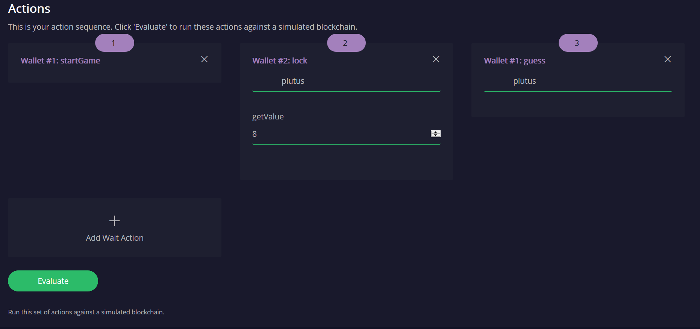
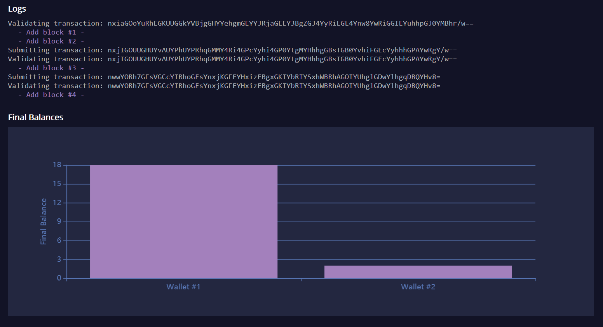
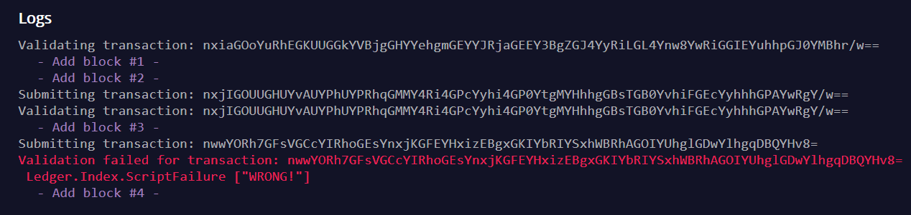
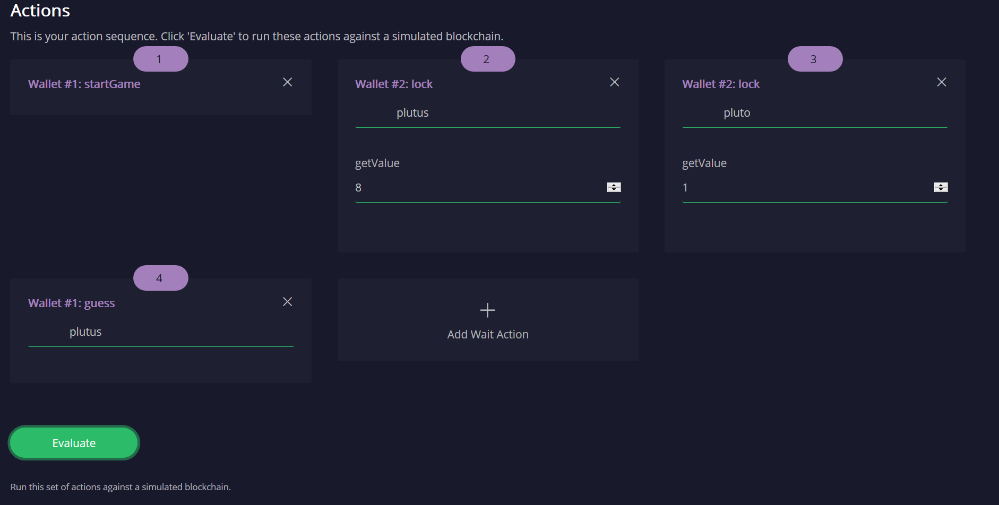

# Wallet API I: Basics

This tutorial explains how to get Plutus onto the blockchain, using a simple guessing game as an example. This is the second in a series of tutorials on Plutus smart contracts.

1. [Plutus Tx](./01-plutus-tx.md)
2. A guessing game (this tutorial)
3. [A crowdfunding campaign](./03-wallet-api.md)
4. [Working with the emulator](../../tutorial/Tutorial/Emulator.hs)
5. [A multi-stage contract](../../tutorial/Tutorial/Vesting.hs)

You can run this code in the [Plutus Playground](https://prod.playground.plutus.iohkdev.io/) - see Section 2, "Testing the contract in the Playground".

We assume the reader is familiar with the [UTxO model with scripts](../../../docs/extended-utxo/README.md) and the [PlutusTx tutorial](./01-plutus-tx.md).

**WARNING:** The wallet API and by extension the wallet API tutorial is a work in progress and may be changed without notice.

This tutorial has three parts. In part 1 we write the contract, including all the data types we need, validator scripts, and contract endpoints that handle the interactions between wallet and blockchain. In part 2 we show how to test the contract. Part 3 contains a number of questions and exercises.

# 1. Contract Definition

We need some language extensions and imports:

```haskell
{-# LANGUAGE DataKinds           #-}
{-# LANGUAGE RecordWildCards     #-}
{-# LANGUAGE TemplateHaskell     #-}
{-# LANGUAGE DeriveGeneric       #-}
{-# LANGUAGE ScopedTypeVariables #-}
{-# LANGUAGE OverloadedStrings   #-}
module Tutorial.ValidatorScripts where
```

The language extensions fall into three categories. The first category is extensions required by the plugin that translates Haskell Core to Plutus IR (Intermediate Representation - a more abstract form of Plutus Core). This category includes [`DataKinds`](https://downloads.haskell.org/~ghc/8.4.3/docs/html/users_guide/glasgow_exts.html#datatype-promotion), [`TemplateHaskell`](https://downloads.haskell.org/~ghc/8.4.3/docs/html/users_guide/glasgow_exts.html#template-haskell) and [`ScopedTypeVariables`](https://downloads.haskell.org/~ghc/8.4.3/docs/html/users_guide/glasgow_exts.html#lexically-scoped-type-variables). The second category is extensions that contract endpoints to be automatically generated in the Plutus Playground, and it contains only the [`DeriveGeneric`](https://downloads.haskell.org/~ghc/8.4.3/docs/html/users_guide/glasgow_exts.html#deriving-representations) extension. The final category is extensions that make the code look nicer. These include [`RecordWildCards`](https://downloads.haskell.org/~ghc/8.4.3/docs/html/users_guide/glasgow_exts.html#record-wildcards), which lets us use write `Campaign{..}` in pattern matching to bring into scope all fields of a `Campaign` value, and [`OverloadedStrings`](https://downloads.haskell.org/~ghc/8.4.3/docs/html/users_guide/glasgow_exts.html#overloaded-string-literals) which allows us to write log messages as string literals without having to convert them to `Text` values first.

```haskell
import qualified Language.PlutusTx            as P
import qualified Ledger.Interval              as P
import           Ledger                       (Address, DataScript(..), PubKey(..), RedeemerScript(..), Signature(..), Slot(..), TxId, ValidatorScript(..))
import qualified Ledger                       as L
import qualified Ledger.Ada                   as Ada
import           Ledger.Ada                   (Ada)
import           Ledger.Validation            (PendingTx(..), PendingTxIn(..), PendingTxOut)
import qualified Ledger.Validation            as V
import           Wallet                       (WalletAPI(..), WalletDiagnostics(..), MonadWallet, EventHandler(..), EventTrigger)
import qualified Wallet                       as W
import           Prelude                      hiding ((&&))
import           GHC.Generics                 (Generic)

import qualified Data.ByteString.Lazy.Char8   as C
```

The module [`Ledger.Validation`](https://input-output-hk.github.io/plutus/wallet-api-0.1.0.0/html/Ledger-Validation.html), imported as `V`, contains types and functions that can be used in on-chain code. `Language.PlutusTx` lets us translate code between Haskell and Plutus Core (see the [PlutusTx tutorial](./01-plutus-tx.md)). [`Ledger`](https://input-output-hk.github.io/plutus/wallet-api-0.1.0.0/html/Ledger.html) has data types for the ledger model and [`Wallet`](https://input-output-hk.github.io/plutus/wallet-api-0.1.0.0/html/Wallet.html) is the wallet API. It covers interactions with the wallet, for example generating the transactions that actually get the crowdfunding contract onto the blockchain.

## 1.1 Data Types

The guessing game involves two moves: First, player A chooses a secret word, and uses the game validator script to lock some Ada (the prize), providing the hash of the secret word as the data script. Second, player B guesses the secret, by attempting to spend A's transaction output using the guess as a redeemer script.

Both the hashed secret and the cleartext guess are represented as `ByteString` values in on-chain code. `ByteString` represents the usual Haskell bytestrings in on-chain code.

To avoid any confusion between cleartext and hash we wrap them in data types called `HashedText` and `ClearText`, respectively.

```haskell
data HashedText = HashedText P.ByteString
data ClearText = ClearText P.ByteString
```

One of the strengths of PlutusTx is the ability to use the same definitions for on-chain and off-chain code, which includes lifting values from Haskell to Plutus Core. To enable values of our string types to be lifted, we need to call `makeLift` from the `PlutusTx` module.

```haskell
P.makeLift ''HashedText
P.makeLift ''ClearText
```

`mkDataScript` creates a data script for the guessing game by hashing the string and lifting the hash to its on-chain representation.

```haskell
mkDataScript :: String -> DataScript
mkDataScript word =
    let hashedWord = V.plcSHA2_256 (C.pack word)
    in  DataScript (L.lifted (HashedText hashedWord))
```

`mkRedeemerScript` creates a redeemer script for the guessing game by lifting the string to its on-chain representation

```haskell
mkRedeemerScript :: String -> RedeemerScript
mkRedeemerScript word =
    let clearWord = C.pack word
    in RedeemerScript (L.lifted (ClearText clearWord))

```

## 1.2 The Validator Script

The general form of a validator script is `DataScript -> Redeemer -> PendingTx -> Answer`. That is, the validator script is a function of three arguments that produces a value of type `Answer` (or fails with an error). As contract authors we can freely choose the types of `DataScript`, `Redeemer` and `Answer`. The third argument has to be of type [`PendingTx`](https://input-output-hk.github.io/plutus/wallet-api-0.1.0.0/html/Ledger-Validation.html#t:PendingTx) because that is the information about the current transaction, provided by the slot leader. When the evaluation of the script has finished without an error, the result is discarded and never used again. The value of `Answer` is not relevant, and therefore we usually choose `Answer` to be the unit type `()`.

In our case, the data script is a `HashedText`, and the redeemer is a `ClearText`. This gives us a script with the signature `HashedText -> ClearText -> PendingTx -> ()`. The function needs to be wrapped in Template Haskell quotes, beginning with `[||` and ending with `||]`.

We can then use `L.compileScript`, a function exported by the `Ledger` module, to compile the TH quote to its on-chain representation:

```haskell
-- | The validator script of the game.
gameValidator :: ValidatorScript
gameValidator = ValidatorScript ($$(L.compileScript [||
    -- The code between the '[||' and  '||]' quotes is on-chain code.
    \(HashedText actual) (ClearText guessed) (_ :: PendingTx) ->
```

The actual game logic is very simple: We compare the hash of the `guessed` argument with the `actual` secret hash, and throw an error if the two don't match. In on-chain code, we can use the `$$()` splicing operator to access functions from the Plutus prelude, imported as `P`. For example, `$$(P.equalsByteString) :: ByteString -> ByteString -> Bool`  compares two `ByteString` values for equality.

```haskell
    if $$(P.equalsByteString) actual ($$(P.sha2_256) guessed)
    then ()
    else ($$(P.error) ($$(P.traceH) "WRONG!" ()))

    ||])) -- marks the end of the quoted (on-chain) code
```

`$$(P.traceH) :: String -> a -> a` returns its second argument after adding its first argument to the log output of this script. The log output is only available in the emulator and on the playground, and will be ignored when the code is run on the real blockchain.

Before we move on to the wallet interactions that produces transactions for our game, let us look at the failure case more closely. There are two two subtle differences between on-chain and off-chain code that we need to be aware of. First, the signature of `P.error` is `forall a. () -> a` and therefore we alway have to apply it to a unit value. `P.error` is different from Haskell's `undefined :: forall a. a` because of differences in the type systems of the two languages.

Second, `$$(P.error)` terminates evaluation of the script when it is encountered, but (due to the strict evaluation order of on-chain code) only *after* its argument has been evaluated. That is why we need to put the call to `P.traceH` as the argument to `P.error`. In regular Haskell we would write `traceH "WRONG!" undefined`.

## 1.3 Contract endpoints

We can now use the wallet API to create a transaction that produces an output locked by the game validator. This means the address of the output is the hash of the validator script, and the output can only be spent if the correct redeemer is provided.

To create the output we need to know the address, that is the hash of the `gameValidator` script:

```haskell
gameAddress :: Address
gameAddress = L.scriptAddress gameValidator
```

Contract endpoints are functions that use the wallet API to interact with the blockchain. To contract users, endpoints are the visible interface of the contract. They provide a UI (HTML form) for entering the parameters of the actions we may take as part of the contract.

When writing smart contracts we define their endpoints as functions that return a value of type `MonadWallet m => m ()`. This type indicates that the function uses the wallet API to produce and spend transaction outputs on the blockchain.

The first endpoint we need for our game is the function `lock`. It pays the specified amount of Ada to the script address. Paying to a script address is a common task at the beginning of a contract, and the wallet API implements it in [`payToScript_`](https://input-output-hk.github.io/plutus/wallet-api-0.1.0.0/html/Wallet-API.html#v:payToScript_). The underscore is a Haskell naming convention, indicating that [`payToScript_`](https://input-output-hk.github.io/plutus/wallet-api-0.1.0.0/html/Wallet-API.html#v:payToScript_) is a variant of [`payToScript`](https://input-output-hk.github.io/plutus/wallet-api-0.1.0.0/html/Wallet-API.html#v:payToScript) which ignores its return value and produces a `()` instead.

Since `MonadWallet` is a sub-class of `Monad` we can use Haskell's `do` notation, allowing us to list our instructions to the wallet in a sequence (see [here](https://en.wikibooks.org/wiki/Haskell/do_notation) for more information).

```haskell
-- | The "lock" contract endpoint.
lock :: MonadWallet m => String -> Ada -> m ()
lock word adaValue =
    W.payToScript_ W.defaultSlotRange gameAddress (Ada.toValue adaValue) (mkDataScript word)
```

The second endpoint, `guess`, creates a transaction that spends the game output using the guessed word as a redeemer.

```haskell
-- | The "guess" contract endpoint.
guess :: MonadWallet m => String -> m ()
guess word =
    -- 'collectFromScript' is a function of the wallet API. It consumes the
    -- unspent transaction outputs at a script address and pays them to a
    -- public key address owned by this wallet. It takes the validator script
    -- and the redeemer scripts as arguments.
    W.collectFromScript W.defaultSlotRange gameValidator (mkRedeemerScript word)
```

If we run `guess` now, nothing will happen. Why? Because in order to spend all outputs at the script address, the wallet needs to be aware of this address before the outputs are produced. That way, it can scan incoming blocks from the blockchain for outputs at that address, and doesn't have to keep a record of all unspent outputs of the entire blockchain. So before the game starts, players need to run the following action:

```haskell
-- | The "startGame" contract endpoint, telling the wallet to start watching
--   the address of the game script.
startGame :: MonadWallet m => m ()
startGame =
    -- 'startWatching' is a function of the wallet API. It instructs the wallet
    -- to keep track of all outputs at the address. Player 2 needs to call
    -- 'startGame' before Player 1 uses the 'lock' endpoint, to ensure that
    -- Player 2's wallet is aware of the game address.
    W.startWatching gameAddress
```

Endpoints can have any number of parameters: `lock` has two  parameters, `guess` has one and `startGame` has none. For each endpoint we include a call to `mkFunction` at the end of the contract definition, by writing `$(mkFunction 'lock)`, `$(mkFunction 'guess)` and `$(mkFunction 'startGame)` in three separate lines. This causes the Haskell compiler to generate a schema for the endpoint. The Plutus Playground then uses this schema to present an HTML form to the user where the parameters can be entered.

# 2. Testing the contract in the Playground

To test this contract, open the [Plutus Playground](https://prod.playground.plutus.iohkdev.io/) and click the "Game" button above the editor field. Then click "Compile".

You can now create a trace using the endpoints `lock`, `guess` and `startGame`. For a successful run of the game, click Wallet 1's `startGame` button, then Wallet 2's `lock` button and finally Wallet 1's `guess` button. Three boxes appear in the "Actions" section, numbered 1 to 3. In the second box, type "plutus" in the first input and 8 in the second input. In the third box type "plutus". The trace should look like the screenshot below.



Now click "Evaluate". This button sends the contract code and the trace to the server, and populates the "Transactions" section of the UI with the results. The logs tell us that there were three successful transactions. The first transaction is the initial transaction of the blockchain. It distributes the initial funds to the participating wallets. The second and third transactions are related to our game: One transaction from the `lock` action (submitted by Wallet 2) and one transaction from the `guess` action (submitted by Wallet 1).



If you change the word "plutus" in the third item of the trace to "pluto" and click "Evaluate", the log shows that validation of the `guess` transaction failed.



# 3. Problems / Questions

1. Run traces for a successful game and a failed game in the Playground, and examine the logs after each trace.
1. Change the error case of the validator script to `($$(P.traceH) "WRONG!" ($$(P.error) ()))` and run the trace again with a wrong guess. Note how this time the log does not include the error message.
1. Look at the trace shown below. What will the logs say after running "Evaluate"?



# Next steps

The [next part](./03-wallet-api.md) of the tutorial shows how to implement a crowdfunding campaign. It covers blockchain triggers and the validity range of transactions.
