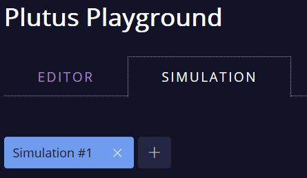

# Multiple Simulations

The [Plutus Playground](https://prod.playground.plutus.iohkdev.io/) now supports multiple simulations. Simulations consist of a description of wallets with their initial balances, and a sequence of actions.

The "Simulation" tab shows one button for each simulation. To add a new simulation click the "+" button. To delete a simulation click the "X" button next to the simulation. Clicking on a simulation selects it.
