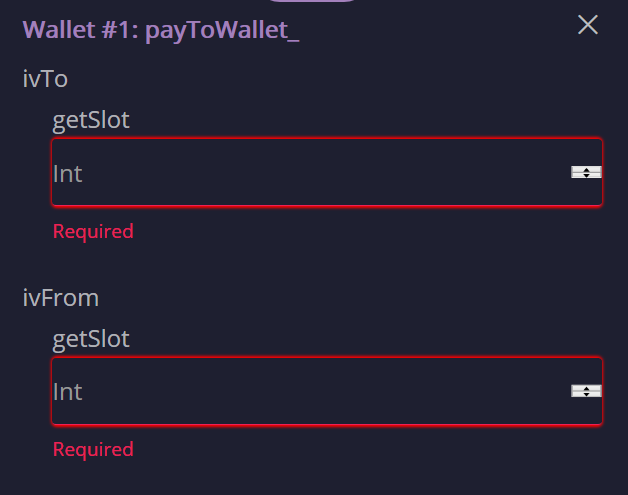
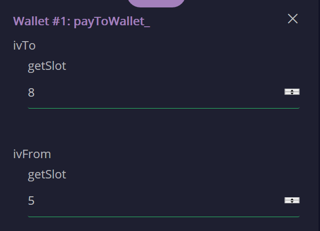

# Validity range for transactions

All transactions on the simulated blockchain now have a *validity range*. The validity range is an (open, closed) interval of slots. Transactions may only be validated if their validity range contains the current slot number. The validity range feature is what makes Plutus scripts completely deterministic - their resource usage (and hence the amount of gas required to run them) can be computed before the transaction is submitted. As a result, there is no risk of a Plutus smart contract running out of gas accidentally, and no risk of overpaying gas fees either.

The Playground displays validity ranges as a pair of fiels `ivTo` and `ivFrom`:

Note that the interval is inclusive-excluse. If the current slot number is equal to `ivTo` then the transaction can be validated, but if it is equal to or larger than `ivFrom` then it cannot be validated. Consider the following example:

A transaction `ivFrom=5` and `ivTo=8` can be validated during any of the slots 5, 6, and 7.

Also please note the order of the fields in the UI: `ivTo` is shown before `ivFrom`. If you set `ivFrom` to a value greater than or equal to `ivTo` then the transaction can never be validated and will forver linger in the pool of pending transactions.

