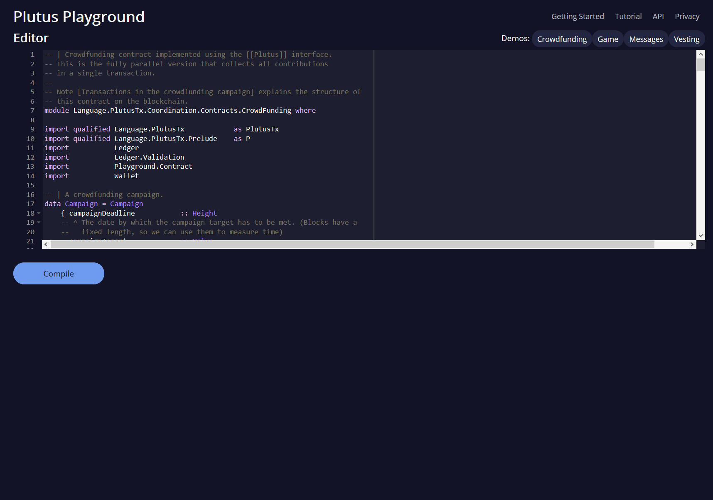

# wallet-api: Wallet-API tutorial

This tutorial shows how to implement a simple crowdfunding campaign as a Plutus contract, using the wallet API to submit it to the blockchain. There are two ways to run the code:

1. Open the [Plutus Playground](https://prod.playground.plutus.iohkdev.io/), delete all the text in the editor field, and type / copy the code bits in there. Make sure to preserve the indentation.
2. The tutorial is written as a literate Haskell file, so it can be fed directly to the Haskell compiler. The easiest way to do that is to clone the Plutus repository at `git@github.com:input-output-hk/plutus.git` and build the `wallet-api` library using `nix-build -A localPackages.wallet-api`. This runs the `wallet-api-doctests` test suite that compiles the tutorial. Alternatively, run `cabal test wallet-api`. Note that the test suite requires Unix symlinks to be supported by the file system, which means that it will not work on Windows Subsystem for Linux (WSL), even though nix generally does work!

We assume the reader is familiar with the [UTxO model with scripts](../../docs/extended-utxo/README.md) and the [PlutusTx tutorial](../../plutus-tx/tutorial/Tutorial.md). Please note that the wallet API and by extension the wallet API tutorial is a work in progress and may be changed significantly without much warning. 

The tutorial has two parts. In part 1 we write the contract, including all the data types we need, validator scripts, and contract endpoints that handle the interactions between wallet and blockchain. In part 2 we show how to test the contract.

# 1. Contract Definition

We need some language extensions and imports:

```haskell
{-# LANGUAGE DataKinds           #-}
{-# LANGUAGE RecordWildCards     #-}
{-# LANGUAGE TemplateHaskell     #-}
{-# LANGUAGE DeriveGeneric       #-}
{-# LANGUAGE ScopedTypeVariables #-}
{-# LANGUAGE OverloadedStrings   #-}
{-# OPTIONS_GHC -O0 #-}
module Tutorial where
```

The language extensions fall into three categories. The first category is extensions required by the plugin that translates Haskell Core to Plutus IR (Intermediate Representation - a more abstract form of Plutus Core). This category includes [`DataKinds`](https://downloads.haskell.org/~ghc/8.4.3/docs/html/users_guide/glasgow_exts.html#datatype-promotion), [`TemplateHaskell`](https://downloads.haskell.org/~ghc/8.4.3/docs/html/users_guide/glasgow_exts.html#template-haskell) and [`ScopedTypeVariables`](https://downloads.haskell.org/~ghc/8.4.3/docs/html/users_guide/glasgow_exts.html#lexically-scoped-type-variables). The second category is extensions that contract endpoints to be automatically generated in the Plutus Playground, and it contains only the [`DeriveGeneric`](https://downloads.haskell.org/~ghc/8.4.3/docs/html/users_guide/glasgow_exts.html#deriving-representations) extension. The final category is extensions that make the code look nicer. These include [`RecordWildCards`](https://downloads.haskell.org/~ghc/8.4.3/docs/html/users_guide/glasgow_exts.html#record-wildcards), which lets us use write `Campaign{..}` in pattern matching to bring into scope all fields of a `Campaign` value, and [`OverloadedStrings`](https://downloads.haskell.org/~ghc/8.4.3/docs/html/users_guide/glasgow_exts.html#overloaded-string-literals) which allows us to write log messages as string literals without having to convert them to `Text` values first.

We also need the `{-# OPTIONS_GHC -O0 #-}` compiler option. It disables some of GHC's optimisations to ensure that the generated Haskell Core can be translated to Plutus IR easily.

```haskell
import qualified Language.PlutusTx            as P
import qualified Ledger.Interval              as P
import           Ledger                       (Address, DataScript(..), PubKey(..), RedeemerScript(..), Signature(..), Slot(..), TxId, ValidatorScript(..), Value(..))
import qualified Ledger                       as L
import           Ledger.Validation            (PendingTx(..), PendingTxIn(..), PendingTxOut)
import qualified Ledger.Validation            as V
import           Wallet                       (EventHandler(..), EventTrigger)
import qualified Wallet                       as W
import           Wallet.Emulator              (MockWallet)
import           Prelude                      hiding ((&&))
import           GHC.Generics                 (Generic)
```

The module `Ledger.Validation`, imported as `V`, contains types and functions that can be used in on-chain code. `Language.PlutusTx` lets us translate code between Haskell and Plutus Core (see the [PlutusTx tutorial](../../plutus-tx/tutorial/Tutorial.md)). `Ledger` has data types for the ledger model and `Wallet` is the wallet API. `Wallet.Emulator` covers interactions with the wallet, for example generating the transactions that actually get the crowdfunding contract onto the blockchain.

## 1.1 Data Types

The campaign has the following parameters:

* Funding target
* End date
* Collection deadline
* Campaign owner

If the funding target is reached at the end date, then the campaign owner may collect all the funds. If it isn't reached, or if the owner does not collect the funds before the collection deadline, then the contributors are entitled to a refund.

In Haskell:

```haskell
data Campaign = Campaign {
      fundingTarget      :: Value,
      endDate            :: Slot,
      collectionDeadline :: Slot,
      campaignOwner      :: PubKey
 }
```

The type of monetary values is `Value`. Dates are expressed in terms of slots, and their type is `Slot`. The campaign owner is identified by their public key.

One of the strengths of PlutusTx is the ability to use the same definitions for on-chain and off-chain code, which includes lifting values from Haskell to Plutus Core. To enable values of the `Campaign` type to be lifted, we need to call `makeLift` from the `PlutusTx` module:

```haskell
P.makeLift ''Campaign
```

Now we need to figure out what the campaign will look like on the blockchain. Which transactions are involved, who submits them, and in what order?

Each contributor pays their contribution to the address of the campaign script. When the slot `endDate` is reached, the campaign owner submits a single transaction, spending all inputs from the campaign address and paying them to a pubkey address. If the funding target isn't reached, or the campaign owner fails to collect the funds, then each contributor can claim a refund, in the form of a transaction that spends their own contribution. This means that the validator script is going to be run once per contribution, and we need to tell it which of the two cases outcomes it should check.

We can encode the two possible actions in a data type. For each action we provide a signature, so that the validator script can check that the redeemer is legitimate.

```haskell
data CampaignAction = Collect Signature | Refund Signature
P.makeLift ''CampaignAction
```

The `CampaignAction` will be submitted as the redeemer script. Now we need one final bit of information, namely the identity (public key) of each contributor, so that we know the recipient of the refund. This data can't be part of the redeemer script because then a reclaim could be made by anyone, not just the original contributor. Therefore the public key is going to be stored in the data script of the contribution.

```haskell
data Contributor = Contributor PubKey
P.makeLift ''Contributor
```

**Note (What is the role of the data script?)** Pay-to-script outputs contain a (hash of a) validator script and a data script, but their address is the hash of the validator script only, not of the data script. The wallet uses the address to track the state of a contract, by watching the outputs at that address. So the separate data script allows us to have multiple outputs belonging to the same contract but with different data scripts.

In the crowdfunding campaign the data script contains a `Contributor` value, which is used to verify the "refund" transaction. If that data was part of the validator script, then each contribution would go to a unique address, and the campaign owner would have to be informed of all the addresses through some other mechanism. 

## 1.2 The Validator Script

The general form of a validator script is `Redeemer -> DataScript -> PendingTx -> Answer`. That is, the validator script is a function of three arguments that produces a value of type `Answer` (or fails with an error). As contract authors we can freely choose the types of `Redeemer`, `DataScript` and `Answer`. The third argument has to be of type `PendingTx` because that is the information about the current transaction, provided by the slot leader. When the evaluation of the script has finished without an error, the result is discarded and never used again. The value of `Answer` is not relevant, and therefore we usually choose `Answer` to be the unit type `()`.

Since we already know the types of data and redeemer scripts (`Contributor` and `CampaignAction`, respectively), we automatically know the signature of the validator script:

```haskell
type CampaignValidator = CampaignAction -> Contributor -> PendingTx -> ()
```

`CampaignValidator` is a function that takes three parameters - `CampaignAction`, `Contributor`, and `PendingTx` - and produces a unit value `()` or fails with an error.

If we want to implement `CampaignValidator` we need to know the parameters of the campaign, so that we can check if the selected `CampaignAction` is allowed. In Haskell we can do this by writing a function `mkValidator :: Campaign -> CampaignValidator` that takes a `Campaign` and produces a `CampaignValidator`. However, we need to wrap `mkValidator` in Template Haskell quotes so that it can be compiled to Plutus Core. We therefore write `mkValidator` like this:

```haskell
mkValidatorScript :: Campaign -> ValidatorScript
mkValidatorScript campaign = ValidatorScript val where
  val = L.applyScript mkValidator (L.lifted campaign)
  -- ^ val is the script obtained by applying `mkValidator` to the lifted `campaign` value
  mkValidator = L.fromCompiledCode $$(P.compile [||
```

Anything between the `[||` and `||]` quotes is going to be _on-chain code_ and anything outside the quotes is _off-chain code_. We can now implement a lambda function that looks like `mkValidator`, starting with its parameters:

```haskell
              \(c :: Campaign) (act :: CampaignAction) (con :: Contributor) (p :: PendingTx) ->
```

Before we check whether `act` is permitted, we define a number of intermediate values that will make the checking code much more readable. These definitions are placed inside a `let` block, which is closed by a corresponding `in` below.

```haskell
              let
                  infixr 3 &&
                  (&&) :: Bool -> Bool -> Bool
                  (&&) = $$(P.and)

                  signedBy :: PubKey -> Signature -> Bool
                  signedBy (PubKey pk) (Signature s) = pk == s
```

There is no standard library of functions that are automatically in scope for on-chain code, so we need to import the ones that we want to use from the `Validation` module using the `\$\$()` splicing operator.

Next, we pattern match on the structure of the `PendingTx` value `p` to get the Validation information we care about:

```haskell
                  PendingTx ins outs _ _ _ txnValidRange = p -- p is bound to the pending transaction
```

This binds `ins` to the list of all inputs of the current transaction, `outs` to the list of all its outputs, and `currentSlot` to the current slot. Each slot stands for a specific interval of time in the real world, so we can use the `Slot` type as a proxy for time in our scripts.

We also need the parameters of the campaign, which we can get by pattern matching on `c`.

```haskell
                  Campaign (Value target) deadline collectionDeadline campaignOwner = c
```

Then we compute the total value of all transaction inputs, using `P.foldr` on the list of inputs `ins`. Note that there is a limit on the number of inputs a transaction may have, and thus on the number of contributions in this crowdfunding campaign. In this tutorial we ignore that limit, because it depends on the details of the implementation of Plutus on the Cardano chain, and that implementation has not happened yet.

```haskell
                  totalInputs :: Int
                  totalInputs =
                      let v (PendingTxIn _ _ (Value vl)) = vl in
                      $$(P.foldr) (\i total -> total + v i) 0 ins
```

We now have all the information we need to check whether the action `act` is allowed. This will be computed as

```haskell
                  isValid = case act of
                      Refund sig ->
                          let
                              Contributor pkCon = con
```

In the `Refund` branch we check that the outputs of this transaction all go to the contributor identified by `pkCon`. To that end we define a predicate

```haskell
                              contributorTxOut :: PendingTxOut -> Bool
                              contributorTxOut o =
                                case $$(V.pubKeyOutput) o of
                                  Nothing -> False
                                  Just pk -> $$(V.eqPubKey) pk pkCon
```

We check if `o` is a pay-to-pubkey output. If it isn't, then the predicate `contributorTxOut` is false. If it is, then we check if the public key matches the one we got from the data script.

The predicate `contributorTxOut` is applied to all outputs of the current transaction:

```haskell
                              contributorOnly = $$(P.all) contributorTxOut outs
```

For the contribution to be refundable, three conditions must hold. The collection deadline must have passed, all outputs of this transaction must go to the contributor `con`, and the transaction was signed by the contributor.

```haskell
                              refundable = $$(P.before) collectionDeadline txnValidRange &&
                                           contributorOnly &&
                                           pkCon `signedBy` sig
```

The overall result of this branch is the `refundable` value:

```haskell
                          in refundable
```

The second branch represents a successful campaign.

```haskell
                      Collect sig ->
```

In the `Collect` case, the current slot must be between `deadline` and `collectionDeadline`, the target must have been met, and and transaction has to be signed by the campaign owner.

```haskell
                          $$(P.contains) ($$(P.interval) deadline collectionDeadline) txnValidRange &&
                          totalInputs >= target &&
                          campaignOwner `signedBy` sig

              in
```

**Note (Operators in On-Chain Code)** We can use the operators `>`, `<`, `>=`, `<=` and `==` to compare `Int` values in PLC without having to define them in the script itself, as we did with `&&`. The compiler plugin that translates Haskell Core to Plutus Core knows about those operators because `Int` is a primitive type in Plutus Core and operations on it are built in. `Bool` on the other hand is treated like any other user-defined data type, and all functions that operate on it must be defined locally. More details can be found in the [PlutusTx tutorial](../../plutus-tx/tutorial/Tutorial.md).

Finally, we can return the unit value `()` if `isValid` is true, or fail with an error otherwise. We can produce an error using the `P.error` function from the Prelude, but the signature of `P.error` is `forall a. () -> a` and therefore we alway have to apply it to a unit value. `P.error` is different from Haskell's `undefined` (of type `forall a. a`) because of differences in the type systems of the two languages.

```haskell
              if isValid then () else ($$(P.error) ())
                  ||]) -- this is the end of the on-chain (quoted Template Haskell) code
```

## 1.3 Contract Endpoints

Now that we have the validator script, we need to set up contract endpoints for contributors and the campaign owner. Contract endpoints are interactions between the wallet and the blockchain, and they represent the interface that is visible to users of a contract. In our case the users are campaign owners and contributors, so we need contract endpoints for contributing, collecting, and claiming a refund.

We will need to know the address of a campaign, which amounts to  hashing the output of `mkValidatorScript`:

```haskell
campaignAddress :: Campaign -> Address
campaignAddress cmp = L.scriptAddress (mkValidatorScript cmp)
```

Contributors put their public key in a data script:

```haskell
mkDataScript :: PubKey -> DataScript
mkDataScript pk = DataScript (L.lifted (Contributor pk))
```

Contract endpoints have the return type `MockWallet ()`, which means that they can use the wallet API to create and submit transactions, query blockchain addresses, and log messages. `MockWallet` indicates that this wallet action can be run by the emulator, so you don't need to have a testnet available. When the contract is ready to be deployed, we simply change the type to `CardanoWallet`. 

When writing a `MockWallet` action we can use Haskell's `do` notation, allowing us to list our instructions to the wallet in a sequence (see [here](https://en.wikibooks.org/wiki/Haskell/do_notation) for more information).

```haskell
contribute :: Campaign -> Value -> MockWallet ()
contribute cmp amount = do
```

Contributing to a campaign is easy: We need to pay the value `amount` to a script address, and provide our own public key as the data script. Paying to a script address is a common task at the beginning of a contract, and the wallet API implements it in `payToScript_`. The underscore is a Haskell naming convention, indicating that `payToScript_` is a variant of `payToScript` which ignores its return value and produces a `()` instead. 

```haskell
      pk <- W.ownPubKey
      let dataScript = mkDataScript pk
      W.payToScript_ W.defaultSlotRange (campaignAddress cmp) amount dataScript
```

When we want to spend the contributions we need to provide a `RedeemerScript` value. In our case this is just the `CampaignAction`:

```haskell
mkRedeemer :: CampaignAction -> RedeemerScript
mkRedeemer action = RedeemerScript (L.lifted (action))
```

To collect the funds we use `collectFromScript`, which expects a validator script and a redeemer script.

```haskell
collect :: Campaign -> MockWallet ()
collect cmp = do
      sig <- W.ownSignature
      let validator = mkValidatorScript cmp
          redeemer  = mkRedeemer (Collect sig)
          range     = W.interval (endDate cmp) (collectionDeadline cmp)
      W.collectFromScript range validator redeemer
```

If we run `collect` now, nothing will happen. Why? Because in order to spend all outputs at the script address, the wallet needs to be aware of this address _before_ the outputs are produced. That way, it can scan incoming blocks from the blockchain for contributions to that address, and doesn't have to keep a record of all unspent outputs of the entire blockchain. So before the campaign starts, the campaign owner needs to run the following action:

```haskell
startCampaign :: Campaign -> MockWallet ()
startCampaign campaign = W.startWatching (campaignAddress campaign)
```

## 1.4 Blockchain triggers

Some interactions with contracts can be automated. For example, the `collect` endpoint does not require any user input, so it could be run automatically as soon as the campaign is over, provided the campaign target has been reached. 

The wallet API allows us to specify a pair of `EventTrigger` and `EventHandler` to automatically run `collect`. An event trigger describes a condition of the blockchain and can be true or false. There are four basic triggers: `slotRangeT` is true when the slot number is in a specific range, `fundsAtAddressT` is true when the total value of unspent outputs at an address is within a range, `alwaysT` is always true and `neverT` is never true. We also have boolean connectives `andT`, `orT` and `notT` to describe more complex conditions.

```haskell
collectFundsTrigger :: Campaign -> EventTrigger
collectFundsTrigger c = W.andT
    -- We use `W.intervalFrom` to create an open-ended interval that starts at the funding target.
    (W.fundsAtAddressT (campaignAddress c) (W.intervalFrom (fundingTarget c)))

    -- With `W.interval` we create an interval from the campaign's end date (inclusive) to 
    -- the collection deadline (exclusive)
    (W.slotRangeT (W.interval (endDate c) (collectionDeadline c)))
```

The campaign owner can collect contributions when two conditions hold: The funds at the address must have reached the target, and the current slot must be greater than the campaign deadline but smaller than the collection deadline.

Now we can define an event handler that collects the contributions:

```haskell
collectionHandler :: Campaign -> EventHandler MockWallet
collectionHandler cmp = EventHandler (\_ -> do
        W.logMsg "Collecting funds"
        sig <- W.ownSignature
        let redeemerScript = L.RedeemerScript (L.lifted (Collect sig))
            range          = W.interval (endDate cmp) (collectionDeadline cmp)
        W.collectFromScript range (mkValidatorScript cmp) redeemerScript)
```

The handler is a function of one argument, which we ignore in this case (the argument tells us which of the conditions in the trigger are true, which can be useful if we used `orT` to build a complex condition). In our case we don't need this information because we know that both the `fundsAtAddressT` and the `slotRangeT` conditions hold when the event handler is run, so we can call `collectFromScript` immediately.

Note that the trigger mechanism is a feature of the wallet, not of the blockchain. That means that the wallet needs to be running when the condition becomes true, so that it can react to it and submit transactions. Anything that happens in an `EventHandler` is a normal interaction with the blockchain facilitated by the wallet.

With that, we can re-write the `startCampaign` endpoint to register a `collectFundsTrigger` and collect the funds automatically if the campaign is successful:

```haskell
scheduleCollection :: Campaign -> MockWallet ()
scheduleCollection cmp = W.register (collectFundsTrigger cmp) (collectionHandler cmp)
```

Now the campaign owner only has to run `scheduleCollection` at the beginning of the campaign and the wallet will collect the funds automatically.

This takes care of the successful outcome to the campaign. We need another contract endpoint for claiming a refund in case the goal was not reached. After contributing to a campaign we do not need any user input to determine whether we are eligible for a refund of our contribution. Eligibility is defined entirely in terms of the blockchain state, and therefore we can use the event mechanism to automatically process our refund. 

Let's start with the event handler. Just like the `collection` handler, our refund handler should also collect outputs from a script address, so we one might think we could use `collectFromScript` to implement it, like we did in `collectionHandler`. However, `collectFromScript` consumes *all* outputs at the script address. In our refund transaction we only want to consume the output that corresponds to our own contribution. 

If we submitted a refund transaction for all outputs, that transaction would fail to validate because our validator script checks that refunds go to their intended recipients (see the equation for `contributorOnly` above). Instead of `collectFromScript` we can use `collectFromScriptTxn`, which takes an additional `TxId` parameter and only collects outputs produced by that transaction.

```haskell
refundHandler :: TxId -> Campaign -> EventHandler MockWallet
refundHandler txid cmp = EventHandler (\_ -> do
    W.logMsg "Claiming refund"
    sig <- W.ownSignature
    let redeemer  = L.RedeemerScript (L.lifted (Refund sig))
        range     = W.intervalFrom (collectionDeadline cmp)
    W.collectFromScriptTxn range (mkValidatorScript cmp) redeemer txid)
```

Now we can register the refund handler when we make the contribution. The condition for being able to claim a refund is

```haskell
refundTrigger :: Campaign -> EventTrigger
refundTrigger c = W.andT
    (W.fundsAtAddressT (campaignAddress c) (W.intervalFrom 1))
    (W.slotRangeT (W.intervalFrom (collectionDeadline c)))
```

We will call the new endpoint `contribute2` because it replaces the `contribute` endpoint defined above.

```haskell
contribute2 :: Campaign -> Value -> MockWallet ()
contribute2 cmp amount = do
      pk <- W.ownPubKey
      let dataScript = mkDataScript pk

      -- payToScript returns the transaction that was submitted
      -- (unlike payToScript_ which returns unit)
      tx <- W.payToScript W.defaultSlotRange (campaignAddress cmp) amount dataScript
      W.logMsg "Submitted contribution"

      -- L.hashTx gives the `TxId` of a transaction
      let txId = L.hashTx tx

      W.register (refundTrigger cmp) (refundHandler txId cmp)
      W.logMsg "Registered refund trigger"
```

That brings our total number contract endpoints down to two: `contribute2` for contributors, and `scheduleCollection` for campaign owners.

# 2. Testing the Contract

There are two ways to test a Plutus contract. We can run it interactively in the [Playground](https://prod.playground.plutus.iohkdev.io/), or test it like any other program by writing some unit and property tests. Both methods give the same results because they do the same thing behind the scenes: Generate some transactions and evaluate them on the mockchain. The emulator performs the same validity checks (including running the compiled scripts) as the slot leader would for the real blockchain, so we can be confident that our contract works as expected when we deploy it.

## 2.1 Playground

We need to tell the Playground what our contract endpoints are, so that it can generate a UI for them. This is done by adding a call to `mkFunctions` for the endpoints to the end of the script:

`$(mkFunctions ['scheduleCollection, 'contribute])`

(We can't use the usual Haskell syntax highlighting for these two lines because the entire script is compiled and executed as part of the test suite for the `wallet-api` project. The Playground-specific `mkFunctions` is defined in a different library (`plutus-playground-lib`) and it is not available for this tutorial.)

Alternatively, you can click the "Crowdfunding" button in the Playground to load the sample contract including `mkFunction` calls. Note that the sample code differs slightly from what is written in this tutorial, because it does not include some of the intermediate definitions of contract endpoints such as `startCampaign` (which was superseded by `scheduleCollection`) and `contribute` (superseded by `contribute2`). 

Either way, once the contract is defined we click "Compile" to get a list of endpoints:



We can then simulate a campaign by adding actions for `scheduleCollection` and `contribute`. Note that we also need to add a number of empty blocks to make sure the time advances past the `endDate` of the campaign. 


A click on "Evaluate" runs the simulation and returns the result. We can see in the logs that the campaign finished successfully:


## 2.2 Emulator

Testing contracts with unit and property tests requires more effort than running them in the Playground, but it has several advantages. In a unit test we have much more fine-grained control over the mockchain. For example, we can simulate network outages that cause a wallet to fall behind in its notifications, and we can deploy multiple contracts on the same mockchain to see how they interact. And by writing smart contracts the same way as all other software we can use the same tools (versioning, continuous integration, release processes, etc.) without having to set up additional infrastructure.

We plan to write a tutorial on this soon. Until then we would like to refer you to the test suite in [Crowdfunding.hs](../../plutus-use-cases/test/Spec/Crowdfunding.hs).

You can run the test suite with `nix build -f default.nix localPackages.plutus-use-cases` or `cabal test plutus-use-cases`.
